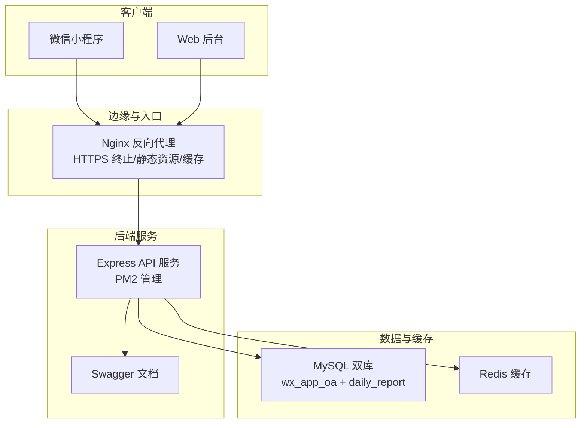
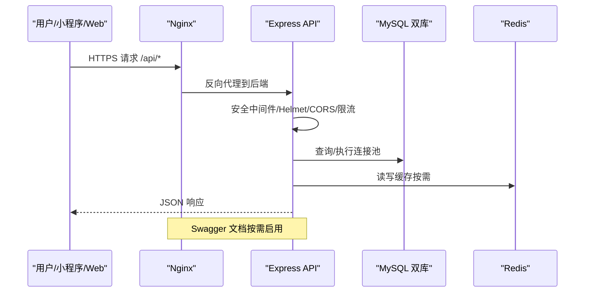
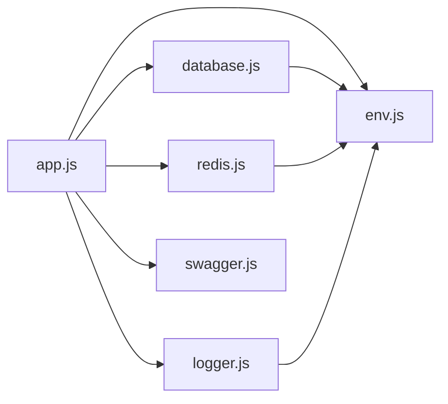
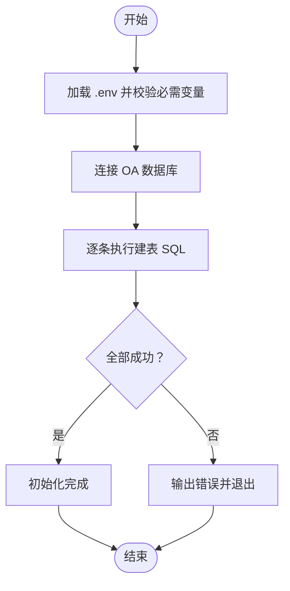

# 部署配置

<cite>
**本文引用的文件**
- [backend/package.json](file://backend/package.json)
- [backend/src/app.js](file://backend/src/app.js)
- [backend/src/common/config/env.js](file://backend/src/common/config/env.js)
- [backend/src/common/config/database.js](file://backend/src/common/config/database.js)
- [backend/src/common/config/redis.js](file://backend/src/common/config/redis.js)
- [backend/src/common/utils/logger.js](file://backend/src/common/utils/logger.js)
- [backend/src/common/config/swagger.js](file://backend/src/common/config/swagger.js)
- [backend/scripts/init-db.js](file://backend/scripts/init-db.js)
- [backend/docs/技术可行性分析报告.md](file://backend/docs/技术可行性分析报告.md)
- [.workbuddy/memory/2026-05-25.md](file://.workbuddy/memory/2026-05-25.md)
- [miniapp/package.json](file://miniapp/package.json)
- [miniapp/vite.config.js](file://miniapp/vite.config.js)
- [webapp/package.json](file://webapp/package.json)
- [webapp/vite.config.ts](file://webapp/vite.config.ts)
</cite>

## 目录
1. [简介](#简介)
2. [项目结构](#项目结构)
3. [核心组件](#核心组件)
4. [架构总览](#架构总览)
5. [详细组件分析](#详细组件分析)
6. [依赖关系分析](#依赖关系分析)
7. [性能考虑](#性能考虑)
8. [故障排查指南](#故障排查指南)
9. [结论](#结论)
10. [附录](#附录)

## 简介
本文件面向“智慧办公助手 OA 系统”的生产部署，覆盖服务器基础设施、后端 API 服务（PM2 进程管理、Nginx 反向代理、SSL 证书）、前后端（小程序与 Web 后台）静态资源与缓存策略、数据库与缓存高可用方案（MySQL 主从、Redis 集群）、环境变量、日志与监控告警、备份与恢复等完整配置指南。内容基于仓库现有代码与文档进行提炼与扩展，确保可落地、可验证。

## 项目结构
系统采用前后端分离架构：
- 后端：基于 Node.js + Express 的 RESTful API 服务，负责认证、审批、报表、消息、统计等功能。
- 前端：小程序与 Web 后台分别独立构建，通过反向代理统一接入后端 API。
- 数据层：MySQL（双库：wx_app_oa 新库 + daily_report 旧库兼容），Redis 缓存。

图表来源
- [backend/src/app.js:102-127](file://backend/src/app.js#L102-L127)
- [backend/src/common/config/database.js:11-43](file://backend/src/common/config/database.js#L11-L43)
- [backend/src/common/config/redis.js:16-57](file://backend/src/common/config/redis.js#L16-L57)
- [backend/src/common/config/swagger.js:8-26](file://backend/src/common/config/swagger.js#L8-L26)

章节来源
- [backend/src/app.js:102-127](file://backend/src/app.js#L102-L127)
- [backend/src/common/config/database.js:11-43](file://backend/src/common/config/database.js#L11-L43)
- [backend/src/common/config/redis.js:16-57](file://backend/src/common/config/redis.js#L16-L57)
- [backend/src/common/config/swagger.js:8-26](file://backend/src/common/config/swagger.js#L8-L26)

## 核心组件
- 环境变量与配置中心：集中于环境变量加载与校验，提供数据库、Redis、JWT、微信、日志、Swagger 等配置入口。
- 数据库连接池：双库连接池（新库 + 旧库），提供查询、执行、事务、连通性检测。
- Redis 客户端：延迟初始化、自动重连策略、错误与关闭处理。
- 日志系统：Winston 结构化日志，控制台与文件输出，请求级上下文注入。
- API 服务：安全中间件（Helmet/CORS/限流）、路由注册、全局错误处理、优雅退出。
- Swagger 文档：按路由与控制器注释自动生成，便于联调与运维。

章节来源
- [backend/src/common/config/env.js:13-44](file://backend/src/common/config/env.js#L13-L44)
- [backend/src/common/config/env.js:50-115](file://backend/src/common/config/env.js#L50-L115)
- [backend/src/common/config/database.js:11-24](file://backend/src/common/config/database.js#L11-L24)
- [backend/src/common/config/database.js:30-43](file://backend/src/common/config/database.js#L30-L43)
- [backend/src/common/config/database.js:65-109](file://backend/src/common/config/database.js#L65-L109)
- [backend/src/common/config/redis.js:16-57](file://backend/src/common/config/redis.js#L16-L57)
- [backend/src/common/utils/logger.js:22-61](file://backend/src/common/utils/logger.js#L22-L61)
- [backend/src/common/utils/logger.js:67-96](file://backend/src/common/utils/logger.js#L67-L96)
- [backend/src/app.js:26-55](file://backend/src/app.js#L26-L55)
- [backend/src/app.js:102-140](file://backend/src/app.js#L102-L140)
- [backend/src/common/config/swagger.js:8-26](file://backend/src/common/config/swagger.js#L8-L26)

## 架构总览
生产环境典型拓扑：
- 外网通过 HTTPS 访问 Nginx，Nginx 将 /api 前缀转发至后端 API 服务。
- API 服务内部加载环境变量、初始化数据库与 Redis，注册路由与中间件，暴露健康检查与 Swagger 文档。
- 小程序与 Web 后台分别构建产物托管于 CDN 或静态服务器，通过 Nginx 提供缓存与压缩。

图表来源
- [backend/src/app.js:26-55](file://backend/src/app.js#L26-L55)
- [backend/src/app.js:102-140](file://backend/src/app.js#L102-L140)
- [backend/src/common/config/database.js:11-43](file://backend/src/common/config/database.js#L11-L43)
- [backend/src/common/config/redis.js:16-57](file://backend/src/common/config/redis.js#L16-L57)
- [backend/src/common/config/swagger.js:88-100](file://backend/src/common/config/swagger.js#L88-L100)

## 详细组件分析

### 后端 API 服务部署（PM2 + Nginx + SSL）
- 进程管理
  - 使用 PM2 管理后端进程，建议以单实例 fork 模式或集群模式部署，结合环境变量与日志目录配置。
  - 优雅退出：监听 SIGTERM/SIGINT，关闭 HTTP 与 Redis 连接，超时强制退出。
- 反向代理
  - Nginx 将 /api 前缀转发至后端服务，开启 gzip/缓存，配置 HTTPS 证书与安全头。
  - 开发期可参考前端 Vite 配置中的代理示例，生产环境统一走 Nginx。
- 安全加固
  - Helmet、CORS、速率限制（全局限流与登录端点限流）已在应用内实现，确保 Nginx 不破坏 X-Forwarded-For。
- 健康检查与文档
  - 暴露健康检查端点与 Swagger 文档（按需启用），便于监控与联调。

章节来源
- [backend/src/app.js:145-204](file://backend/src/app.js#L145-L204)
- [backend/src/app.js:26-55](file://backend/src/app.js#L26-L55)
- [backend/src/app.js:102-140](file://backend/src/app.js#L102-L140)
- [backend/src/common/config/swagger.js:88-100](file://backend/src/common/config/swagger.js#L88-L100)
- [webapp/vite.config.ts:24-31](file://webapp/vite.config.ts#L24-L31)

### 数据库部署与配置（MySQL 双库）
- 双库设计
  - 新库 wx_app_oa：承载 M2 阶段业务主库。
  - 旧库 daily_report：兼容旧系统与用户表迁移。
- 连接池
  - 支持最大连接数、队列限制、长连接保活、字符集与时区设置。
- 初始化
  - 提供建表脚本，按顺序创建各业务表，支持多语句执行与逐条校验。
- 高可用建议
  - 生产建议采用主从复制，读写分离，配合只读副本提升查询能力；敏感操作使用主库事务。

章节来源
- [backend/src/common/config/database.js:11-43](file://backend/src/common/config/database.js#L11-L43)
- [backend/src/common/config/database.js:65-109](file://backend/src/common/config/database.js#L65-L109)
- [backend/scripts/init-db.js:18-322](file://backend/scripts/init-db.js#L18-L322)
- [backend/docs/技术可行性分析报告.md:146-166](file://backend/docs/技术可行性分析报告.md#L146-L166)

### Redis 缓存部署与配置
- 连接与初始化
  - 支持密码认证、DB 选择、自动重连策略与事件监听。
  - 应用启动时延迟初始化，首次使用时建立连接。
- 安全与持久化
  - 建议开启 AOF、设置 maxmemory 策略、合理分配内存。
- 高可用建议
  - 生产建议使用 Redis Sentinel 或 Redis Cluster，实现故障转移与水平扩展。

章节来源
- [backend/src/common/config/redis.js:16-57](file://backend/src/common/config/redis.js#L16-L57)
- [backend/src/common/config/redis.js:85-93](file://backend/src/common/config/redis.js#L85-L93)
- [backend/docs/技术可行性分析报告.md:191-211](file://backend/docs/技术可行性分析报告.md#L191-L211)

### 环境变量与配置
- 必需变量
  - NODE_ENV、PORT、OA_DB_*、OLD_DB_*、REDIS_*、JWT_SECRET、WX_APPID 等。
- 配置入口
  - 统一导出 config 对象，包含数据库、Redis、JWT、微信、日志级别与目录、Swagger 开关等。
- 建议
  - 生产环境使用密钥管理服务或容器注入，避免明文存储。

章节来源
- [backend/src/common/config/env.js:13-44](file://backend/src/common/config/env.js#L13-L44)
- [backend/src/common/config/env.js:50-115](file://backend/src/common/config/env.js#L50-L115)

### 日志管理
- 输出策略
  - 控制台彩色输出（开发）、错误日志文件与综合日志文件，按大小轮转。
- 请求追踪
  - 中间件为每个请求注入带 requestId、URL、方法、状态码等上下文。
- 建议
  - 生产环境接入集中式日志（如 ELK/云日志服务），设置日志级别与保留周期。

章节来源
- [backend/src/common/utils/logger.js:22-61](file://backend/src/common/utils/logger.js#L22-L61)
- [backend/src/common/utils/logger.js:67-96](file://backend/src/common/utils/logger.js#L67-L96)

### 前端部署策略（小程序与 Web 后台）
- 小程序
  - 使用 uni-app 构建微信小程序，配置别名与插件，构建产物上传至 CDN 或静态托管。
- Web 后台
  - Vue3 + Vite 构建，开发时通过代理指向线上后端；生产通过 Nginx 提供静态资源与缓存。
- 静态资源优化
  - 启用 gzip/br 压缩、缓存头、CDN 加速、资源指纹化与懒加载策略。

章节来源
- [miniapp/package.json:5-10](file://miniapp/package.json#L5-L10)
- [miniapp/vite.config.js:1-13](file://miniapp/vite.config.js#L1-L13)
- [webapp/package.json:6-14](file://webapp/package.json#L6-L14)
- [webapp/vite.config.ts:14-32](file://webapp/vite.config.ts#L14-L32)

### 监控告警与备份恢复
- 健康检查
  - API 暴露健康检查端点，包含数据库与 Redis 连通性检查。
- 监控指标
  - 建议采集 CPU/内存/连接池使用率、Redis 命中率、慢查询、错误率、响应时间。
- 备份策略
  - MySQL：逻辑备份（mysqldump）与物理备份（Percona XtraBackup）结合；增量与全量结合，异地容灾。
  - Redis：AOF/RDB 持久化与定期快照，跨机房同步。
- 恢复演练
  - 定期进行备份恢复演练，验证 RTO/RPO。

章节来源
- [backend/src/common/config/swagger.js:69-103](file://backend/src/common/config/swagger.js#L69-L103)
- [backend/src/common/config/database.js:187-207](file://backend/src/common/config/database.js#L187-L207)
- [backend/src/common/config/redis.js:85-93](file://backend/src/common/config/redis.js#L85-L93)

## 依赖关系分析
- 后端依赖
  - Express、Winston、helmet、cors、express-rate-limit、mysql2、redis、swagger-ui-express 等。
- 前端依赖
  - 小程序：uni-app、vue、pinia。
  - Web：vue、axios、element-plus、vue-router、xlsx 等。
- 关键耦合点
  - 环境变量驱动数据库与 Redis 连接；日志中间件贯穿请求生命周期；Swagger 依赖路由与控制器注释。

图表来源
- [backend/src/app.js:8-17](file://backend/src/app.js#L8-L17)
- [backend/src/common/config/env.js:4-5](file://backend/src/common/config/env.js#L4-L5)
- [backend/src/common/config/database.js:4-5](file://backend/src/common/config/database.js#L4-L5)
- [backend/src/common/config/redis.js:4-5](file://backend/src/common/config/redis.js#L4-L5)
- [backend/src/common/utils/logger.js:5-6](file://backend/src/common/utils/logger.js#L5-L6)
- [backend/src/common/config/swagger.js:3-4](file://backend/src/common/config/swagger.js#L3-L4)

章节来源
- [backend/package.json:16-35](file://backend/package.json#L16-L35)
- [miniapp/package.json:11-26](file://miniapp/package.json#L11-L26)
- [webapp/package.json:15-44](file://webapp/package.json#L15-L44)

## 性能考虑
- 连接池与事务
  - 合理设置 poolMin/poolMax，避免峰值拥塞；对批量写入使用事务减少锁竞争。
- 缓存策略
  - 热点数据放入 Redis，设置合适过期策略；对读多写少场景使用多级缓存。
- 网络与中间件
  - Nginx 层开启 gzip/缓存，Helmet/CORS/限流降低后端压力。
- 前端优化
  - 静态资源 CDN、按需加载、图片压缩与懒加载，减少首屏阻塞。

## 故障排查指南
- 启动失败
  - 检查必需环境变量是否齐全；查看日志文件定位错误。
- 数据库无法连接
  - 使用 ping 方法验证连通性；核对主机、端口、账号、密码与网络策略。
- Redis 连接异常
  - 查看重连日志与错误事件；确认密码、DB 选择与网络连通。
- 429 限流
  - 检查全局限流与登录端点限流策略，必要时临时放宽或调整白名单。
- 优雅退出
  - 观察 SIGTERM/SIGINT 处理流程，确保 Redis 与 HTTP 服务有序关闭。

章节来源
- [backend/src/common/config/env.js:34-44](file://backend/src/common/config/env.js#L34-L44)
- [backend/src/common/config/database.js:187-207](file://backend/src/common/config/database.js#L187-L207)
- [backend/src/common/config/redis.js:85-93](file://backend/src/common/config/redis.js#L85-L93)
- [backend/src/app.js:48-65](file://backend/src/app.js#L48-L65)
- [backend/src/app.js:168-194](file://backend/src/app.js#L168-L194)

## 结论
本部署配置文档基于仓库现有代码与技术可行性报告，给出了生产环境的基础设施、后端服务、数据库与缓存、前端静态资源、日志与监控、备份恢复的完整方案。建议在上线前完成服务器环境准备、数据库初始化、Redis 安全加固与 Nginx 代理配置，并制定完善的监控与演练机制，确保系统稳定运行。

## 附录

### A. 环境变量清单（摘自配置与可行性报告）
- 服务与日志
  - NODE_ENV、PORT、LOG_LEVEL、LOG_DIR、SWAGGER_ENABLED
- 数据库（新库 wx_app_oa）
  - OA_DB_HOST、OA_DB_PORT、OA_DB_USER、OA_DB_PASSWORD、OA_DB_NAME、OA_DB_POOL_MIN、OA_DB_POOL_MAX
- 数据库（旧库 daily_report）
  - OLD_DB_HOST、OLD_DB_PORT、OLD_DB_USER、OLD_DB_PASSWORD、OLD_DB_NAME、OLD_DB_POOL_MIN、OLD_DB_POOL_MAX
- Redis
  - REDIS_HOST、REDIS_PORT、REDIS_PASSWORD、REDIS_DB、REDIS_KEY_PREFIX
- 安全与第三方
  - JWT_SECRET、WX_APPID、WX_SECRET、QYWX_CORPID、QYWX_SECRET、QYWX_ADMIN_USERIDS

章节来源
- [backend/src/common/config/env.js:13-44](file://backend/src/common/config/env.js#L13-L44)
- [backend/src/common/config/env.js:50-115](file://backend/src/common/config/env.js#L50-L115)
- [backend/docs/技术可行性分析报告.md:146-166](file://backend/docs/技术可行性分析报告.md#L146-L166)

### B. 数据库初始化流程（简化）

图表来源
- [backend/scripts/init-db.js:327-374](file://backend/scripts/init-db.js#L327-L374)
- [backend/src/common/config/env.js:34-44](file://backend/src/common/config/env.js#L34-L44)

### C. 服务器迁移与服务恢复参考
- 服务器迁移后，需确认 Node.js/MySQL/Nginx/PM2 安装与运行状态。
- 合并最新路由与修复 LIMIT 绑定参数问题。
- 重新初始化数据库表并配置 PM2 开机自启。

章节来源
- [.workbuddy/memory/2026-05-25.md:9-35](file://.workbuddy/memory/2026-05-25.md#L9-L35)