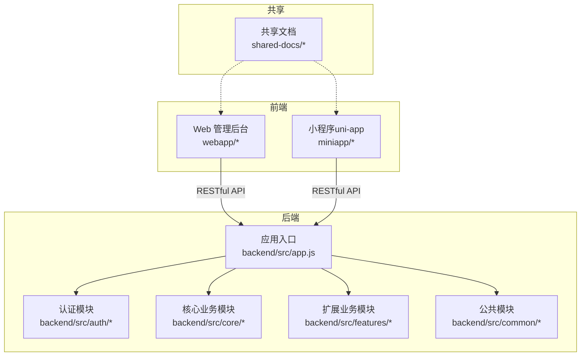
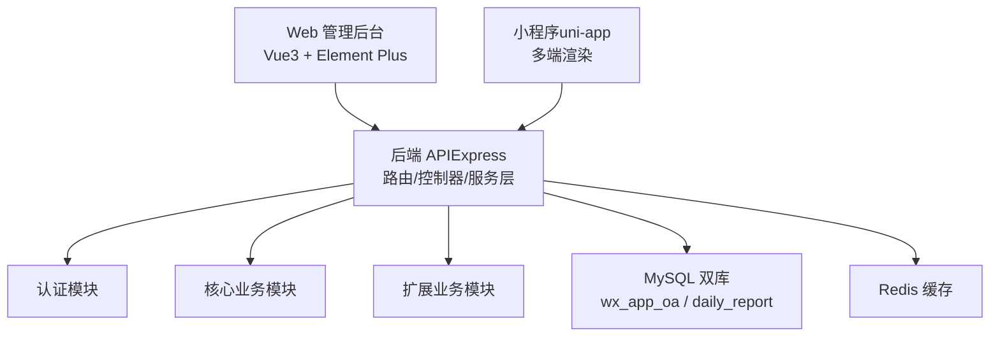
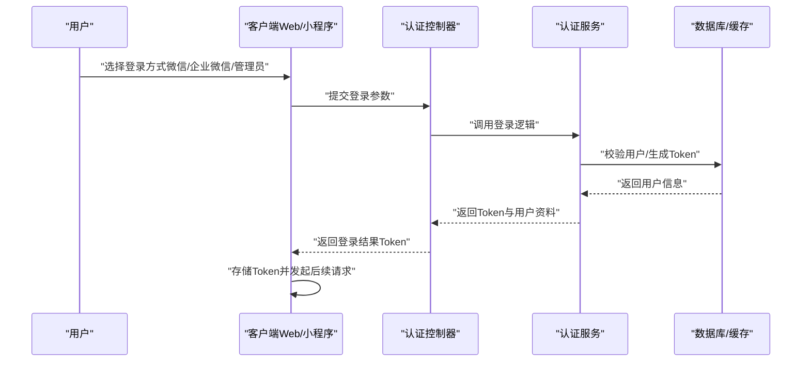
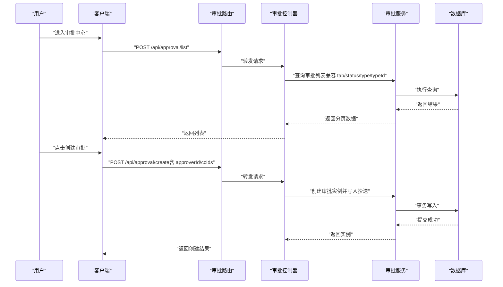
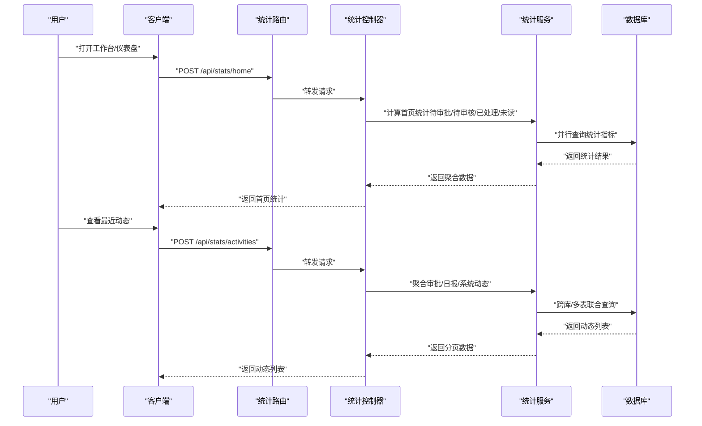
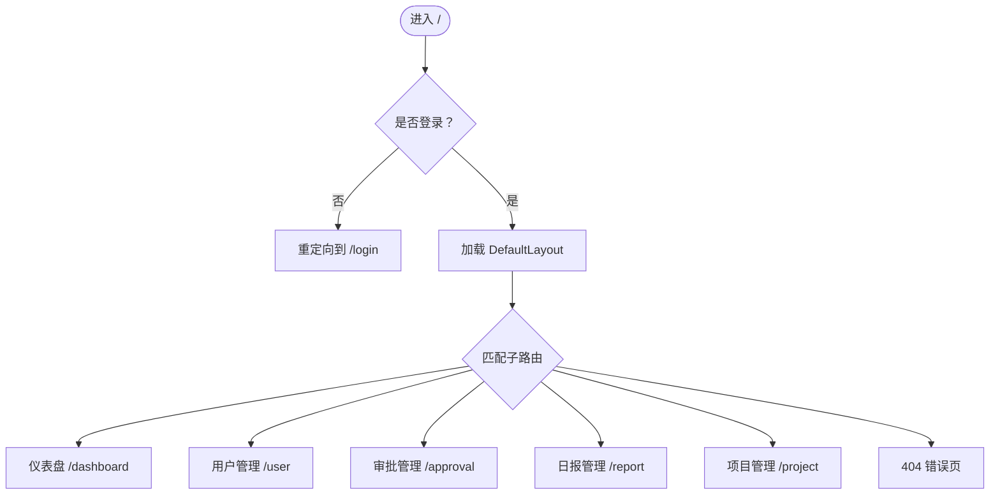
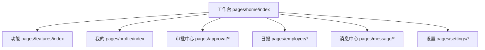
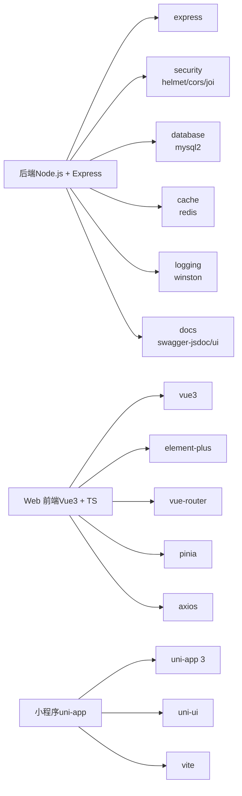

# 项目概述

<cite>
**本文引用的文件**
- [backend/src/app.js](file://backend/src/app.js)
- [backend/src/common/config/env.js](file://backend/src/common/config/env.js)
- [backend/docs/README.md](file://backend/docs/README.md)
- [backend/package.json](file://backend/package.json)
- [backend/src/auth/controllers/auth.controller.js](file://backend/src/auth/controllers/auth.controller.js)
- [backend/src/core/controllers/approval.controller.js](file://backend/src/core/controllers/approval.controller.js)
- [backend/src/features/controllers/stats.controller.js](file://backend/src/features/controllers/stats.controller.js)
- [shared-docs/overview.md](file://shared-docs/overview.md)
- [shared-docs/Tech-Plan.md](file://shared-docs/Tech-Plan.md)
- [webapp/src/main.ts](file://webapp/src/main.ts)
- [webapp/src/router/index.ts](file://webapp/src/router/index.ts)
- [webapp/src/views/dashboard/index.vue](file://webapp/src/views/dashboard/index.vue)
- [webapp/package.json](file://webapp/package.json)
- [miniapp/src/pages.json](file://miniapp/src/pages.json)
- [miniapp/src/main.js](file://miniapp/src/main.js)
- [miniapp/package.json](file://miniapp/package.json)
</cite>

## 目录
1. [简介](#简介)
2. [项目结构](#项目结构)
3. [核心组件](#核心组件)
4. [架构总览](#架构总览)
5. [详细组件分析](#详细组件分析)
6. [依赖分析](#依赖分析)
7. [性能考虑](#性能考虑)
8. [故障排查指南](#故障排查指南)
9. [结论](#结论)
10. [附录](#附录)

## 简介
智慧办公助手 OA 办公系统是一个面向现代组织的多端协同办公平台，围绕“统一认证、审批流转、日报管理、消息通知、统计看板”等核心业务展开。系统采用前后端分离架构，后端基于 Node.js + Express 提供 RESTful API，前端覆盖微信小程序与 Web 管理后台（Vue3 + TypeScript + Element Plus）。系统强调多端一致体验与高内聚低耦合的模块化设计，支持企业微信登录、二次验证、消息推送与权限控制，满足日常办公的审批、汇报、统计与管理需求。

## 项目结构
项目采用“根仓库 + 多端并行”的组织方式：
- backend：后端 API 服务，按模块分层（routes/controllers/services），内置认证、核心业务与扩展功能模块，并提供 Swagger 文档与统一响应格式。
- webapp：Web 管理后台，基于 Vue3 + TypeScript + Element Plus，提供用户、审批、日报、项目等管理视图。
- miniapp：基于 uni-app 的多端小程序，覆盖工作台、审批、日报、消息、设置等功能页面。
- shared-docs：跨端共享文档，包含最终交付概览、技术方案与对接规范等。
- 其他目录：脚本、测试、文档等支撑性内容。

图表来源
- [backend/src/app.js:142-141](file://backend/src/app.js#L142-L141)
- [backend/docs/README.md:37-53](file://backend/docs/README.md#L37-L53)
- [webapp/src/router/index.ts:1-77](file://webapp/src/router/index.ts#L1-L77)
- [miniapp/src/pages.json:1-220](file://miniapp/src/pages.json#L1-L220)

章节来源
- [backend/docs/README.md:17-65](file://backend/docs/README.md#L17-L65)
- [shared-docs/overview.md:3-32](file://shared-docs/overview.md#L3-L32)

## 核心组件
- 认证与用户中心：提供微信 code 登录、Web 管理员登录、企业微信登录、TOTP 二次验证、用户资料查询与更新等能力。
- 审批管理：支持审批列表、详情、创建（含抄送 ccIds）、审批动作（通过/驳回）与参数兼容适配。
- 日报管理：支持日报提交（扩展多字段）、草稿保存/获取、删除等，兼容旧版数据库字段映射。
- 消息通知：提供消息列表、标记已读、详情展示与字段映射。
- 统计看板：首页统计、最近动态聚合、个人中心统计等。
- 审核管理（Admin）：管理员视角的审核列表、详情、操作与统计。
- Web 管理后台：基于 Vue3 + TypeScript + Element Plus，提供仪表盘、用户、审批、日报、项目等视图与路由守卫。

章节来源
- [backend/src/auth/controllers/auth.controller.js:12-162](file://backend/src/auth/controllers/auth.controller.js#L12-L162)
- [backend/src/core/controllers/approval.controller.js:10-138](file://backend/src/core/controllers/approval.controller.js#L10-L138)
- [backend/src/features/controllers/stats.controller.js:11-81](file://backend/src/features/controllers/stats.controller.js#L11-L81)
- [webapp/src/views/dashboard/index.vue:1-147](file://webapp/src/views/dashboard/index.vue#L1-L147)

## 架构总览
系统采用“后端 API + 多前端应用”的前后端分离架构：
- 后端以 Express 为核心，通过中间件实现安全加固（Helmet/CORS/限流）、统一日志、Swagger 文档、全局错误处理与优雅停机。
- 前端分为 Web 管理后台与小程序，分别使用 Vue3 + Element Plus 与 uni-app，通过统一的 RESTful API 进行数据交互。
- 数据层采用双库策略：wx_app_oa 主库承载新业务，daily_report 旧库兼容历史数据，跨库查询通过服务层整合。
- 缓存层使用 Redis，结合 JWT 实现会话与权限控制。

图表来源
- [backend/src/app.js:29-141](file://backend/src/app.js#L29-L141)
- [backend/src/common/config/env.js:58-87](file://backend/src/common/config/env.js#L58-L87)
- [webapp/src/main.ts:1-28](file://webapp/src/main.ts#L1-L28)
- [miniapp/src/main.js:1-11](file://miniapp/src/main.js#L1-L11)

章节来源
- [backend/src/app.js:29-141](file://backend/src/app.js#L29-L141)
- [backend/src/common/config/env.js:50-118](file://backend/src/common/config/env.js#L50-L118)

## 详细组件分析

### 认证与登录流程
系统支持多种登录方式，统一通过认证模块处理，并下发 JWT Token 供后续接口鉴权使用。

图表来源
- [backend/src/auth/controllers/auth.controller.js:12-162](file://backend/src/auth/controllers/auth.controller.js#L12-L162)

章节来源
- [backend/src/auth/controllers/auth.controller.js:12-162](file://backend/src/auth/controllers/auth.controller.js#L12-L162)

### 审批管理（列表/详情/创建/审批）
审批模块提供完整的生命周期管理，支持参数兼容与抄送功能增强。

图表来源
- [backend/src/core/controllers/approval.controller.js:10-138](file://backend/src/core/controllers/approval.controller.js#L10-L138)

章节来源
- [backend/src/core/controllers/approval.controller.js:10-138](file://backend/src/core/controllers/approval.controller.js#L10-L138)

### 统计看板（首页/动态/个人中心）
统计模块聚合首页统计、最近动态与个人中心数据，支撑多端仪表盘展示。

图表来源
- [backend/src/features/controllers/stats.controller.js:11-81](file://backend/src/features/controllers/stats.controller.js#L11-L81)

章节来源
- [backend/src/features/controllers/stats.controller.js:11-81](file://backend/src/features/controllers/stats.controller.js#L11-L81)

### Web 管理后台路由与视图
Web 管理后台采用 Vue Router 管理页面导航，配合 Pinia 状态管理与 Element Plus 组件库，提供统一的管理界面。

图表来源
- [webapp/src/router/index.ts:1-77](file://webapp/src/router/index.ts#L1-L77)
- [webapp/src/views/dashboard/index.vue:1-147](file://webapp/src/views/dashboard/index.vue#L1-L147)

章节来源
- [webapp/src/router/index.ts:1-77](file://webapp/src/router/index.ts#L1-L77)
- [webapp/src/views/dashboard/index.vue:1-147](file://webapp/src/views/dashboard/index.vue#L1-L147)

### 小程序页面与导航
小程序端通过 pages.json 配置页面与 tabBar，统一导航栏与底部标签，提升多端一致性。

图表来源
- [miniapp/src/pages.json:1-220](file://miniapp/src/pages.json#L1-L220)

章节来源
- [miniapp/src/pages.json:1-220](file://miniapp/src/pages.json#L1-L220)

## 依赖分析
- 后端依赖：Express、helmet、cors、express-rate-limit、mysql2、redis、winston、swagger-jsdoc、swagger-ui-express、joi、jsonwebtoken、bcryptjs 等，覆盖安全、数据库、缓存、日志、文档与校验等能力。
- Web 前端依赖：Vue3、Element Plus、vue-router、pinia、axios、echarts、xlsx 等，提供现代化 UI 与数据可视化能力。
- 小程序前端依赖：uni-app 3、@dcloudio/uni-ui、sass、vite 等，支持多端构建与样式体系。

图表来源
- [backend/package.json:16-35](file://backend/package.json#L16-L35)
- [webapp/package.json:15-23](file://webapp/package.json#L15-L23)
- [miniapp/package.json:11-26](file://miniapp/package.json#L11-L26)

章节来源
- [backend/package.json:16-35](file://backend/package.json#L16-L35)
- [webapp/package.json:15-23](file://webapp/package.json#L15-L23)
- [miniapp/package.json:11-26](file://miniapp/package.json#L11-L26)

## 性能考虑
- 限流与安全：全局限流与登录端点限流，避免滥用；Helmet/CORS 配置降低常见攻击面。
- 数据库与缓存：双库策略与连接池配置，Redis 用于热点数据与会话缓存，减少数据库压力。
- 前端性能：按需加载组件与路由，Element Plus 图标全局注册减少体积；Vite 构建优化与 Tree Shaking。
- 统计聚合：统计模块采用并行查询与跨库合并，减少单次请求耗时；分页与懒加载降低首屏压力。

章节来源
- [backend/src/app.js:29-141](file://backend/src/app.js#L29-L141)
- [backend/src/common/config/env.js:58-87](file://backend/src/common/config/env.js#L58-L87)
- [webapp/src/main.ts:1-28](file://webapp/src/main.ts#L1-L28)

## 故障排查指南
- 环境变量缺失：启动时报错提示缺少必需环境变量，检查 NODE_ENV、PORT、数据库与 Redis、JWT、微信相关配置。
- 跨域与限流：若出现跨域或 429 限流，检查 CORS 配置与速率限制策略；登录失败被限流属预期行为。
- Swagger 文档：Swagger 挂载失败时查看日志输出，确认配置与依赖安装。
- 未捕获异常：后端对未捕获异常与未处理 Promise 拒绝进行记录与优雅停机，排查日志定位问题。
- 前端请求：开发模式下可通过 dev-mode-token 返回 mock 数据，便于联调；生产环境请移除 mock 分支。

章节来源
- [backend/src/common/config/env.js:13-44](file://backend/src/common/config/env.js#L13-L44)
- [backend/src/app.js:88-100](file://backend/src/app.js#L88-L100)
- [backend/src/app.js:195-204](file://backend/src/app.js#L195-L204)

## 结论
智慧办公助手 OA 办公系统以“统一认证 + 多端协同 + 统一 API + 分层模块化”为核心理念，实现了从审批、日报到统计看板的完整办公闭环。后端以 Express 为基础，结合安全中间件、统一响应与 Swagger 文档，保障稳定性与可维护性；前端以 Vue3 与 uni-app 为载体，提供一致的用户体验。项目具备良好的扩展性与演进空间，适合持续迭代与规模化推广。

## 附录
- 已完成模块与接口：详见最终交付报告中的模块与接口清单。
- 技术方案与风险：详见技术方案文档，涵盖模块设计、参数映射、字段对齐与风险缓解措施。
- Web 管理后台：基于 Vue3 + TypeScript + Element Plus，提供仪表盘与管理视图。
- 小程序页面：通过 pages.json 统一导航与样式，覆盖工作台、审批、日报、消息与设置。

章节来源
- [shared-docs/overview.md:3-108](file://shared-docs/overview.md#L3-L108)
- [shared-docs/Tech-Plan.md:21-52](file://shared-docs/Tech-Plan.md#L21-L52)
- [webapp/src/main.ts:1-28](file://webapp/src/main.ts#L1-L28)
- [miniapp/src/pages.json:1-220](file://miniapp/src/pages.json#L1-L220)