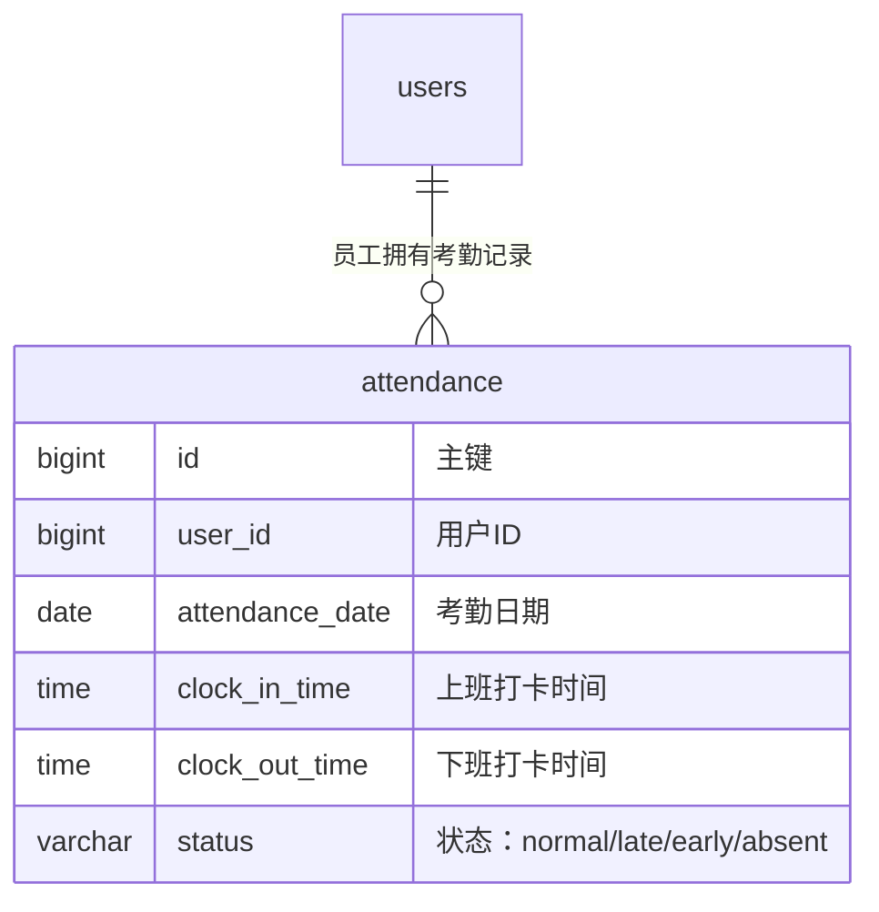

# 02-data-design — 数据设计模板

> 维度：数据模型（ER 图、DDL、索引、迁移）
> 读者：后端开发、DBA
> 上游依赖：`01-requirements.md`（需要知道有哪些实体）
> 下游影响：`03-api-design.md`（接口响应结构依赖表结构）、`06-tech-architecture.md`（服务层依赖表结构）

## 文档目标

定义本功能块的全部数据结构：实体关系图、完整建表 DDL、索引设计、迁移脚本。后端开发据此建表，API 设计据此定义响应结构。

## 1. ER 图

使用 Mermaid erDiagram 语法描述实体关系。

```mermaid
erDiagram
    <实体1> ||--o{ <实体2> : "<关系说明>"
    <实体1> {
        <类型> <字段名> "<注释>"
        <类型> <字段名> "<注释>"
    }
    <实体2> {
        <类型> <字段名> "<注释>"
    }
```

示例：



## 2. 完整建表 DDL

要求：
- 使用 `CREATE TABLE IF NOT EXISTS`
- 每个字段必须有注释 `COMMENT`
- 字符集统一 `utf8mb4`
- 表必须有注释

```sql
CREATE TABLE IF NOT EXISTS `<表名>` (
  `id` BIGINT UNSIGNED NOT NULL AUTO_INCREMENT COMMENT '主键ID',
  `<字段名>` <类型> <约束> COMMENT '<字段注释>',
  `created_at` DATETIME NOT NULL DEFAULT CURRENT_TIMESTAMP COMMENT '创建时间',
  `updated_at` DATETIME NOT NULL DEFAULT CURRENT_TIMESTAMP ON UPDATE CURRENT_TIMESTAMP COMMENT '更新时间',
  `deleted_at` DATETIME DEFAULT NULL COMMENT '软删除时间',
  PRIMARY KEY (`id`)
) ENGINE=InnoDB DEFAULT CHARSET=utf8mb4 COLLATE=utf8mb4_unicode_ci COMMENT='<表注释>';
```

### 新建表清单

<列出本功能块新建的所有表，每张表一份完整 DDL。>

#### 表1：`<表名>`

<说明这张表的用途。>

```sql
<完整 DDL>
```

### 扩展表（已有表加字段）

<如果需要给已有表加字段，列出 ALTER 语句。>

```sql
ALTER TABLE `<已有表名>` ADD COLUMN `<字段名>` <类型> <约束> COMMENT '<注释>';
```

## 3. 索引设计

| 索引名 | 表名 | 字段 | 类型 | 说明 |
|--------|------|------|------|------|
| idx_<表名>_<字段> | <表名> | <字段> | 普通 | <查询场景说明> |
| uk_<表名>_<字段> | <表名> | <字段> | 唯一 | <唯一约束说明> |
| idx_<表名>_<字段1>_<字段2> | <表名> | <字段1, 字段2> | 联合 | <联合查询场景> |

索引建表 DDL：

```sql
CREATE INDEX `idx_<表名>_<字段>` ON `<表名>`(`<字段>`);
CREATE UNIQUE INDEX `uk_<表名>_<字段>` ON `<表名>`(`<字段>`);
```

## 4. 迁移脚本

### 正向迁移（up）

要求：幂等执行，重复运行不报错。

```sql
-- 迁移：<功能名> 数据表初始化
-- 日期：YYYY-MM-DD
-- 作者：<姓名>

<所有 CREATE TABLE IF NOT EXISTS 语句>
<所有 ALTER TABLE 语句（先判断列是否存在）>
<所有 CREATE INDEX 语句>
```

### 回滚脚本（down）

```sql
-- 回滚：<功能名> 数据表清理
-- 日期：YYYY-MM-DD
-- 作者：<姓名>

<DROP TABLE IF EXISTS 语句（按依赖逆序）>
<DROP INDEX 语句>
```

## 5. 数据初始化（可选）

<如果需要预置初始数据（如枚举字典、默认配置），列出 INSERT 语句。>

```sql
INSERT INTO `<表名>` (`<字段1>`, `<字段2>`) VALUES
  ('<值1>', '<值2>'),
  ('<值3>', '<值4>');
```

## 变更记录

| 日期 | 变更内容 | 变更人 |
|------|---------|--------|
| YYYY-MM-DD | 初始创建 | <姓名> |
