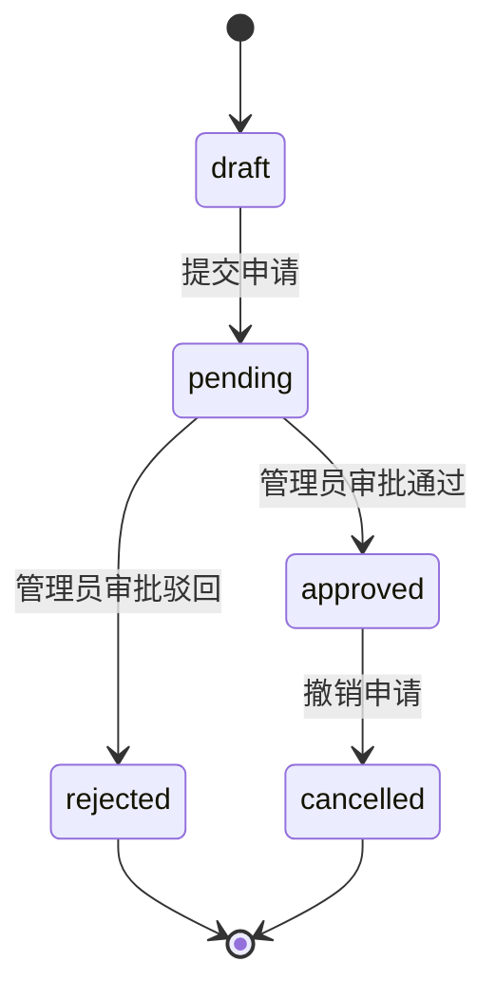

# 04-business-logic — 业务逻辑模板

> 维度：业务规则（核心规则、状态机、伪代码、映射表）
> 读者：后端开发、测试、产品
> 上游依赖：`01-requirements.md`（功能清单）、`02-data-design.md`（数据结构）、`03-api-design.md`（接口定义）
> 下游影响：`06-tech-architecture.md`（服务层实现业务逻辑）、`08-acceptance.md`（验收用例基于业务规则）

## 文档目标

用自然语言 + 状态机 + 伪代码定义本功能块的全部业务规则，使后端开发能精确实现，测试能据此编写用例。

## 1. 核心业务规则

<用自然语言描述每条业务规则，每条规则独立编号。>

### 规则 1：`<规则名>`

<规则描述。例：员工每日只能打卡一次上班和一次下班，重复打卡提示"今日已打卡"。>

- **触发条件**：<什么情况下触发此规则>
- **执行逻辑**：<规则的具体逻辑>
- **异常处理**：<违反规则时的处理>

### 规则 2：`<规则名>`

<同上格式。>

## 2. 状态机

<对有状态流转的实体，用 Mermaid stateDiagram 描述状态机。>

```mermaid
stateDiagram-v2
    [*] --> <状态1>
    <状态1> --> <状态2> : <触发条件>
    <状态2> --> <状态3> : <触发条件>
    <状态3> --> [*]
```



### 状态定义

| 状态 | 名称 | 说明 | 允许的操作 |
|------|------|------|-----------|
| <状态1> | <名称> | <说明> | <允许的操作列表> |
| <状态2> | <名称> | <说明> | <允许的操作列表> |

### 状态转换条件

| 起始状态 | 目标状态 | 触发条件 | 操作角色 | 副作用 |
|---------|---------|---------|---------|--------|
| <状态1> | <状态2> | <条件> | <角色> | <副作用说明> |
| <状态2> | <状态3> | <条件> | <角色> | <副作用说明> |

示例（请假申请状态机）：



## 3. 伪代码

<对关键业务逻辑，用伪代码描述函数签名和逻辑步骤。>

### 3.1 `<函数名1>`

**函数签名：**

```
function <函数名>(<参数1>: <类型>, <参数2>: <类型>): <返回类型>
```

**逻辑步骤：**

1. <步骤1：校验入参>
2. <步骤2：查询/校验数据>
3. <步骤3：执行业务逻辑>
4. <步骤4：写入/更新数据>
5. <步骤5：返回结果>

**伪代码：**

```
function <函数名>(<参数>):
    // 1. 校验入参
    if <参数> 为空:
        throw ParameterError("<错误信息>")

    // 2. 查询数据
    <变量> = repository.findById(<参数>)
    if <变量> 不存在:
        throw NotFoundError("<错误信息>")

    // 3. 校验业务规则
    if <条件>:
        throw BusinessError(<错误码>, "<错误信息>")

    // 4. 执行业务逻辑
    <变量>.<字段> = <新值>
    repository.save(<变量>)

    // 5. 返回结果
    return <返回值>
```

### 3.2 `<函数名2>`

<同上格式。>

## 4. 映射表

### 4.1 枚举值映射

| 字段 | 值 | 名称 | 说明 |
|------|-----|------|------|
| <字段名> | 0 | <名称> | <说明> |
| <字段名> | 1 | <名称> | <说明> |
| <字段名> | 2 | <名称> | <说明> |

### 4.2 转换规则

<描述数据转换规则。例：打卡时间在 09:00:00 之前为"正常"，09:00:00-09:30:00 为"迟到"，09:30:00 之后为"缺卡"。>

| 输入 | 条件 | 输出 |
|------|------|------|
| <输入值> | <条件> | <输出值> |

### 4.3 计算规则

<描述业务计算规则。例：考勤异常扣分规则：迟到1次扣2分，早退1次扣2分，缺卡1次扣5分。>

| 场景 | 计算公式 | 示例 |
|------|---------|------|
| <场景1> | <公式> | <示例> |
| <场景2> | <公式> | <示例> |

## 5. 权限规则

### RBAC 权限矩阵

| 操作 | employee | admin | superadmin |
|------|----------|-------|------------|
| <操作1，如：查看自己的考勤> | ✅ 自己 | ✅ 部门 | ✅ 全部 |
| <操作2，如：导出考勤报表> | ❌ | ✅ 部门 | ✅ 全部 |
| <操作3，如：修改考勤记录> | ❌ | ❌ | ✅ |

### 数据权限

| 角色 | 可见数据范围 |
|------|------------|
| employee | 仅自己的数据 |
| admin | 本部门所有员工的数据 |
| superadmin | 全部数据 |

## 变更记录

| 日期 | 变更内容 | 变更人 |
|------|---------|--------|
| YYYY-MM-DD | 初始创建 | <姓名> |
