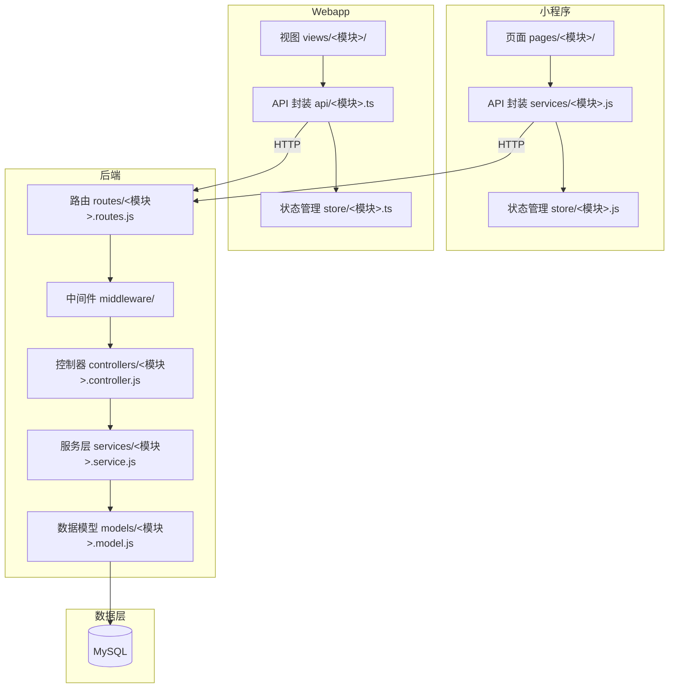

# 06-tech-architecture — 技术架构模板

> 维度：技术架构（系统架构图、模块划分、服务层、前端封装、中间件）
> 读者：后端开发、前端开发
> 上游依赖：`02-data-design.md`（数据结构）、`03-api-design.md`（接口契约）、`04-business-logic.md`（业务逻辑）
> 下游影响：`07-agent-matrix.md`（文件归属基于模块划分）、`architecture-blueprint.md`（蓝图汇总技术架构）

## 文档目标

定义本功能块的技术实现架构：系统架构图、模块划分、服务层设计、前端 API 封装、中间件设计。开发据此组织代码结构。

## 1. 系统架构图



## 2. 模块划分

### 后端模块

| 模块 | 路径 | 职责 |
|------|------|------|
| 路由层 | `backend/src/features/<模块>/routes/<模块>.routes.js` | 定义路由、绑定中间件 |
| 控制器层 | `backend/src/features/<模块>/controllers/<模块>.controller.js` | 参数校验、调用服务、返回响应 |
| 服务层 | `backend/src/features/<模块>/services/<模块>.service.js` | 业务逻辑实现 |
| 数据模型 | `backend/src/features/<模块>/models/<模块>.model.js` | Sequelize 模型定义 |
| 中间件 | `backend/src/middleware/<模块>.middleware.js` | 专属中间件（如权限校验） |

### 小程序模块

| 模块 | 路径 | 职责 |
|------|------|------|
| 页面 | `miniapp/src/pages/<模块>/` | 页面 UI 与交互 |
| API 封装 | `miniapp/src/services/<模块>.js` | 接口调用封装 |
| 状态管理 | `miniapp/src/store/<模块>.js` | 全局状态（如需要） |

### Webapp 模块

| 模块 | 路径 | 职责 |
|------|------|------|
| 视图 | `webapp/src/views/<模块>/` | 页面 UI 与交互 |
| API 封装 | `webapp/src/api/<模块>.ts` | 接口调用封装（TypeScript） |
| 状态管理 | `webapp/src/store/<模块>.ts` | Pinia 状态管理（如需要） |

## 3. 服务层设计

<对关键服务函数，给出伪代码签名和依赖关系。>

### 3.1 `<服务名>Service`

**文件**：`backend/src/features/<模块>/services/<模块>.service.js`

**函数签名：**

```javascript
class <模块>Service {
  // 创建
  async create(data, userId): Promise<Record>

  // 查询列表
  async list(query, userId, role): Promise<{ list: Record[], total: number }>

  // 查询详情
  async findById(id, userId, role): Promise<Record>

  // 更新
  async update(id, data, userId, role): Promise<Record>

  // 删除
  async delete(id, userId, role): Promise<void>

  // <其他业务方法>
  async <方法名>(<参数>): Promise<返回类型>
}
```

**依赖关系：**

- 依赖 `<其他模块>Service`：<原因>
- 依赖 `<模型>Model`：<数据访问>

### 3.2 `<其他服务>`

<同上格式。>

## 4. 前端 API 封装

### 4.1 小程序端

**文件**：`miniapp/src/services/<模块>.js`

```javascript
import request from '../utils/request'

export const <模块>Api = {
  // 列表查询
  list(params) {
    return request.post('/api/<模块>/list', params)
  },

  // 详情查询
  detail(id) {
    return request.get(`/api/<模块>/${id}`)
  },

  // 创建
  create(data) {
    return request.post('/api/<模块>/create', data)
  },

  // 更新
  update(id, data) {
    return request.post(`/api/<模块>/${id}/update`, data)
  },

  // 删除
  delete(id) {
    return request.post(`/api/<模块>/${id}/delete`)
  }
}
```

### 4.2 Webapp 端

**文件**：`webapp/src/api/<模块>.ts`

```typescript
import request from '@/utils/request'

export interface <模块>Item {
  id: string
  <字段1>: <类型>
  <字段2>: <类型>
  created_at: string
  updated_at: string
}

export interface <模块>ListParams {
  page: number
  pageSize: number
  <筛选字段>?: <类型>
}

export interface <模块>ListResult {
  list: <模块>Item[]
  total: number
}

export const <模块>Api = {
  list(params: <模块>ListParams): Promise<{ code: number; data: <模块>ListResult }> {
    return request.post('/api/<模块>/list', params)
  },

  detail(id: string): Promise<{ code: number; data: <模块>Item }> {
    return request.get(`/api/<模块>/${id}`)
  },

  create(data: Partial<<模块>Item>): Promise<{ code: number; data: <模块>Item }> {
    return request.post('/api/<模块>/create', data)
  },

  update(id: string, data: Partial<<模块>Item>): Promise<{ code: number; data: <模块>Item }> {
    return request.post(`/api/<模块>/${id}/update`, data)
  },

  delete(id: string): Promise<{ code: number }> {
    return request.post(`/api/<模块>/${id}/delete`)
  }
}
```

## 5. 中间件设计

### 5.1 authenticate（认证中间件）

```javascript
// backend/src/middleware/authenticate.js
function authenticate(req, res, next) {
  const token = req.headers.authorization?.replace('Bearer ', '')
  if (!token) {
    return res.status(401).json({ code: 40100, message: '未登录', data: null })
  }
  try {
    const payload = jwt.verify(token, JWT_SECRET)
    req.user = { id: payload.id, role: payload.role }
    next()
  } catch (err) {
    return res.status(401).json({ code: 40100, message: '登录已过期', data: null })
  }
}
```

### 5.2 requireRole（权限中间件）

```javascript
// backend/src/middleware/requireRole.js
function requireRole(...roles) {
  return (req, res, next) => {
    if (!roles.includes(req.user.role)) {
      return res.status(403).json({ code: 40300, message: '无权限', data: null })
    }
    next()
  }
}

// 使用示例：
// router.post('/export', authenticate, requireRole('admin', 'superadmin'), controller.export)
```

### 5.3 errorHandler（错误处理中间件）

```javascript
// backend/src/middleware/errorHandler.js
function errorHandler(err, req, res, next) {
  console.error(err)
  if (err instanceof BusinessError) {
    return res.json({ code: err.code, message: err.message, data: null })
  }
  return res.status(500).json({ code: 50000, message: '服务器错误', data: null })
}
```

### 5.4 本功能块专属中间件

<如果本功能块需要专属中间件（如数据归属校验），在此定义。>

```javascript
// backend/src/middleware/<模块>.middleware.js
function <校验名>(req, res, next) {
  // <校验逻辑>
  next()
}
```

## 6. 路由定义

**文件**：`backend/src/features/<模块>/routes/<模块>.routes.js`

```javascript
import express from 'express'
import { authenticate, requireRole } from '../../../middleware/auth.js'
import controller from '../controllers/<模块>.controller.js'

const router = express.Router()

router.post('/list', authenticate, controller.list)
router.get('/:id', authenticate, controller.detail)
router.post('/create', authenticate, controller.create)
router.post('/:id/update', authenticate, controller.update)
router.post('/:id/delete', authenticate, requireRole('admin', 'superadmin'), controller.delete)

export default router
```

## 变更记录

| 日期 | 变更内容 | 变更人 |
|------|---------|--------|
| YYYY-MM-DD | 初始创建 | <姓名> |
