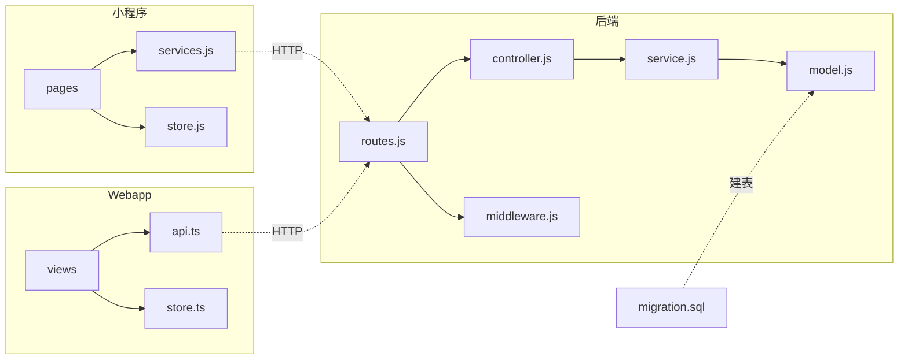

# 07-agent-matrix — Agent 归属模板

> 维度：代码归属（Agent 归属表、目录结构、文件清单、依赖关系）
> 读者：所有开发 Agent（backend-agent / miniapp-agent / webapp-agent）
> 上游依赖：`06-tech-architecture.md`（模块划分）
> 下游影响：`architecture-blueprint.md`（蓝图汇总归属）、阶段 4 implement（Agent 按归属表领取任务）

## 文档目标

定义本功能块每个文件的归属 Agent，避免多 Agent 协作时冲突。Agent 据此知道自己要生成哪些文件。

## 1. Agent 归属表

| 文件路径 | 归属 Agent | 类型 | 上游依赖 |
|---------|-----------|------|---------|
| `backend/src/features/<模块>/routes/<模块>.routes.js` | backend-agent | 路由 | 03-api-design.md |
| `backend/src/features/<模块>/controllers/<模块>.controller.js` | backend-agent | 控制器 | 03-api-design.md |
| `backend/src/features/<模块>/services/<模块>.service.js` | backend-agent | 服务层 | 04-business-logic.md |
| `backend/src/features/<模块>/models/<模块>.model.js` | backend-agent | 数据模型 | 02-data-design.md |
| `backend/src/middleware/<模块>.middleware.js` | backend-agent | 中间件 | 06-tech-architecture.md |
| `backend/src/migrations/<时间戳>_<模块>.sql` | backend-agent | 迁移脚本 | 02-data-design.md |
| `miniapp/src/pages/<模块>/index.vue` | miniapp-agent | 页面 | 05-ui-ux.md |
| `miniapp/src/pages/<模块>/detail.vue` | miniapp-agent | 页面 | 05-ui-ux.md |
| `miniapp/src/pages/<模块>/form.vue` | miniapp-agent | 页面 | 05-ui-ux.md |
| `miniapp/src/services/<模块>.js` | miniapp-agent | API 封装 | 03-api-design.md |
| `miniapp/src/store/<模块>.js` | miniapp-agent | 状态管理 | 06-tech-architecture.md |
| `webapp/src/views/<模块>/index.vue` | webapp-agent | 视图 | 05-ui-ux.md |
| `webapp/src/views/<模块>/components/<组件>.vue` | webapp-agent | 组件 | 05-ui-ux.md |
| `webapp/src/api/<模块>.ts` | webapp-agent | API 封装 | 03-api-design.md |
| `webapp/src/store/<模块>.ts` | webapp-agent | 状态管理 | 06-tech-architecture.md |

## 2. 目录结构树

```
backend/src/features/<模块>/
├── routes/
│   └── <模块>.routes.js
├── controllers/
│   └── <模块>.controller.js
├── services/
│   └── <模块>.service.js
└── models/
    └── <模块>.model.js

backend/src/middleware/
└── <模块>.middleware.js

backend/src/migrations/
└── <时间戳>_<模块>.sql

miniapp/src/
├── pages/
│   └── <模块>/
│       ├── index.vue          # 列表页
│       ├── detail.vue         # 详情页
│       └── form.vue           # 表单页
├── services/
│   └── <模块>.js
└── store/
    └── <模块>.js

webapp/src/
├── views/
│   └── <模块>/
│       ├── index.vue          # 列表页
│       └── components/
│           └── <组件>.vue     # 业务组件
├── api/
│   └── <模块>.ts
└── store/
    └── <模块>.ts
```

## 3. 文件清单

### 3.1 后端文件（backend-agent）

| # | 路径 | 用途 | 行数预估 |
|---|------|------|---------|
| 1 | `backend/src/features/<模块>/routes/<模块>.routes.js` | 路由定义 | ~30 |
| 2 | `backend/src/features/<模块>/controllers/<模块>.controller.js` | 控制器，参数校验 | ~100 |
| 3 | `backend/src/features/<模块>/services/<模块>.service.js` | 服务层，业务逻辑 | ~200 |
| 4 | `backend/src/features/<模块>/models/<模块>.model.js` | Sequelize 模型 | ~60 |
| 5 | `backend/src/middleware/<模块>.middleware.js` | 专属中间件 | ~40 |
| 6 | `backend/src/migrations/<时间戳>_<模块>.sql` | 数据库迁移 | ~80 |

### 3.2 小程序文件（miniapp-agent）

| # | 路径 | 用途 | 行数预估 |
|---|------|------|---------|
| 1 | `miniapp/src/pages/<模块>/index.vue` | 列表页 | ~200 |
| 2 | `miniapp/src/pages/<模块>/detail.vue` | 详情页 | ~150 |
| 3 | `miniapp/src/pages/<模块>/form.vue` | 表单页 | ~180 |
| 4 | `miniapp/src/services/<模块>.js` | API 封装 | ~50 |
| 5 | `miniapp/src/store/<模块>.js` | 状态管理 | ~40 |

### 3.3 Webapp 文件（webapp-agent）

| # | 路径 | 用途 | 行数预估 |
|---|------|------|---------|
| 1 | `webapp/src/views/<模块>/index.vue` | 列表页 | ~250 |
| 2 | `webapp/src/views/<模块>/components/<组件>.vue` | 业务组件 | ~100 |
| 3 | `webapp/src/api/<模块>.ts` | API 封装 | ~60 |
| 4 | `webapp/src/store/<模块>.ts` | 状态管理 | ~40 |

## 4. 依赖关系图



### 生成顺序

1. `migration.sql` → `model.js`（数据层先行）
2. `service.js`（依赖 model）
3. `controller.js`（依赖 service）
4. `routes.js` + `middleware.js`（依赖 controller）
5. 前端 API 封装（`services.js` / `api.ts`，依赖接口契约）
6. 前端页面/视图（依赖 API 封装 + 状态管理）

## 5. Agent 协作规则

- **backend-agent 先行**：后端接口定义完成后，前端 Agent 才能开始封装 API
- **并行边界**：三端文件互不冲突，可并行生成（后端完成后）
- **共享契约**：`03-api-design.md` 是前后端共享契约，任何一方修改接口需先更新此文档
- **禁止跨端修改**：backend-agent 不得修改前端文件，反之亦然

## 变更记录

| 日期 | 变更内容 | 变更人 |
|------|---------|--------|
| YYYY-MM-DD | 初始创建 | <姓名> |
