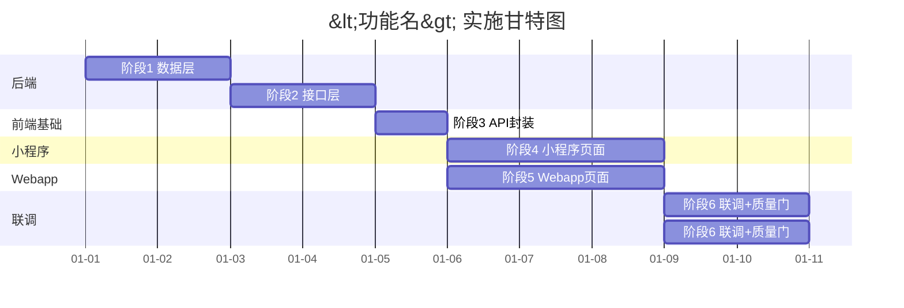

# 09-milestones — 里程碑模板

> 维度：实施计划（阶段、依赖、Agent 分工、风险）
> 读者：项目负责人、所有开发 Agent
> 上游依赖：`07-agent-matrix.md`（文件归属与工作量）、`08-acceptance.md`（验收标准）
> 下游影响：阶段 4 implement（按阶段顺序执行）

## 文档目标

定义本功能块的实施计划：阶段划分、依赖关系、Agent 分工、风险项。团队据此协调开发节奏。

## 1. 实施阶段

### 阶段概览

| 阶段 | 内容 | 产出 | 依赖 | 预估工期 |
|------|------|------|------|---------|
| 1 | 数据层 + 后端基础 | migration + model + service | 无 | <天数> |
| 2 | 后端接口 | controller + routes + middleware | 阶段 1 | <天数> |
| 3 | 前端基础 | API 封装 + 状态管理 | 阶段 2（接口定义完成） | <天数> |
| 4 | 小程序页面 | pages 列表/详情/表单 | 阶段 3 | <天数> |
| 5 | Webapp 页面 | views 列表/表单/组件 | 阶段 3 | <天数> |
| 6 | 联调 + 质量门 | 全链路联调 + 9 项检查 | 阶段 4 + 5 | <天数> |

### 阶段详细

#### 阶段 1：数据层 + 后端基础

- **内容**：建表迁移脚本、Sequelize 模型、服务层业务逻辑
- **产出文件**：
  - `backend/src/migrations/<时间戳>_<模块>.sql`
  - `backend/src/features/<模块>/models/<模块>.model.js`
  - `backend/src/features/<模块>/services/<模块>.service.js`
- **校验**：迁移脚本可执行，服务层单测通过

#### 阶段 2：后端接口

- **内容**：控制器、路由、中间件
- **产出文件**：
  - `backend/src/features/<模块>/controllers/<模块>.controller.js`
  - `backend/src/features/<模块>/routes/<模块>.routes.js`
  - `backend/src/middleware/<模块>.middleware.js`
- **校验**：Postman 调用全部接口正常

#### 阶段 3：前端基础

- **内容**：前端 API 封装、状态管理
- **产出文件**：
  - `miniapp/src/services/<模块>.js`
  - `miniapp/src/store/<模块>.js`
  - `webapp/src/api/<模块>.ts`
  - `webapp/src/store/<模块>.ts`
- **校验**：API 封装可调用，类型定义无报错

#### 阶段 4：小程序页面

- **内容**：列表页、详情页、表单页
- **产出文件**：
  - `miniapp/src/pages/<模块>/index.vue`
  - `miniapp/src/pages/<模块>/detail.vue`
  - `miniapp/src/pages/<模块>/form.vue`
- **校验**：页面可渲染，基础交互正常

#### 阶段 5：Webapp 页面

- **内容**：列表页、业务组件
- **产出文件**：
  - `webapp/src/views/<模块>/index.vue`
  - `webapp/src/views/<模块>/components/<组件>.vue`
- **校验**：页面可渲染，基础交互正常

#### 阶段 6：联调 + 质量门

- **内容**：前后端联调、9 项质量门检查、bug 修复
- **产出**：质量门 9/9 通过
- **校验**：`08-acceptance.md` 全部 checklist 通过

## 2. 依赖关系



### 关键依赖路径

```
阶段1（数据层）→ 阶段2（接口）→ 阶段3（前端基础）
                                    ↓
                        ┌───────────┴───────────┐
                        ↓                       ↓
                  阶段4（小程序）          阶段5（Webapp）
                        └───────────┬───────────┘
                                    ↓
                            阶段6（联调+质量门）
```

- 阶段 4 和阶段 5 **可并行**（小程序与 Webapp 独立）
- 阶段 3 必须等阶段 2 完成（接口定义稳定后才能封装）
- 阶段 6 必须等阶段 4 和阶段 5 都完成

## 3. Agent 分工表

| 阶段 | Agent | 任务 | 预估工期 | 并行 |
|------|-------|------|---------|------|
| 1 | backend-agent | migration + model + service | 2d | — |
| 2 | backend-agent | controller + routes + middleware | 2d | — |
| 3 | miniapp-agent + webapp-agent | API 封装 + 状态管理 | 1d | 两端并行 |
| 4 | miniapp-agent | 小程序 3 个页面 | 3d | 与阶段5并行 |
| 5 | webapp-agent | Webapp 页面 + 组件 | 3d | 与阶段4并行 |
| 6 | backend-agent + miniapp-agent + webapp-agent | 联调 + 质量门 + bug 修复 | 2d | 三端协同 |

### Agent 负载统计

| Agent | 总工期 | 并行后实际工期 |
|-------|--------|--------------|
| backend-agent | 6d | 6d |
| miniapp-agent | 4d | 4d（阶段3+4） |
| webapp-agent | 4d | 4d（阶段3+5） |
| **总计** | 14d | **8d**（并行优化后） |

## 4. 风险项

| # | 风险 | 影响 | 概率 | 应对 |
|---|------|------|------|------|
| 1 | 数据库迁移与现有数据冲突 | 迁移失败，阻塞后端 | 中 | 迁移脚本幂等设计，先在测试环境验证 |
| 2 | 接口定义变更导致前端返工 | 前端封装需重写 | 中 | 接口定义阶段 2 完成后冻结，变更走变更流程 |
| 3 | 小程序兼容性问题 | 部分机型页面错乱 | 低 | 开发期多机型测试，关键页面 iOS/Android 双测 |
| 4 | 并发场景数据一致性 | 数据不一致 | 中 | 服务层加事务，乐观锁/悲观锁按场景选择 |
| 5 | 工期估算偏差 | 延期交付 | 中 | 每阶段留 20% buffer，阶段 3 后重新评估 |
| 6 | 三端联调问题多 | 联调阶段超时 | 中 | 阶段 2 完成后提供 Mock 接口，前端提前自测 |

## 5. 里程碑节点

| 里程碑 | 完成标志 | 预计日期 |
|--------|---------|---------|
| M1 后端就绪 | 阶段 1+2 完成，接口可调用 | YYYY-MM-DD |
| M2 前端就绪 | 阶段 3+4+5 完成，页面可操作 | YYYY-MM-DD |
| M3 质量通过 | 阶段 6 完成，9 项质量门通过 | YYYY-MM-DD |
| M4 上线就绪 | README 完成，git commit 完成 | YYYY-MM-DD |

## 变更记录

| 日期 | 变更内容 | 变更人 |
|------|---------|--------|
| YYYY-MM-DD | 初始创建 | <姓名> |
