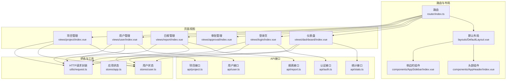
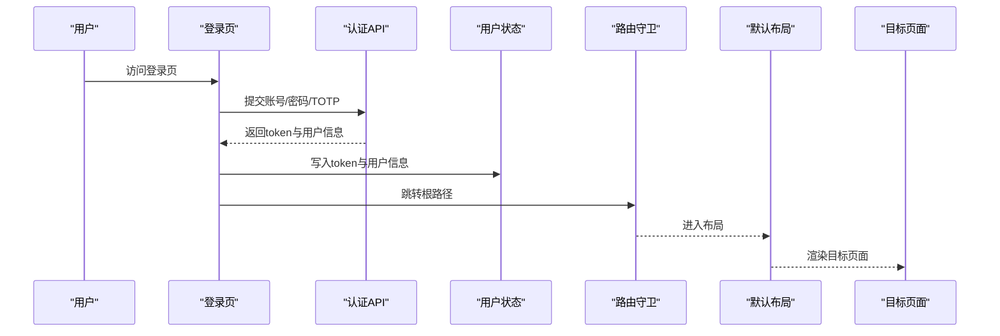
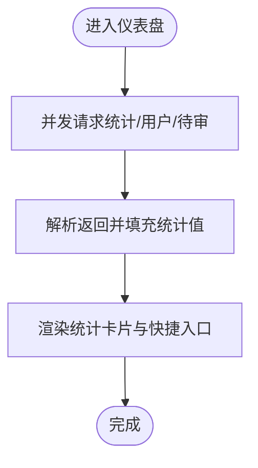
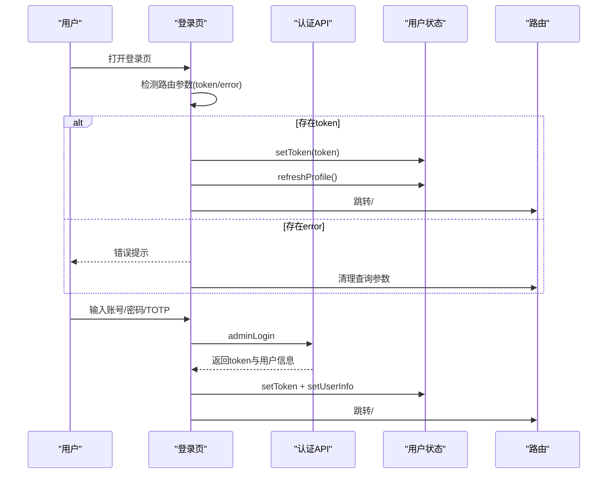
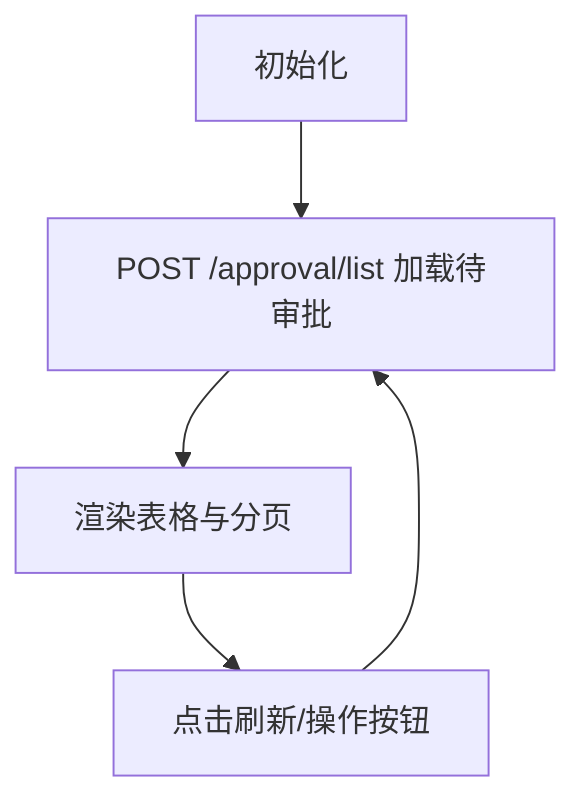
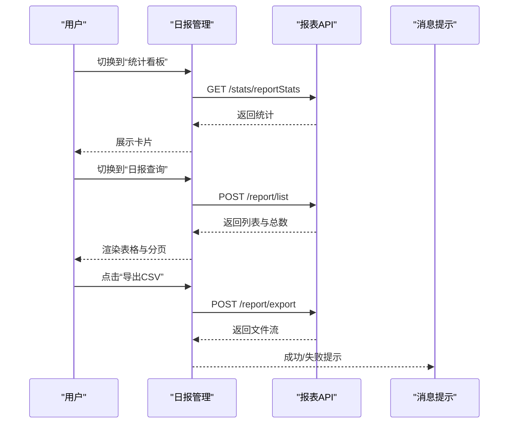
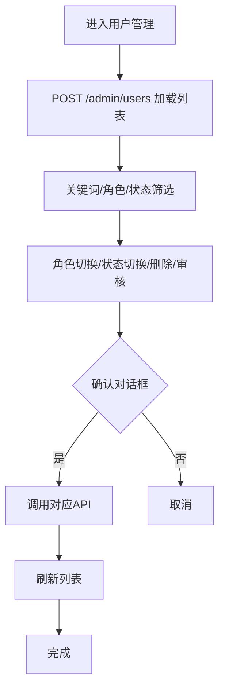
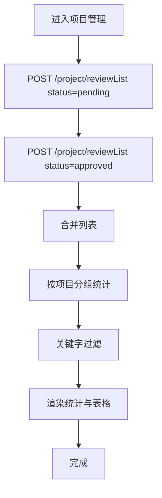
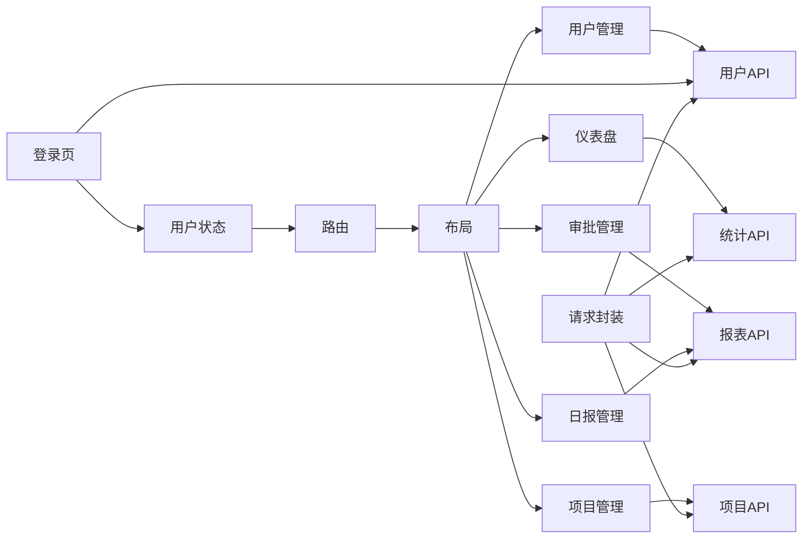

# 功能页面

<cite>
**本文引用的文件**
- [webapp/src/views/dashboard/index.vue](file://webapp/src/views/dashboard/index.vue)
- [webapp/src/views/login/index.vue](file://webapp/src/views/login/index.vue)
- [webapp/src/views/approval/index.vue](file://webapp/src/views/approval/index.vue)
- [webapp/src/views/report/index.vue](file://webapp/src/views/report/index.vue)
- [webapp/src/views/user/index.vue](file://webapp/src/views/user/index.vue)
- [webapp/src/views/project/index.vue](file://webapp/src/views/project/index.vue)
- [webapp/src/router/index.ts](file://webapp/src/router/index.ts)
- [webapp/src/layouts/DefaultLayout.vue](file://webapp/src/layouts/DefaultLayout.vue)
- [webapp/src/components/AppHeader/index.vue](file://webapp/src/components/AppHeader/index.vue)
- [webapp/src/components/AppSidebar/index.vue](file://webapp/src/components/AppSidebar/index.vue)
- [webapp/src/stores/user.ts](file://webapp/src/stores/user.ts)
- [webapp/src/stores/app.ts](file://webapp/src/stores/app.ts)
- [webapp/src/utils/request.ts](file://webapp/src/utils/request.ts)
- [webapp/src/api/auth.ts](file://webapp/src/api/auth.ts)
- [webapp/src/api/user.ts](file://webapp/src/api/user.ts)
- [webapp/src/api/report.ts](file://webapp/src/api/report.ts)
- [webapp/src/api/stats.ts](file://webapp/src/api/stats.ts)
- [webapp/src/api/project.ts](file://webapp/src/api/project.ts)
</cite>

## 目录
1. [简介](#简介)
2. [项目结构](#项目结构)
3. [核心组件](#核心组件)
4. [架构总览](#架构总览)
5. [详细组件分析](#详细组件分析)
6. [依赖分析](#依赖分析)
7. [性能考量](#性能考量)
8. [故障排查指南](#故障排查指南)
9. [结论](#结论)
10. [附录](#附录)

## 简介
本文件面向 Web 管理后台的功能页面，系统化梳理仪表盘、登录页、审批管理、日报管理、用户管理、项目管理等核心页面的实现方式，覆盖数据获取、状态管理、用户交互、表单校验、布局与路由、权限控制、页面间导航与数据流转、错误处理等关键主题，并提供开发最佳实践与优化建议。

## 项目结构
Web 管理后台采用 Vue 3 + TypeScript + Element Plus + Pinia 的前端技术栈，页面位于 views 目录下，路由集中于 router/index.ts，布局组件位于 layouts 与 components，状态管理位于 stores，HTTP 请求封装于 utils/request.ts，API 接口定义位于 api 目录。

图表来源
- [webapp/src/router/index.ts:1-77](file://webapp/src/router/index.ts#L1-L77)
- [webapp/src/layouts/DefaultLayout.vue:1-54](file://webapp/src/layouts/DefaultLayout.vue#L1-L54)
- [webapp/src/components/AppHeader/index.vue:1-89](file://webapp/src/components/AppHeader/index.vue#L1-L89)
- [webapp/src/components/AppSidebar/index.vue:1-148](file://webapp/src/components/AppSidebar/index.vue#L1-L148)
- [webapp/src/views/dashboard/index.vue:1-147](file://webapp/src/views/dashboard/index.vue#L1-L147)
- [webapp/src/views/login/index.vue:1-211](file://webapp/src/views/login/index.vue#L1-L211)
- [webapp/src/views/approval/index.vue:1-77](file://webapp/src/views/approval/index.vue#L1-L77)
- [webapp/src/views/report/index.vue:1-290](file://webapp/src/views/report/index.vue#L1-L290)
- [webapp/src/views/user/index.vue:1-289](file://webapp/src/views/user/index.vue#L1-L289)
- [webapp/src/views/project/index.vue:1-117](file://webapp/src/views/project/index.vue#L1-L117)
- [webapp/src/stores/user.ts:1-54](file://webapp/src/stores/user.ts#L1-L54)
- [webapp/src/stores/app.ts:1-30](file://webapp/src/stores/app.ts#L1-L30)
- [webapp/src/utils/request.ts:1-77](file://webapp/src/utils/request.ts#L1-L77)
- [webapp/src/api/auth.ts:1-31](file://webapp/src/api/auth.ts#L1-L31)
- [webapp/src/api/user.ts:1-63](file://webapp/src/api/user.ts#L1-L63)
- [webapp/src/api/report.ts:1-106](file://webapp/src/api/report.ts#L1-L106)
- [webapp/src/api/stats.ts:1-51](file://webapp/src/api/stats.ts#L1-L51)
- [webapp/src/api/project.ts:1-53](file://webapp/src/api/project.ts#L1-L53)

章节来源
- [webapp/src/router/index.ts:1-77](file://webapp/src/router/index.ts#L1-L77)
- [webapp/src/layouts/DefaultLayout.vue:1-54](file://webapp/src/layouts/DefaultLayout.vue#L1-L54)

## 核心组件
- 路由与守卫：负责页面导航、登录态校验与公共/受保护路由区分。
- 默认布局：包含头部与侧边栏，承载主内容区与路由视图。
- 侧边栏菜单：根据路由元信息渲染图标与标题，支持折叠切换。
- 头部导航：显示面包屑与用户下拉菜单，支持个人中心与退出登录。
- 状态管理：Pinia 用户状态与应用状态，持久化 token，控制侧边栏折叠。
- 请求封装：Axios 实例，统一封装 Authorization 头、错误提示与 401 自动登出。

章节来源
- [webapp/src/router/index.ts:59-74](file://webapp/src/router/index.ts#L59-L74)
- [webapp/src/layouts/DefaultLayout.vue:1-54](file://webapp/src/layouts/DefaultLayout.vue#L1-L54)
- [webapp/src/components/AppHeader/index.vue:1-89](file://webapp/src/components/AppHeader/index.vue#L1-L89)
- [webapp/src/components/AppSidebar/index.vue:1-148](file://webapp/src/components/AppSidebar/index.vue#L1-L148)
- [webapp/src/stores/user.ts:1-54](file://webapp/src/stores/user.ts#L1-L54)
- [webapp/src/stores/app.ts:1-30](file://webapp/src/stores/app.ts#L1-L30)
- [webapp/src/utils/request.ts:1-77](file://webapp/src/utils/request.ts#L1-L77)

## 架构总览
页面级架构围绕“路由 -> 布局 -> 页面 -> API -> 状态”的链路展开。页面通过 API 层获取数据，使用 Element Plus 组件进行展示与交互；全局状态用于登录态与侧边栏状态；请求封装统一处理鉴权与错误。

图表来源
- [webapp/src/views/login/index.vue:37-65](file://webapp/src/views/login/index.vue#L37-L65)
- [webapp/src/api/auth.ts:22-30](file://webapp/src/api/auth.ts#L22-L30)
- [webapp/src/stores/user.ts:23-30](file://webapp/src/stores/user.ts#L23-L30)
- [webapp/src/router/index.ts:59-74](file://webapp/src/router/index.ts#L59-L74)
- [webapp/src/layouts/DefaultLayout.vue:14-26](file://webapp/src/layouts/DefaultLayout.vue#L14-L26)

## 详细组件分析

### 仪表盘页面
- 数据获取：进入页面并发拉取首页统计、用户总量、待审日报，使用 Promise.allSettled 并容错处理。
- 展示结构：统计卡片、快捷入口、最近动态三列布局；快捷入口直连各功能页。
- 交互细节：加载态、空态、点击快捷入口跳转；最近动态占位为空时显示“暂无动态”。

图表来源
- [webapp/src/views/dashboard/index.vue:30-54](file://webapp/src/views/dashboard/index.vue#L30-L54)

章节来源
- [webapp/src/views/dashboard/index.vue:1-147](file://webapp/src/views/dashboard/index.vue#L1-L147)
- [webapp/src/api/stats.ts:32-40](file://webapp/src/api/stats.ts#L32-L40)
- [webapp/src/api/user.ts:29-32](file://webapp/src/api/user.ts#L29-L32)
- [webapp/src/api/report.ts:78-83](file://webapp/src/api/report.ts#L78-L83)

### 登录页
- 企业微信 OAuth 回调：检测路由参数 token 或 error，成功写入 token 后刷新用户资料并跳转首页；失败提示并清理查询参数。
- 表单校验：基于 Element Plus Form 的必填规则；TOTP 可选。
- 账号密码登录：提交账号、密码、TOTP，成功后写入用户信息与 token，提示欢迎语并跳转首页。
- 企业微信登录：向后端获取 corpid，拼接授权 URL 跳转。

图表来源
- [webapp/src/views/login/index.vue:16-27](file://webapp/src/views/login/index.vue#L16-L27)
- [webapp/src/views/login/index.vue:37-65](file://webapp/src/views/login/index.vue#L37-L65)
- [webapp/src/api/auth.ts:22-30](file://webapp/src/api/auth.ts#L22-L30)
- [webapp/src/stores/user.ts:23-30](file://webapp/src/stores/user.ts#L23-L30)
- [webapp/src/router/index.ts:59-74](file://webapp/src/router/index.ts#L59-L74)

章节来源
- [webapp/src/views/login/index.vue:1-211](file://webapp/src/views/login/index.vue#L1-L211)
- [webapp/src/api/auth.ts:1-31](file://webapp/src/api/auth.ts#L1-L31)

### 审批管理
- 数据模型：定义审批项接口，包含标题、类型、申请人、部门、日期、状态与文本。
- 列表渲染：默认加载“待审批”Tab，支持刷新。
- 类型映射：将后端类型映射为中文标签；状态按类型渲染不同 Tag。
- Tab 切换：支持“待审批/我发起的/已处理”，当前实现聚焦待审批。

图表来源
- [webapp/src/views/approval/index.vue:27-39](file://webapp/src/views/approval/index.vue#L27-L39)

章节来源
- [webapp/src/views/approval/index.vue:1-77](file://webapp/src/views/approval/index.vue#L1-L77)

### 日报管理
- 三大 Tab：统计看板、日报查询、人员看板。
- 统计看板：加载总数量、月度数量、待审数量、已通过数量、通过率。
- 日报查询：关键词/状态/起止日期筛选，分页加载，支持导出 CSV、删除、审核（通过/驳回），行点击弹出详情。
- 人员看板：按人员统计总数/月度数/最后提交时间，支持跳转到该人员的日报查询。
- 导航联动：人员看板点击“查看日报”会自动切换到查询 Tab 并填充关键字。

图表来源
- [webapp/src/views/report/index.vue:54-61](file://webapp/src/views/report/index.vue#L54-L61)
- [webapp/src/views/report/index.vue:64-78](file://webapp/src/views/report/index.vue#L64-L78)
- [webapp/src/views/report/index.vue:83-104](file://webapp/src/views/report/index.vue#L83-L104)
- [webapp/src/api/report.ts:47-88](file://webapp/src/api/report.ts#L47-L88)

章节来源
- [webapp/src/views/report/index.vue:1-290](file://webapp/src/views/report/index.vue#L1-L290)
- [webapp/src/api/report.ts:1-106](file://webapp/src/api/report.ts#L1-L106)
- [webapp/src/api/stats.ts:47-50](file://webapp/src/api/stats.ts#L47-L50)

### 用户管理
- 查询过滤：关键词、角色、状态三类筛选，支持清空与回车触发。
- 表格字段：用户名、部门、角色、状态、联系方式、最后登录时间。
- 操作按钮：针对“待审核”状态提供“自动激活”提示；对非超级管理员用户支持“设为管理员/取消管理员”、“启用/禁用”、“删除”。
- 弹窗功能：注册新用户（预注册）、邀请用户（直接激活）。
- 状态切换：角色切换、状态切换、删除、审核通过均通过确认对话框二次确认。

图表来源
- [webapp/src/views/user/index.vue:45-58](file://webapp/src/views/user/index.vue#L45-L58)
- [webapp/src/views/user/index.vue:63-105](file://webapp/src/views/user/index.vue#L63-L105)
- [webapp/src/api/user.ts:29-62](file://webapp/src/api/user.ts#L29-L62)

章节来源
- [webapp/src/views/user/index.vue:1-289](file://webapp/src/views/user/index.vue#L1-L289)
- [webapp/src/api/user.ts:1-63](file://webapp/src/api/user.ts#L1-L63)

### 项目管理
- 数据聚合：合并“待审核”与“已通过”两类日报，按项目维度去重汇总用户数、统计数与最近提交时间。
- 搜索过滤：支持按项目名关键字过滤。
- 统计指标：活跃项目数、待审日报数、总日报数。
- 表格字段：项目名称、日报数、参与人数、最近日报时间。

图表来源
- [webapp/src/views/project/index.vue:43-55](file://webapp/src/views/project/index.vue#L43-L55)
- [webapp/src/views/project/index.vue:14-37](file://webapp/src/views/project/index.vue#L14-L37)

章节来源
- [webapp/src/views/project/index.vue:1-117](file://webapp/src/views/project/index.vue#L1-L117)
- [webapp/src/api/report.ts:78-83](file://webapp/src/api/report.ts#L78-L83)

## 依赖分析
- 路由与页面：路由配置 children 定义各页面路径与元信息；布局组件承载页面视图。
- 状态与权限：用户状态提供 token 与角色，路由守卫据此判断是否放行；头部组件读取用户信息展示。
- 请求与错误：请求封装统一注入 Authorization，响应拦截器处理 401/403/404/500 等错误并引导登出或提示。
- 页面与 API：各页面通过 API 模块调用后端接口，接口定义清晰，便于维护与扩展。

图表来源
- [webapp/src/router/index.ts:6-56](file://webapp/src/router/index.ts#L6-L56)
- [webapp/src/layouts/DefaultLayout.vue:14-26](file://webapp/src/layouts/DefaultLayout.vue#L14-L26)
- [webapp/src/views/dashboard/index.vue:3-6](file://webapp/src/views/dashboard/index.vue#L3-L6)
- [webapp/src/views/approval/index.vue:2-3](file://webapp/src/views/approval/index.vue#L2-L3)
- [webapp/src/views/report/index.vue:5-8](file://webapp/src/views/report/index.vue#L5-L8)
- [webapp/src/views/user/index.vue](file://webapp/src/views/user/index.vue#L5)
- [webapp/src/views/project/index.vue](file://webapp/src/views/project/index.vue#L5)
- [webapp/src/stores/user.ts:13-52](file://webapp/src/stores/user.ts#L13-L52)
- [webapp/src/utils/request.ts:15-74](file://webapp/src/utils/request.ts#L15-L74)

章节来源
- [webapp/src/router/index.ts:1-77](file://webapp/src/router/index.ts#L1-L77)
- [webapp/src/stores/user.ts:1-54](file://webapp/src/stores/user.ts#L1-L54)
- [webapp/src/utils/request.ts:1-77](file://webapp/src/utils/request.ts#L1-L77)

## 性能考量
- 并发加载：仪表盘使用 Promise.allSettled 并发请求，减少首屏等待；建议对高频接口增加缓存策略。
- 分页与懒加载：用户管理、日报查询、人员看板均采用分页，避免一次性传输大量数据。
- 图标与样式：使用 Element Plus 图标组件与 SCSS 变量，保持一致风格与较小体积。
- 请求拦截：统一注入 Authorization，避免重复逻辑；响应拦截集中处理错误，降低页面复杂度。
- 侧边栏折叠：通过 Pinia 控制宽度过渡，兼顾移动端体验与桌面端效率。

## 故障排查指南
- 登录失败/401：检查请求拦截器中 401 分支是否正确触发登出与跳转。
- 无权限/403：确认用户角色与权限集合，必要时在用户状态中扩展权限判定。
- 网络异常：响应拦截器对无 response 的情况给出“网络连接失败”提示。
- 企业微信登录：若提示未配置 corpid，检查后端返回与前端 URL 拼接逻辑。
- 表单校验：登录页对用户名/密码进行必填校验，确保提交前校验通过。

章节来源
- [webapp/src/utils/request.ts:46-74](file://webapp/src/utils/request.ts#L46-L74)
- [webapp/src/views/login/index.vue:67-80](file://webapp/src/views/login/index.vue#L67-L80)
- [webapp/src/stores/user.ts:38-41](file://webapp/src/stores/user.ts#L38-L41)

## 结论
本后台页面以路由与布局为核心骨架，结合 Pinia 状态管理与 Axios 封装，形成清晰的数据流与交互链路。各页面职责明确、接口契约清晰，具备良好的可维护性与扩展性。建议后续在权限细化、接口缓存、国际化与无障碍方面持续完善。

## 附录
- 页面导航关系：登录页为唯一公开页面，其余页面受路由守卫保护；默认布局承载侧边栏与头部，子路由渲染具体页面。
- 权限控制：当前通过用户状态中的角色与 token 判断登录态；可在用户状态中扩展 hasPermission 方法以支持细粒度权限。
- 最佳实践：
  - 页面内尽量使用组合式 API 管理本地状态，复杂共享状态放入 Pinia。
  - 对高频接口增加本地缓存与防抖，优化交互流畅度。
  - 统一错误提示与日志上报，便于问题定位。
  - 表单与列表操作均使用确认对话框，避免误操作。