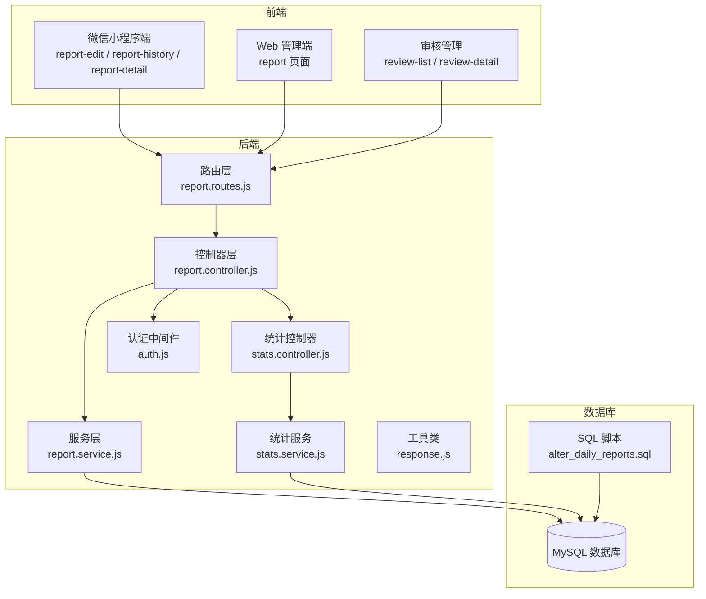
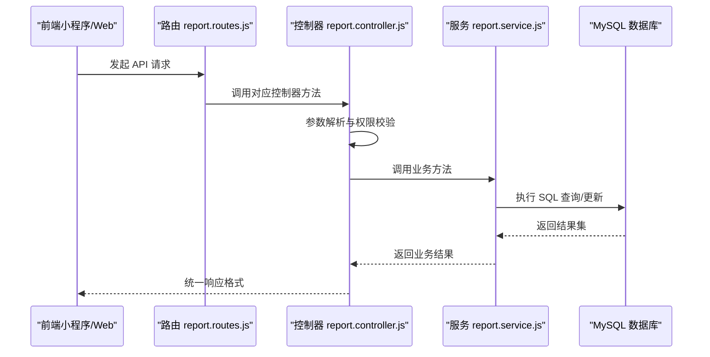
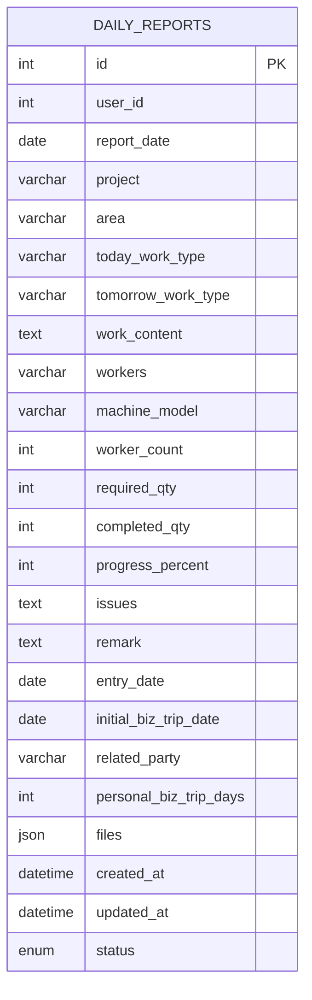
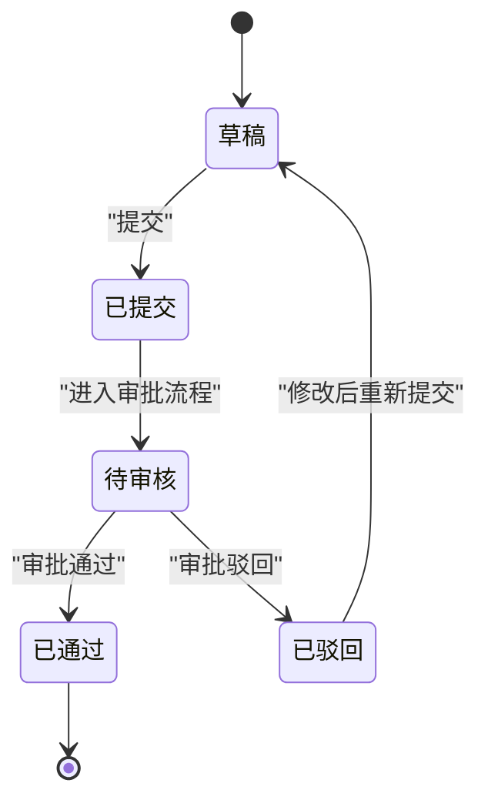
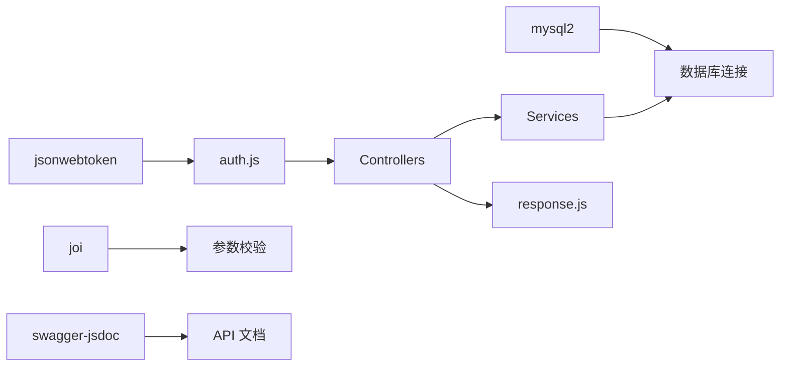

# 日报管理模块

<cite>
**本文档引用的文件**
- [report.controller.js](file://backend/src/core/controllers/report.controller.js)
- [report.service.js](file://backend/src/core/services/report.service.js)
- [report.routes.js](file://backend/src/core/routes/report.routes.js)
- [report.js](file://miniapp/src/services/modules/report.js)
- [report.ts](file://webapp/src/api/report.ts)
- [alter_daily_reports.sql](file://backend/scripts/alter_daily_reports.sql)
- [index.vue（日报编辑）](file://miniapp/src/pages/employee/report-edit/index.vue)
- [index.vue（日报历史）](file://miniapp/src/pages/employee/report-history/index.vue)
- [index.vue（日报详情）](file://miniapp/src/pages/employee/report-detail/index.vue)
- [index.vue（审核列表）](file://miniapp/src/pages/admin/review-list/index.vue)
- [index.vue（审核详情）](file://miniapp/src/pages/admin/review-detail/index.vue)
- [stats.service.js](file://backend/src/features/services/stats.service.js)
- [stats.controller.js](file://backend/src/features/controllers/stats.controller.js)
- [auth.js](file://backend/src/common/middleware/auth.js)
- [response.js](file://backend/src/common/utils/response.js)
- [package.json](file://backend/package.json)
</cite>

## 目录
1. [简介](#简介)
2. [项目结构](#项目结构)
3. [核心组件](#核心组件)
4. [架构概览](#架构概览)
5. [详细组件分析](#详细组件分析)
6. [依赖关系分析](#依赖关系分析)
7. [性能考虑](#性能考虑)
8. [故障排除指南](#故障排除指南)
9. [结论](#结论)
10. [附录](#附录)

## 简介
本文件为智慧办公助手 OA 系统的日报管理模块提供全面的技术文档。内容覆盖日报系统的完整生命周期管理，包括创建、编辑、草稿保存、提交审核、状态跟踪、导出统计等能力；详细说明数据结构设计、字段验证规则、数据完整性约束以及与审批流程的集成。同时，文档列举了所有相关 API 接口的请求参数与响应格式，并提供实际代码示例路径以展示复杂业务逻辑的实现细节，如批量操作、数据统计、报表生成等。

## 项目结构
日报管理模块位于后端核心层与前端多端应用之间，采用典型的三层架构：
- 后端核心层：控制器（Controller）、服务（Service）、路由（Route）
- 前端多端：微信小程序端与 Web 管理端
- 数据层：MySQL 数据库与索引优化

图表来源
- [report.routes.js:1-41](file://backend/src/core/routes/report.routes.js#L1-L41)
- [report.controller.js:1-172](file://backend/src/core/controllers/report.controller.js#L1-L172)
- [report.service.js:1-414](file://backend/src/core/services/report.service.js#L1-L414)
- [stats.controller.js:1-81](file://backend/src/features/controllers/stats.controller.js#L1-L81)
- [stats.service.js:1-309](file://backend/src/features/services/stats.service.js#L1-L309)
- [auth.js:1-83](file://backend/src/common/middleware/auth.js#L1-L83)
- [response.js:1-49](file://backend/src/common/utils/response.js#L1-L49)
- [alter_daily_reports.sql:1-29](file://backend/scripts/alter_daily_reports.sql#L1-L29)

章节来源
- [report.controller.js:1-172](file://backend/src/core/controllers/report.controller.js#L1-L172)
- [report.service.js:1-414](file://backend/src/core/services/report.service.js#L1-L414)
- [report.routes.js:1-41](file://backend/src/core/routes/report.routes.js#L1-L41)
- [alter_daily_reports.sql:1-29](file://backend/scripts/alter_daily_reports.sql#L1-L29)

## 核心组件
- 控制器层：负责接收请求、参数解析、调用服务层并返回统一响应格式
- 服务层：封装数据库操作、数据映射与业务规则（如重复提交保护、草稿与正式提交的区分）
- 路由层：定义 API 路径与认证中间件绑定
- 前端服务：封装 API 请求方法，供页面组件调用
- 统计服务：提供首页统计、活动聚合、个人统计与日报看板统计
- 认证中间件：基于 JWT 的用户身份校验与角色校验

章节来源
- [report.controller.js:1-172](file://backend/src/core/controllers/report.controller.js#L1-L172)
- [report.service.js:1-414](file://backend/src/core/services/report.service.js#L1-L414)
- [report.routes.js:1-41](file://backend/src/core/routes/report.routes.js#L1-L41)
- [stats.controller.js:1-81](file://backend/src/features/controllers/stats.controller.js#L1-L81)
- [stats.service.js:1-309](file://backend/src/features/services/stats.service.js#L1-L309)
- [auth.js:1-83](file://backend/src/common/middleware/auth.js#L1-L83)
- [response.js:1-49](file://backend/src/common/utils/response.js#L1-L49)

## 架构概览
后端采用 Express + MySQL 架构，通过 JWT 中间件进行认证授权，控制器层对请求进行参数校验与权限控制，服务层负责数据持久化与业务逻辑处理，前端通过统一的服务模块调用后端接口。

图表来源
- [report.routes.js:13-38](file://backend/src/core/routes/report.routes.js#L13-L38)
- [report.controller.js:14-169](file://backend/src/core/controllers/report.controller.js#L14-L169)
- [report.service.js:105-280](file://backend/src/core/services/report.service.js#L105-L280)
- [response.js:11-46](file://backend/src/common/utils/response.js#L11-L46)

## 详细组件分析

### 数据模型与字段设计
- 表结构扩展：通过 SQL 脚本为 daily_reports 表新增项目、区域、工作类型、人员、数量、进度、备注、出差天数、文件附件等字段，并建立状态、日期、用户+日期复合索引以提升查询性能
- 字段映射：服务层将数据库 snake_case 字段映射为前端 camelCase 字段，同时进行日期格式化、进度百分比计算与人员提取等处理
- 索引策略：idx_status、idx_report_date、idx_user_date 三处索引分别用于状态筛选、日期筛选与唯一性约束（用户+日期）

图表来源
- [alter_daily_reports.sql:7-28](file://backend/scripts/alter_daily_reports.sql#L7-L28)

章节来源
- [alter_daily_reports.sql:1-29](file://backend/scripts/alter_daily_reports.sql#L1-L29)
- [report.service.js:30-73](file://backend/src/core/services/report.service.js#L30-L73)

### API 接口定义与参数说明
- 日报列表（分页+筛选）
  - 方法：POST /api/report/list
  - 请求体参数：page、pageSize、status、startDate、endDate、keyword
  - 权限：登录认证；管理员可见全部，普通用户仅见本人
  - 响应：分页对象，包含 list、total、page、pageSize、totalPages
- 日报详情
  - 方法：POST /api/report/detail
  - 请求体参数：id
  - 响应：统一成功响应，data 为单条日报对象
- 提交日报
  - 方法：POST /api/report/submit
  - 请求体参数：reportDate、formData 或 body 本身作为表单数据、status（默认 pending）
  - 业务规则：若当天已有草稿或已提交/待审核，则更新；否则插入新记录；重复提交抛业务异常
  - 响应：统一成功响应，data 为提交后的日报对象
- 保存草稿
  - 方法：POST /api/report/draft
  - 请求体参数：reportDate、formData
  - 响应：统一成功响应，data 为草稿对象
- 获取草稿
  - 方法：GET /api/report/draft
  - 查询参数：reportDate
  - 响应：统一成功响应，data 为草稿对象或 null
- 删除日报
  - 方法：POST /api/report/delete
  - 请求体参数：id
  - 权限：管理员可删除任意状态；普通用户仅可删除草稿或已驳回
  - 响应：统一成功响应
- 作业人员名单（去重）
  - 方法：GET /api/report/workerList
  - 响应：统一成功响应，data 为去重后的人员姓名数组
- 人员统计看板
  - 方法：POST /api/report/workerStats
  - 请求体参数：page、pageSize、keyword
  - 响应：分页对象，包含 list（含 name、total、monthCount、lastDate）、total
- 导出 CSV
  - 方法：POST /api/report/export
  - 请求体参数：status、startDate、endDate、keyword、worker
  - 响应：CSV 文本流，Content-Type 为 text/csv

章节来源
- [report.controller.js:14-169](file://backend/src/core/controllers/report.controller.js#L14-L169)
- [report.routes.js:13-38](file://backend/src/core/routes/report.routes.js#L13-L38)
- [report.service.js:105-409](file://backend/src/core/services/report.service.js#L105-L409)
- [response.js:34-46](file://backend/src/common/utils/response.js#L34-L46)

### 业务流程与状态机
- 状态流转：草稿（draft）→ 已提交（submitted/pending）→ 已通过（approved）/ 已驳回（rejected）
- 重复提交保护：当某日期存在已提交/待审核状态时，再次提交将被拒绝
- 草稿与正式提交：草稿可随时更新；正式提交后仅允许更新为其他状态或删除

图表来源
- [report.service.js:189-280](file://backend/src/core/services/report.service.js#L189-L280)

章节来源
- [report.service.js:189-280](file://backend/src/core/services/report.service.js#L189-L280)

### 前端交互与页面组件
- 日报编辑页：支持日期选择、入场/出差时间、项目信息、作业人员多选、工作量统计、明日计划、问题与备注、附件上传、自动草稿保存与上次提交回填
- 日报历史页：支持按状态筛选（全部/草稿/已提交/已通过/已驳回），分页加载与下拉刷新
- 日报详情页：展示项目信息、今日完成、明日计划、审核信息（仅非待审状态下显示），支持“修改重提”
- 审核管理：管理员可查看待审、已审列表，详情页支持通过/驳回操作

章节来源
- [index.vue（日报编辑）:1-961](file://miniapp/src/pages/employee/report-edit/index.vue#L1-L961)
- [index.vue（日报历史）:1-310](file://miniapp/src/pages/employee/report-history/index.vue#L1-L310)
- [index.vue（日报详情）:1-366](file://miniapp/src/pages/employee/report-detail/index.vue#L1-L366)
- [index.vue（审核列表）:1-335](file://miniapp/src/pages/admin/review-list/index.vue#L1-L335)
- [index.vue（审核详情）:1-354](file://miniapp/src/pages/admin/review-detail/index.vue#L1-L354)

### 统计与报表
- 首页统计：根据角色返回不同指标（员工：待提交数；管理员：待审核日报数）
- 活动聚合：合并审批、日报、系统消息，按时间排序
- 个人统计：累计日报数、累计审批数、待审批数、连续提交天数
- 日报看板：总数、本月数、待审数、通过数、通过率与近30天趋势

章节来源
- [stats.controller.js:16-73](file://backend/src/features/controllers/stats.controller.js#L16-L73)
- [stats.service.js:23-301](file://backend/src/features/services/stats.service.js#L23-L301)

## 依赖关系分析
- 后端依赖：Express、MySQL2、jsonwebtoken、helmet、cors、joi、swagger-jsdoc 等
- 认证链路：JWT 解码 → 数据库用户状态校验 → 角色一致性校验 → 中间件挂载用户信息
- 统一响应：success/fail/paginated 三种响应格式，便于前后端约定

图表来源
- [auth.js:3-50](file://backend/src/common/middleware/auth.js#L3-L50)
- [response.js:11-46](file://backend/src/common/utils/response.js#L11-L46)
- [package.json:16-35](file://backend/package.json#L16-L35)

章节来源
- [auth.js:1-83](file://backend/src/common/middleware/auth.js#L1-L83)
- [response.js:1-49](file://backend/src/common/utils/response.js#L1-L49)
- [package.json:1-58](file://backend/package.json#L1-L58)

## 性能考虑
- 索引优化：为 status、report_date、user_id+report_date 建立索引，提升筛选与去重统计效率
- 分页与缓存：列表查询使用 LIMIT/OFFSET，建议结合 Redis 对热点数据进行缓存
- JSON 字段：files 为 JSON 类型，注意查询时避免全表扫描，必要时拆分或增加辅助字段
- 并发控制：提交接口对同一用户同一天进行状态判断，避免重复提交
- 导出性能：CSV 导出按筛选条件构建 SQL，建议在大数据量场景下异步导出并提供下载链接

## 故障排除指南
- 认证失败：检查 Authorization 头是否为 Bearer Token，Token 是否过期或无效
- 用户状态异常：确认数据库中用户状态为 active，角色未发生变更
- 重复提交：若提示“该日期已提交日报，请勿重复提交”，请检查当前状态或使用草稿更新
- 权限不足：管理员接口需具备 admin/superadmin 角色
- 数据库连接：确保数据库配置正确，索引存在且可用

章节来源
- [auth.js:14-56](file://backend/src/common/middleware/auth.js#L14-L56)
- [report.service.js:237-241](file://backend/src/core/services/report.service.js#L237-L241)

## 结论
日报管理模块通过清晰的三层架构实现了完整的生命周期管理，从前端表单到后端服务再到数据库持久化形成闭环。模块具备良好的扩展性与可维护性，支持草稿、审核、统计与报表等高级功能。后续可在并发控制、缓存策略与异步导出等方面进一步优化性能与用户体验。

## 附录

### API 接口一览（请求/响应）
- 列表查询
  - 请求：POST /api/report/list
  - 参数：page、pageSize、status、startDate、endDate、keyword
  - 响应：分页对象
- 详情查询
  - 请求：POST /api/report/detail
  - 参数：id
  - 响应：统一成功响应
- 提交日报
  - 请求：POST /api/report/submit
  - 参数：reportDate、formData 或 body、status
  - 响应：统一成功响应
- 保存草稿
  - 请求：POST /api/report/draft
  - 参数：reportDate、formData
  - 响应：统一成功响应
- 获取草稿
  - 请求：GET /api/report/draft
  - 参数：reportDate
  - 响应：统一成功响应
- 删除日报
  - 请求：POST /api/report/delete
  - 参数：id
  - 响应：统一成功响应
- 作业人员名单
  - 请求：GET /api/report/workerList
  - 响应：统一成功响应
- 人员统计看板
  - 请求：POST /api/report/workerStats
  - 参数：page、pageSize、keyword
  - 响应：分页对象
- 导出 CSV
  - 请求：POST /api/report/export
  - 参数：status、startDate、endDate、keyword、worker
  - 响应：CSV 文本流

章节来源
- [report.controller.js:14-169](file://backend/src/core/controllers/report.controller.js#L14-L169)
- [report.routes.js:13-38](file://backend/src/core/routes/report.routes.js#L13-L38)
- [report.service.js:105-409](file://backend/src/core/services/report.service.js#L105-L409)
- [response.js:34-46](file://backend/src/common/utils/response.js#L34-L46)