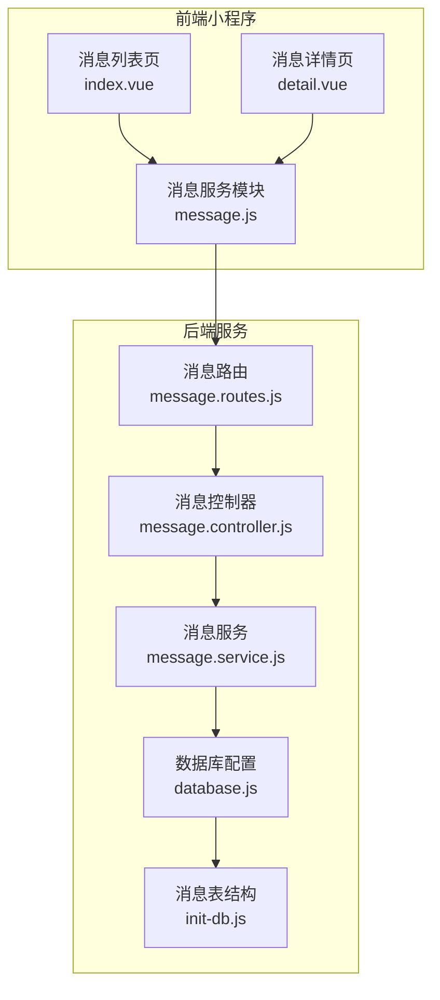
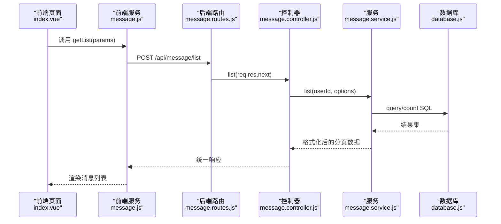
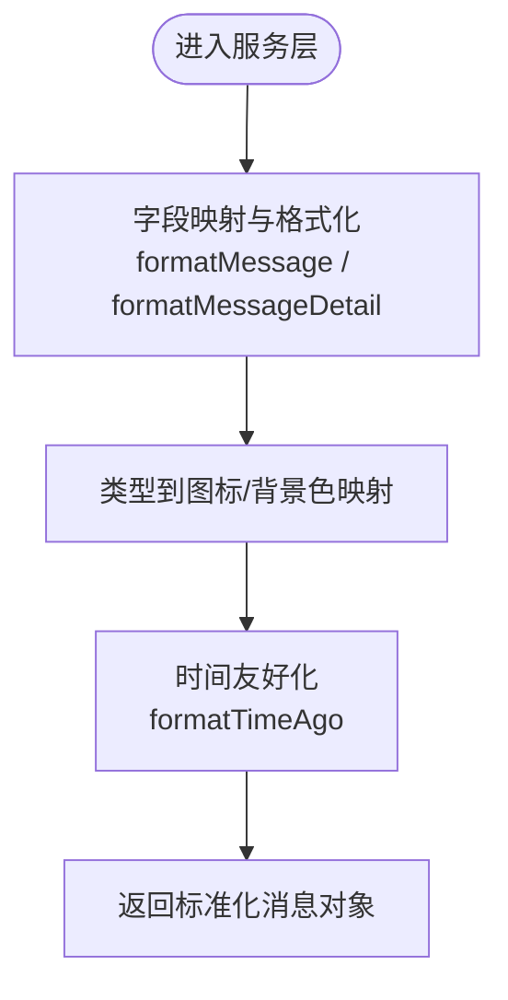
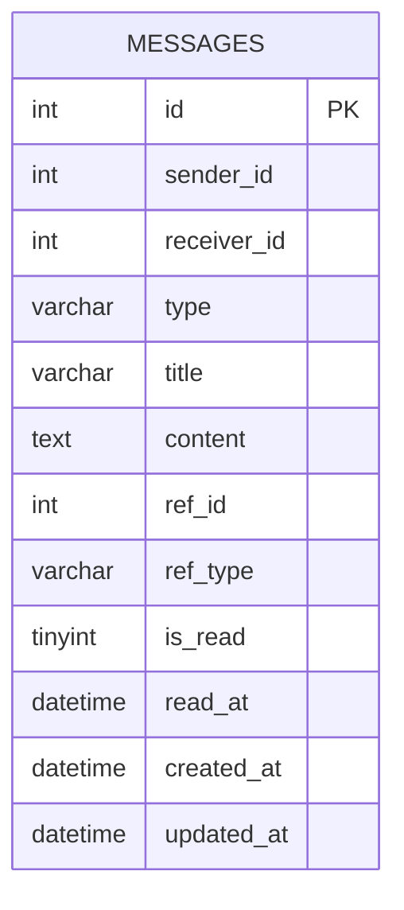
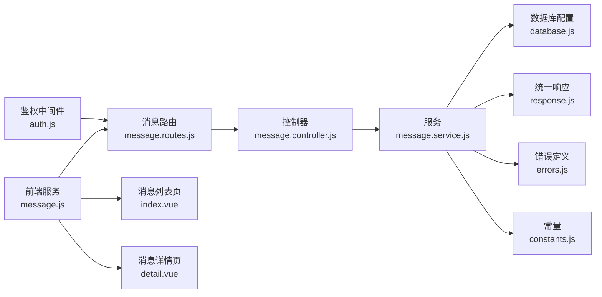

# 消息通知模块

<cite>
**本文引用的文件**
- [message.controller.js](file://backend/src/core/controllers/message.controller.js)
- [message.service.js](file://backend/src/core/services/message.service.js)
- [message.routes.js](file://backend/src/core/routes/message.routes.js)
- [message.js](file://miniapp/src/services/modules/message.js)
- [index.vue](file://miniapp/src/pages/message/index/index.vue)
- [detail.vue](file://miniapp/src/pages/message/detail.vue)
- [database.js](file://backend/src/common/config/database.js)
- [response.js](file://backend/src/common/utils/response.js)
- [errors.js](file://backend/src/common/utils/errors.js)
- [constants.js](file://backend/src/common/utils/constants.js)
- [auth.js](file://backend/src/common/middleware/auth.js)
- [init-db.js](file://backend/scripts/init-db.js)
- [swagger.js](file://backend/src/common/config/swagger.js)
</cite>

## 目录
1. [简介](#简介)
2. [项目结构](#项目结构)
3. [核心组件](#核心组件)
4. [架构总览](#架构总览)
5. [详细组件分析](#详细组件分析)
6. [依赖关系分析](#依赖关系分析)
7. [性能考量](#性能考量)
8. [故障排查指南](#故障排查指南)
9. [结论](#结论)
10. [附录](#附录)

## 简介
本文件为“智慧办公助手 OA 系统”的消息通知模块提供全面技术文档。内容覆盖消息系统架构设计、消息类型分类与处理机制、消息模板与发送策略、消息状态追踪与历史管理，并对消息相关 API 进行逐项说明。同时给出消息列表、详情、未读统计、标记已读、删除等端点的调用方式与数据模型，辅以关键流程图与时序图帮助理解。

## 项目结构
消息模块在后端采用经典的三层结构：路由层负责接口定义与鉴权；控制器层承接请求并组织响应；服务层封装数据访问与业务逻辑；前端通过服务模块调用后端接口，页面组件负责渲染与交互。

图表来源
- [message.routes.js:1-120](file://backend/src/core/routes/message.routes.js#L1-L120)
- [message.controller.js:1-77](file://backend/src/core/controllers/message.controller.js#L1-L77)
- [message.service.js:1-166](file://backend/src/core/services/message.service.js#L1-L166)
- [database.js:1-222](file://backend/src/common/config/database.js#L1-L222)
- [init-db.js:159-180](file://backend/scripts/init-db.js#L159-L180)

章节来源
- [message.routes.js:1-120](file://backend/src/core/routes/message.routes.js#L1-L120)
- [message.controller.js:1-77](file://backend/src/core/controllers/message.controller.js#L1-L77)
- [message.service.js:1-166](file://backend/src/core/services/message.service.js#L1-L166)
- [database.js:1-222](file://backend/src/common/config/database.js#L1-L222)
- [init-db.js:159-180](file://backend/scripts/init-db.js#L159-L180)

## 核心组件
- 消息路由层：定义消息相关接口，统一鉴权与请求体约束，输出 Swagger 文档注释。
- 消息控制器层：解析请求参数，调用服务层，组装统一响应格式。
- 消息服务层：封装数据库访问、消息格式化、分页计算、未读计数、标记已读、删除等逻辑。
- 数据库配置：提供 OA 主库连接池与查询/执行方法，支持事务与日志。
- 前端服务模块：封装消息 API 请求；页面组件负责渲染与交互。

章节来源
- [message.routes.js:1-120](file://backend/src/core/routes/message.routes.js#L1-L120)
- [message.controller.js:1-77](file://backend/src/core/controllers/message.controller.js#L1-L77)
- [message.service.js:1-166](file://backend/src/core/services/message.service.js#L1-L166)
- [database.js:1-222](file://backend/src/common/config/database.js#L1-L222)
- [message.js:1-24](file://miniapp/src/services/modules/message.js#L1-L24)

## 架构总览
消息模块遵循“前后端分离 + 统一响应 + 统一鉴权”的设计原则。后端通过 JWT 中间件进行身份校验与用户信息挂载，所有消息接口均需携带有效 Bearer Token。服务层对数据库进行参数化查询，避免注入风险；前端通过服务模块发起请求，页面组件负责展示与交互。

图表来源
- [message.routes.js:45](file://backend/src/core/routes/message.routes.js#L45)
- [message.controller.js:10-19](file://backend/src/core/controllers/message.controller.js#L10-L19)
- [message.service.js:83-107](file://backend/src/core/services/message.service.js#L83-L107)
- [database.js:65-83](file://backend/src/common/config/database.js#L65-L83)

## 详细组件分析

### 消息类型与模板系统
- 消息类型：后端定义了审批、系统、公告等类型枚举，前端页面根据类型映射图标与背景色，支持按类型筛选。
- 模板字段：消息列表与详情在服务层进行字段映射与格式化，包括标题、摘要、时间、是否已读、图标与背景色、详情正文、动作文本与路由等。

图表来源
- [message.service.js:39-72](file://backend/src/core/services/message.service.js#L39-L72)
- [constants.js:65-73](file://backend/src/common/utils/constants.js#L65-L73)
- [index.vue:105-121](file://miniapp/src/pages/message/index/index.vue#L105-L121)

章节来源
- [constants.js:65-73](file://backend/src/common/utils/constants.js#L65-L73)
- [message.service.js:39-72](file://backend/src/core/services/message.service.js#L39-L72)
- [index.vue:105-121](file://miniapp/src/pages/message/index/index.vue#L105-L121)

### 消息发送策略与去重
- 发送策略：消息表包含发送者、接收者、类型、标题、内容、关联业务标识等字段，便于后续扩展为审批通知、公告推送等场景。
- 去重建议：可在插入消息时基于“接收者 + 关联业务 + 类型”组合建立唯一索引，避免重复推送；当前脚本未见唯一索引定义，建议在生产环境补充。

章节来源
- [init-db.js:162-180](file://backend/scripts/init-db.js#L162-L180)

### 消息状态追踪
- 已读状态：服务层提供标记已读接口，更新 is_read 与 read_at 字段；前端在点击消息卡片时自动触发标记已读。
- 未读计数：服务层提供未读计数接口，按接收者与 is_read=0 统计。
- 历史管理：支持按类型筛选与分页查询，删除接口仅允许消息接收者删除自己的消息。

章节来源
- [message.service.js:134-163](file://backend/src/core/services/message.service.js#L134-L163)
- [message.controller.js:40-74](file://backend/src/core/controllers/message.controller.js#L40-L74)
- [index.vue:129-134](file://miniapp/src/pages/message/index/index.vue#L129-L134)

### 数据模型与索引
消息表结构包含主键、发送者、接收者、类型、标题、内容、关联业务标识、已读标志、阅读时间、创建与更新时间等字段，并在接收者、类型、已读、创建时间等维度建立索引，提升查询性能。

图表来源
- [init-db.js:162-180](file://backend/scripts/init-db.js#L162-L180)

章节来源
- [init-db.js:162-180](file://backend/scripts/init-db.js#L162-L180)

### API 接口定义与调用

- 列表查询
  - 方法：POST
  - 路径：/api/message/list
  - 鉴权：需要 Bearer Token
  - 请求体参数：
    - page：当前页码，默认 1
    - pageSize：每页条数，默认 20
    - type：可选，按类型筛选
  - 响应：分页列表，包含 list、total、page、pageSize、totalPages
  - 前端调用：messageApi.getList(params)

- 详情获取
  - 方法：POST
  - 路径：/api/message/detail
  - 鉴权：需要 Bearer Token
  - 请求体参数：
    - id：消息 ID
  - 响应：消息详情对象，包含标题、摘要、正文、动作文本、动作路由、关联 ID 等

- 未读消息数
  - 方法：POST
  - 路径：/api/message/unread
  - 鉴权：需要 Bearer Token
  - 响应：未读数量

- 标记已读
  - 方法：POST
  - 路径：/api/message/markRead
  - 鉴权：需要 Bearer Token
  - 请求体参数：
    - id：消息 ID
  - 响应：成功

- 删除消息
  - 方法：POST
  - 路径：/api/message/delete
  - 鉴权：需要 Bearer Token
  - 请求体参数：
    - id：消息 ID
  - 响应：删除成功提示

章节来源
- [message.routes.js:14-117](file://backend/src/core/routes/message.routes.js#L14-L117)
- [message.controller.js:10-74](file://backend/src/core/controllers/message.controller.js#L10-L74)
- [message.js:4-22](file://miniapp/src/services/modules/message.js#L4-L22)

### 前端交互与页面组件

- 消息列表页
  - 功能：支持按类型切换（消息通知、系统公告、待办提醒），下拉刷新，删除消息，点击跳转详情并标记已读。
  - 数据来源：调用后端列表接口，渲染消息卡片（标题、摘要、时间、图标、背景色、未读红点）。

- 消息详情页
  - 功能：展示消息标题、时间、正文、动作按钮（跳转至业务详情）。
  - 数据来源：调用后端详情接口。

章节来源
- [index.vue:1-187](file://miniapp/src/pages/message/index/index.vue#L1-L187)
- [detail.vue:1-136](file://miniapp/src/pages/message/detail.vue#L1-L136)
- [message.js:4-22](file://miniapp/src/services/modules/message.js#L4-L22)

## 依赖关系分析

图表来源
- [auth.js:14-56](file://backend/src/common/middleware/auth.js#L14-L56)
- [message.routes.js:1-120](file://backend/src/core/routes/message.routes.js#L1-L120)
- [message.controller.js:1-77](file://backend/src/core/controllers/message.controller.js#L1-L77)
- [message.service.js:1-166](file://backend/src/core/services/message.service.js#L1-L166)
- [database.js:1-222](file://backend/src/common/config/database.js#L1-L222)
- [response.js:1-49](file://backend/src/common/utils/response.js#L1-L49)
- [errors.js:1-99](file://backend/src/common/utils/errors.js#L1-L99)
- [constants.js:1-106](file://backend/src/common/utils/constants.js#L1-L106)
- [message.js:1-24](file://miniapp/src/services/modules/message.js#L1-L24)
- [index.vue:1-187](file://miniapp/src/pages/message/index/index.vue#L1-L187)
- [detail.vue:1-136](file://miniapp/src/pages/message/detail.vue#L1-L136)

章节来源
- [auth.js:14-56](file://backend/src/common/middleware/auth.js#L14-L56)
- [message.routes.js:1-120](file://backend/src/core/routes/message.routes.js#L1-L120)
- [message.controller.js:1-77](file://backend/src/core/controllers/message.controller.js#L1-L77)
- [message.service.js:1-166](file://backend/src/core/services/message.service.js#L1-L166)
- [database.js:1-222](file://backend/src/common/config/database.js#L1-L222)
- [response.js:1-49](file://backend/src/common/utils/response.js#L1-L49)
- [errors.js:1-99](file://backend/src/common/utils/errors.js#L1-L99)
- [constants.js:1-106](file://backend/src/common/utils/constants.js#L1-L106)
- [message.js:1-24](file://miniapp/src/services/modules/message.js#L1-L24)
- [index.vue:1-187](file://miniapp/src/pages/message/index/index.vue#L1-L187)
- [detail.vue:1-136](file://miniapp/src/pages/message/detail.vue#L1-L136)

## 性能考量
- 数据库层面
  - 已建立接收者、类型、已读、创建时间索引，有利于分页与筛选。
  - 建议在“接收者 + 类型 + 关联业务 + 创建时间”上建立复合索引，减少重复消息推送与提升查询效率。
- 服务层层面
  - 使用参数化查询与连接池，避免 SQL 注入与连接泄漏。
  - 分页查询中先查总数再查列表，注意大数据量下的分页性能。
- 前端层面
  - 列表页一次性加载一定数量（如 50）以减少频繁请求。
  - 下拉刷新时避免重复请求，使用状态变量控制刷新节流。

[本节为通用性能建议，无需特定文件引用]

## 故障排查指南
- 未提供有效 Token 或 Token 过期
  - 现象：返回认证错误。
  - 排查：确认请求头 Authorization 是否为 Bearer Token，Token 是否未过期。
  - 参考
    - [auth.js:18-32](file://backend/src/common/middleware/auth.js#L18-L32)

- 用户被禁用或不存在
  - 现象：认证失败。
  - 排查：确认用户状态为 active。
  - 参考
    - [auth.js:34-42](file://backend/src/common/middleware/auth.js#L34-L42)

- 消息不存在或无权限
  - 现象：详情接口抛出资源不存在错误。
  - 排查：确认消息 ID 存在且属于当前用户。
  - 参考
    - [message.service.js:116-126](file://backend/src/core/services/message.service.js#L116-L126)
    - [errors.js:68-76](file://backend/src/common/utils/errors.js#L68-L76)

- 数据库查询异常
  - 现象：日志记录查询失败。
  - 排查：检查 SQL 语法、参数绑定、连接池配置。
  - 参考
    - [database.js:65-83](file://backend/src/common/config/database.js#L65-L83)

章节来源
- [auth.js:18-42](file://backend/src/common/middleware/auth.js#L18-L42)
- [message.service.js:116-126](file://backend/src/core/services/message.service.js#L116-L126)
- [errors.js:68-76](file://backend/src/common/utils/errors.js#L68-L76)
- [database.js:65-83](file://backend/src/common/config/database.js#L65-L83)

## 结论
消息通知模块以清晰的分层架构实现了消息的接收、展示、状态管理与历史维护。后端通过统一响应与鉴权中间件保障安全性与一致性，前端页面提供了良好的交互体验。建议在生产环境中完善消息去重策略与索引设计，持续优化分页与查询性能。

[本节为总结性内容，无需特定文件引用]

## 附录

### 统一响应与错误码
- 统一成功响应：包含 code、message、data 字段。
- 统一分页响应：包含 list、total、page、pageSize、totalPages。
- 错误码枚举：SUCCESS、AUTH_ERROR、FORBIDDEN、VALIDATION_ERROR、NOT_FOUND、BUSINESS_ERROR。

章节来源
- [response.js:11-46](file://backend/src/common/utils/response.js#L11-L46)
- [constants.js:8-15](file://backend/src/common/utils/constants.js#L8-L15)

### 消息类型枚举
- approval：审批相关
- system：系统消息
- announcement：公告

章节来源
- [constants.js:69-73](file://backend/src/common/utils/constants.js#L69-L73)