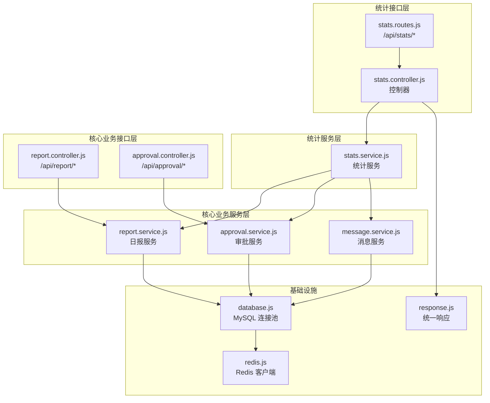
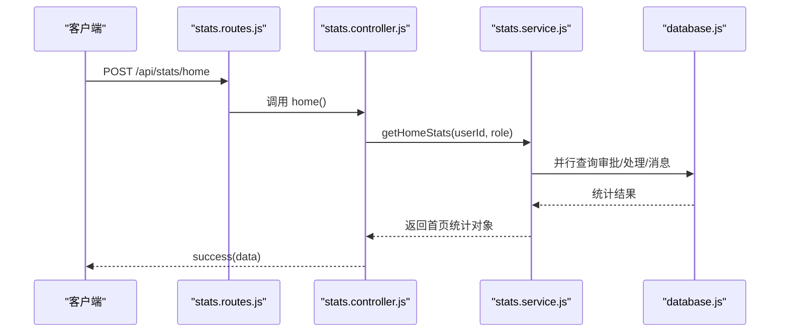
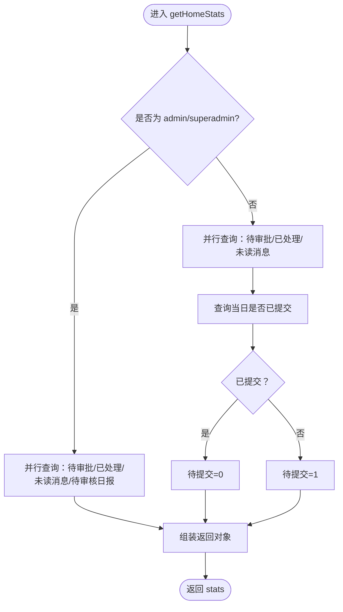
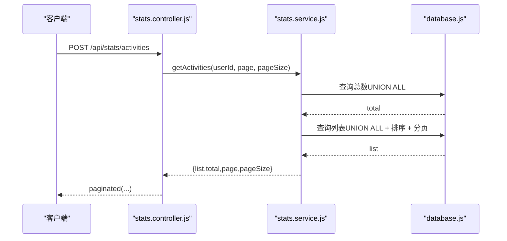
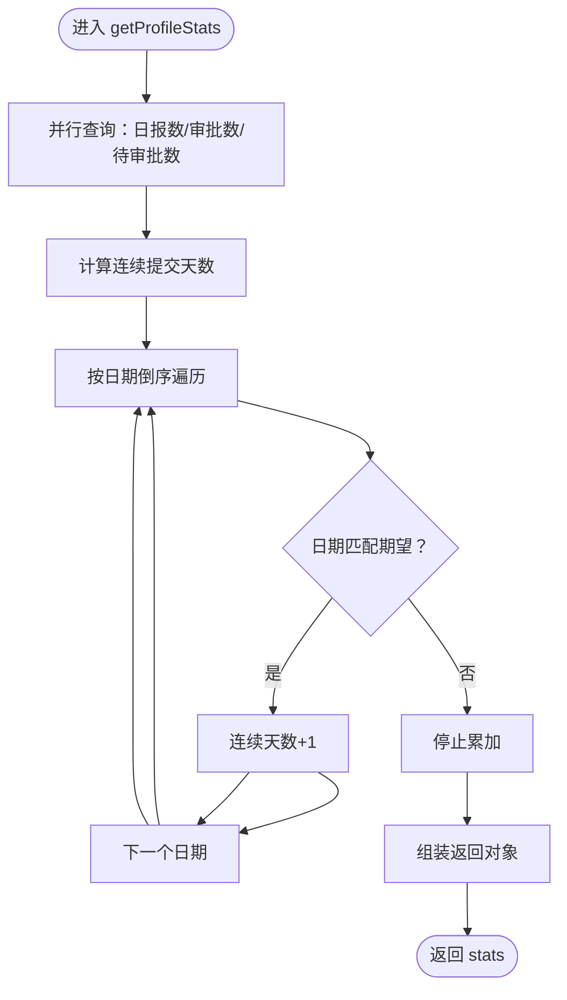
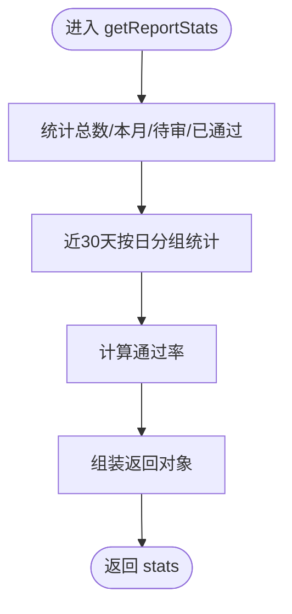
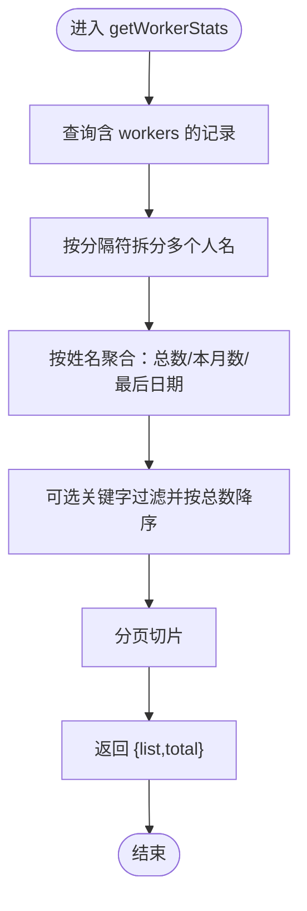
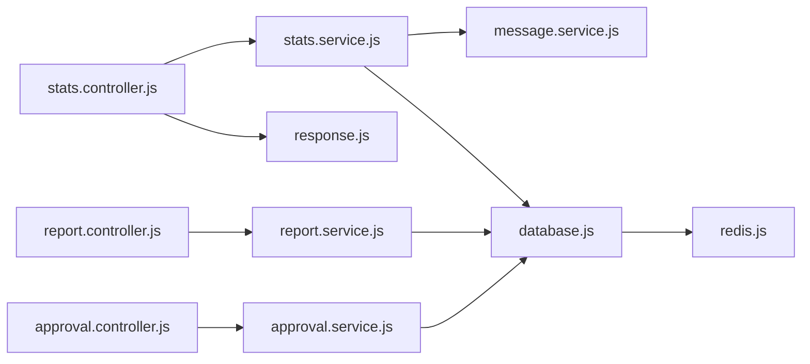

# 统计分析模块

<cite>
**本文引用的文件**
- [stats.controller.js](file://backend/src/features/controllers/stats.controller.js)
- [stats.service.js](file://backend/src/features/services/stats.service.js)
- [stats.routes.js](file://backend/src/features/routes/stats.routes.js)
- [report.controller.js](file://backend/src/core/controllers/report.controller.js)
- [report.service.js](file://backend/src/core/services/report.service.js)
- [approval.controller.js](file://backend/src/core/controllers/approval.controller.js)
- [approval.service.js](file://backend/src/core/services/approval.service.js)
- [message.service.js](file://backend/src/core/services/message.service.js)
- [database.js](file://backend/src/common/config/database.js)
- [redis.js](file://backend/src/common/config/redis.js)
- [response.js](file://backend/src/common/utils/response.js)
</cite>

## 目录
1. [简介](#简介)
2. [项目结构](#项目结构)
3. [核心组件](#核心组件)
4. [架构总览](#架构总览)
5. [详细组件分析](#详细组件分析)
6. [依赖分析](#依赖分析)
7. [性能考虑](#性能考虑)
8. [故障排查指南](#故障排查指南)
9. [结论](#结论)
10. [附录](#附录)

## 简介
本文件面向“智慧办公助手 OA 系统”的统计分析模块，系统性梳理并解释统计架构设计与实现，覆盖以下方面：
- 统计指标定义：首页统计、个人中心统计、最近动态聚合、日报统计看板、人员统计看板等
- 数据聚合算法：并行查询、UNION ALL 动态聚合、按日趋势统计、按人员聚合统计
- 时间维度处理：今日/昨日/某日的友好展示、自然月统计、近 N 天趋势
- 结果缓存策略：Redis 连接与初始化能力（当前统计接口未显式使用缓存，可按需扩展）
- API 接口清单：按日/按月/按年/部门/个人等查询端点的请求参数与响应格式
- 高级分析能力：数据透视、趋势分析、报表导出等实现思路与代码路径

## 项目结构
统计分析模块主要分布在后端 features 与 core 两大领域层，并通过统一的响应工具与数据库配置进行协作。

图表来源
- [stats.routes.js:1-26](file://backend/src/features/routes/stats.routes.js#L1-L26)
- [stats.controller.js:1-81](file://backend/src/features/controllers/stats.controller.js#L1-L81)
- [stats.service.js:1-309](file://backend/src/features/services/stats.service.js#L1-L309)
- [report.controller.js:1-172](file://backend/src/core/controllers/report.controller.js#L1-L172)
- [report.service.js:1-414](file://backend/src/core/services/report.service.js#L1-L414)
- [approval.controller.js:1-138](file://backend/src/core/controllers/approval.controller.js#L1-L138)
- [approval.service.js:1-359](file://backend/src/core/services/approval.service.js#L1-L359)
- [message.service.js:1-166](file://backend/src/core/services/message.service.js#L1-L166)
- [database.js:1-222](file://backend/src/common/config/database.js#L1-L222)
- [redis.js:1-101](file://backend/src/common/config/redis.js#L1-L101)
- [response.js:1-49](file://backend/src/common/utils/response.js#L1-L49)

章节来源
- [stats.routes.js:1-26](file://backend/src/features/routes/stats.routes.js#L1-L26)
- [stats.controller.js:1-81](file://backend/src/features/controllers/stats.controller.js#L1-L81)
- [stats.service.js:1-309](file://backend/src/features/services/stats.service.js#L1-L309)
- [report.controller.js:1-172](file://backend/src/core/controllers/report.controller.js#L1-L172)
- [report.service.js:1-414](file://backend/src/core/services/report.service.js#L1-L414)
- [approval.controller.js:1-138](file://backend/src/core/controllers/approval.controller.js#L1-L138)
- [approval.service.js:1-359](file://backend/src/core/services/approval.service.js#L1-L359)
- [message.service.js:1-166](file://backend/src/core/services/message.service.js#L1-L166)
- [database.js:1-222](file://backend/src/common/config/database.js#L1-L222)
- [redis.js:1-101](file://backend/src/common/config/redis.js#L1-L101)
- [response.js:1-49](file://backend/src/common/utils/response.js#L1-L49)

## 核心组件
- 统计控制器：提供首页统计、最近动态、个人中心统计、日报统计看板四个接口，负责参数解析与分页包装
- 统计服务：实现具体统计逻辑，包含并行查询、动态聚合、趋势统计、连续天数计算等
- 报告控制器/服务：提供日报列表、详情、提交、草稿、人员统计看板、导出 CSV 等能力，支撑日报维度统计
- 审批控制器/服务：提供审批列表、详情、创建、审批操作等能力，支撑审批维度统计
- 消息服务：提供未读消息数统计，被首页统计复用
- 数据库配置：提供 OA 主库连接池与旧库连接池，封装 query/execute/transaction 等方法
- Redis 配置：提供 Redis 客户端初始化、连接状态与 ping 能力
- 统一响应：提供 success/paginated/fail 三种响应格式

章节来源
- [stats.controller.js:1-81](file://backend/src/features/controllers/stats.controller.js#L1-L81)
- [stats.service.js:1-309](file://backend/src/features/services/stats.service.js#L1-L309)
- [report.controller.js:1-172](file://backend/src/core/controllers/report.controller.js#L1-L172)
- [report.service.js:1-414](file://backend/src/core/services/report.service.js#L1-L414)
- [approval.controller.js:1-138](file://backend/src/core/controllers/approval.controller.js#L1-L138)
- [approval.service.js:1-359](file://backend/src/core/services/approval.service.js#L1-L359)
- [message.service.js:1-166](file://backend/src/core/services/message.service.js#L1-L166)
- [database.js:1-222](file://backend/src/common/config/database.js#L1-L222)
- [redis.js:1-101](file://backend/src/common/config/redis.js#L1-L101)
- [response.js:1-49](file://backend/src/common/utils/response.js#L1-L49)

## 架构总览
统计分析模块采用“接口层-服务层-数据层”三层架构：
- 接口层：路由定义与控制器处理，负责鉴权、参数校验、分页与统一响应
- 服务层：统计服务聚合多源数据，使用并行查询提升性能；对时间维度进行友好展示与聚合
- 数据层：通过数据库配置访问主库与旧库，支持事务与连接池管理

图表来源
- [stats.routes.js:13-14](file://backend/src/features/routes/stats.routes.js#L13-L14)
- [stats.controller.js:16-27](file://backend/src/features/controllers/stats.controller.js#L16-L27)
- [stats.service.js:23-82](file://backend/src/features/services/stats.service.js#L23-L82)
- [database.js:65-109](file://backend/src/common/config/database.js#L65-L109)

## 详细组件分析

### 首页统计数据（按角色差异化）
- 接口：POST /api/stats/home
- 请求体参数：
  - role：字符串，取值 employee/admin/superadmin
- 返回字段：
  - pendingCount：待审批数
  - processedCount：已处理数
  - unreadCount：未读消息数
  - reviewCount（admin/superadmin）：待审核日报数
  - submitCount（employee）：待提交日报数（当日未提交则为 1，否则为 0）

实现要点：
- 并行查询三项基础统计，admin/superadmin 额外查询待审核日报数
- employee 场景下，通过比对当日已提交记录决定待提交数

图表来源
- [stats.service.js:23-82](file://backend/src/features/services/stats.service.js#L23-L82)

章节来源
- [stats.controller.js:16-27](file://backend/src/features/controllers/stats.controller.js#L16-L27)
- [stats.service.js:23-82](file://backend/src/features/services/stats.service.js#L23-L82)

### 最近动态列表（分页聚合）
- 接口：POST /api/stats/activities
- 请求体参数：
  - page/pageSize：分页参数
- 返回字段：
  - list：动态列表，包含 type/text/time/date/iconSrc/iconBg 等
  - total/page/pageSize/totalPages：分页信息

实现要点：
- 使用 UNION ALL 聚合审批操作、日报提交、系统消息三类动态
- 对时间进行友好化处理（今天/昨天/日期格式）
- 异常场景：旧库不可用时返回空列表与 0 总数

图表来源
- [stats.controller.js:34-45](file://backend/src/features/controllers/stats.controller.js#L34-L45)
- [stats.service.js:92-195](file://backend/src/features/services/stats.service.js#L92-L195)
- [database.js:65-109](file://backend/src/common/config/database.js#L65-L109)

章节来源
- [stats.controller.js:34-45](file://backend/src/features/controllers/stats.controller.js#L34-L45)
- [stats.service.js:92-195](file://backend/src/features/services/stats.service.js#L92-L195)

### 个人中心统计（P1）
- 接口：POST /api/stats/profile
- 返回字段：
  - reportCount：累计日报数
  - approvalCount：累计审批数（作为发起人）
  - pendingApprovalCount：待审批数
  - continuousDays：连续提交天数（从最新提交往前推算）

实现要点：
- 并行查询三项基础统计
- 连续天数：按日期倒序遍历，逐日比对期望日期，遇断档即停止

图表来源
- [stats.service.js:206-270](file://backend/src/features/services/stats.service.js#L206-L270)

章节来源
- [stats.controller.js:52-62](file://backend/src/features/controllers/stats.controller.js#L52-L62)
- [stats.service.js:206-270](file://backend/src/features/services/stats.service.js#L206-L270)

### 日报统计看板
- 接口：POST /api/stats/reportStats
- 返回字段：
  - total：日报总数
  - monthCount：本月提交数
  - pendingCount：待审数
  - approvedCount：已通过数
  - approvalRate：通过率（百分比字符串）
  - trend：近 30 天每日数量趋势

实现要点：
- 基础统计：COUNT 聚合
- 趋势：按自然日分组统计，近 30 天

图表来源
- [stats.service.js:276-301](file://backend/src/features/services/stats.service.js#L276-L301)

章节来源
- [stats.controller.js:68-73](file://backend/src/features/controllers/stats.controller.js#L68-L73)
- [stats.service.js:276-301](file://backend/src/features/services/stats.service.js#L276-L301)

### 人员统计看板（日报维度）
- 接口：POST /api/report/workerStats
- 请求体参数：
  - page/pageSize：分页
  - keyword：按姓名过滤
- 返回字段：
  - list：每条记录包含 name/total/monthCount/lastDate
  - total：总人数

实现要点：
- 从 workers 字段拆分多个人名，去重聚合
- 本月统计：比较月份
- 最后提交日期：维护最大日期

图表来源
- [report.service.js:344-371](file://backend/src/core/services/report.service.js#L344-L371)

章节来源
- [report.controller.js:149-155](file://backend/src/core/controllers/report.controller.js#L149-L155)
- [report.service.js:344-371](file://backend/src/core/services/report.service.js#L344-L371)

### 报表导出（CSV）
- 接口：POST /api/report/export
- 请求体参数：
  - status：默认已通过
  - startDate/endDate：日期范围
  - keyword：模糊匹配字段
  - worker：按作业人员过滤
- 返回：CSV 文件（UTF-8 BOM）

实现要点：
- 与日报列表相同的筛选条件
- 输出固定列头与转义处理

章节来源
- [report.controller.js:161-169](file://backend/src/core/controllers/report.controller.js#L161-L169)
- [report.service.js:377-411](file://backend/src/core/services/report.service.js#L377-L411)

### 审批统计（概念性说明）
- 当前仓库未提供专门的“审批统计”API 端点，但审批服务具备：
  - 审批列表（分页+筛选）、详情、创建、审批操作
  - 可基于上述能力扩展“按类型/状态/时间维度”的统计接口
- 若需实现“按日/按月/按年/部门/个人”的审批统计，建议在 stats.service.js 中新增对应聚合函数，并在 stats.routes.js 与 stats.controller.js 中补充路由与控制器

[本节为概念性说明，不直接分析具体文件，故无章节来源]

## 依赖分析
- 统计服务依赖数据库配置进行查询与事务处理
- 统计服务依赖消息服务获取未读消息数
- 控制器依赖统一响应工具进行 success/paginated 包装
- Redis 配置提供连接能力，当前统计接口未显式使用，可按需扩展缓存策略

图表来源
- [stats.controller.js:1-81](file://backend/src/features/controllers/stats.controller.js#L1-L81)
- [stats.service.js:1-309](file://backend/src/features/services/stats.service.js#L1-L309)
- [message.service.js:1-166](file://backend/src/core/services/message.service.js#L1-L166)
- [database.js:1-222](file://backend/src/common/config/database.js#L1-L222)
- [response.js:1-49](file://backend/src/common/utils/response.js#L1-L49)
- [report.controller.js:1-172](file://backend/src/core/controllers/report.controller.js#L1-L172)
- [report.service.js:1-414](file://backend/src/core/services/report.service.js#L1-L414)
- [approval.controller.js:1-138](file://backend/src/core/controllers/approval.controller.js#L1-L138)
- [approval.service.js:1-359](file://backend/src/core/services/approval.service.js#L1-L359)
- [redis.js:1-101](file://backend/src/common/config/redis.js#L1-L101)

章节来源
- [stats.controller.js:1-81](file://backend/src/features/controllers/stats.controller.js#L1-L81)
- [stats.service.js:1-309](file://backend/src/features/services/stats.service.js#L1-L309)
- [message.service.js:1-166](file://backend/src/core/services/message.service.js#L1-L166)
- [database.js:1-222](file://backend/src/common/config/database.js#L1-L222)
- [response.js:1-49](file://backend/src/common/utils/response.js#L1-L49)
- [report.controller.js:1-172](file://backend/src/core/controllers/report.controller.js#L1-L172)
- [report.service.js:1-414](file://backend/src/core/services/report.service.js#L1-L414)
- [approval.controller.js:1-138](file://backend/src/core/controllers/approval.controller.js#L1-L138)
- [approval.service.js:1-359](file://backend/src/core/services/approval.service.js#L1-L359)
- [redis.js:1-101](file://backend/src/common/config/redis.js#L1-L101)

## 性能考虑
- 并行查询：首页统计与个人中心统计均采用 Promise.all 并行查询，降低 RT
- 分页与 LIMIT/OFFSET：活动列表与人员统计看板均使用分页，避免一次性加载大量数据
- 时间友好化：在服务层进行日期格式化与“今天/昨天”判断，减少前端重复计算
- 连接池与事务：数据库配置提供连接池与事务封装，保证高并发下的稳定性
- 缓存策略：Redis 客户端可用，建议对热点统计结果（如首页统计）增加短期缓存，结合失效策略与缓存穿透防护

[本节为通用性能建议，不直接分析具体文件，故无章节来源]

## 故障排查指南
- 数据库异常
  - 现象：统计接口偶发失败或返回空列表
  - 排查：检查数据库连接池配置、主库/旧库连通性与慢查询
  - 参考：数据库配置中的 query/oldQuery/transaction 方法与错误日志
- 旧库兼容
  - 现象：活动列表总数为 0 或列表为空
  - 排查：旧版库不可用时会降级返回空结果，确认旧库配置与网络
- 权限与参数
  - 现象：审批/日报接口返回 403/404
  - 排查：确认用户角色与当前用户 ID 是否满足查询条件
- 响应格式
  - 现象：前端收到非预期响应结构
  - 排查：确认控制器是否使用 success/paginated 包装

章节来源
- [database.js:65-135](file://backend/src/common/config/database.js#L65-L135)
- [stats.service.js:95-113](file://backend/src/features/services/stats.service.js#L95-L113)
- [approval.controller.js:15-36](file://backend/src/core/controllers/approval.controller.js#L15-L36)
- [report.controller.js:14-34](file://backend/src/core/controllers/report.controller.js#L14-L34)
- [response.js:11-46](file://backend/src/common/utils/response.js#L11-L46)

## 结论
统计分析模块以清晰的三层架构实现首页统计、个人统计、动态聚合与日报看板等核心能力，配合并行查询与分页机制保障性能与体验。未来可在现有基础上扩展“审批统计”与“高级分析”能力，并引入 Redis 缓存以进一步提升热点数据的响应速度。

[本节为总结性内容，不直接分析具体文件，故无章节来源]

## 附录

### API 接口清单与参数说明
- 首页统计数据
  - 方法：POST
  - 路径：/api/stats/home
  - 请求体：{ role: "employee|admin|superadmin" }
  - 响应：success({ pendingCount, processedCount, unreadCount, reviewCount?, submitCount? })
- 最近动态列表（分页）
  - 方法：POST
  - 路径：/api/stats/activities
  - 请求体：{ page: number, pageSize: number }
  - 响应：paginated({ list, total, page, pageSize })
- 个人中心统计
  - 方法：POST
  - 路径：/api/stats/profile
  - 请求体：{}
  - 响应：success({ reportCount, approvalCount, pendingApprovalCount, continuousDays })
- 日报统计看板
  - 方法：POST
  - 路径：/api/stats/reportStats
  - 请求体：{}
  - 响应：success({ total, monthCount, pendingCount, approvedCount, approvalRate, trend })
- 人员统计看板
  - 方法：POST
  - 路径：/api/report/workerStats
  - 请求体：{ page: number, pageSize: number, keyword?: string }
  - 响应：paginated({ list, total, page, pageSize })
- 报表导出（CSV）
  - 方法：POST
  - 路径：/api/report/export
  - 请求体：{ status?: string, startDate?: string, endDate?: string, keyword?: string, worker?: string }
  - 响应：HTTP 200 + CSV 文件（UTF-8 BOM）

章节来源
- [stats.routes.js:13-23](file://backend/src/features/routes/stats.routes.js#L13-L23)
- [stats.controller.js:16-73](file://backend/src/features/controllers/stats.controller.js#L16-L73)
- [report.controller.js:149-169](file://backend/src/core/controllers/report.controller.js#L149-L169)

### 数据聚合与时间维度处理要点
- 并行查询：使用 Promise.all 同时获取多项指标，减少等待时间
- 动态聚合：使用 UNION ALL 合并多源数据，统一时间排序与友好化展示
- 时间维度：支持“今天/昨天/日期”友好展示；自然月统计通过 MONTH()/YEAR() 过滤；趋势统计按自然日 GROUP BY
- 字段映射：统一 snake_case → camelCase，确保前后端一致

章节来源
- [stats.service.js:27-55](file://backend/src/features/services/stats.service.js#L27-L55)
- [stats.service.js:116-183](file://backend/src/features/services/stats.service.js#L116-L183)
- [stats.service.js:276-301](file://backend/src/features/services/stats.service.js#L276-L301)
- [report.service.js:30-73](file://backend/src/core/services/report.service.js#L30-L73)

### 高级分析实现思路（建议）
- 数据透视：在服务层对多维字段（如日期、类型、部门）进行分组聚合，返回二维或多维矩阵
- 趋势分析：基于时间序列的滑动窗口、同比/环比计算，结合前端可视化库展示
- 报表生成：在导出 CSV 基础上，增加 Excel 模板渲染与多工作表输出
- 缓存策略：对高频查询结果设置 TTL，结合布隆过滤器避免缓存穿透

[本节为通用实现建议，不直接分析具体文件，故无章节来源]