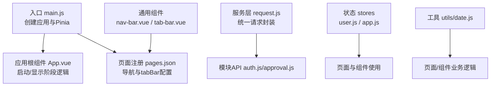
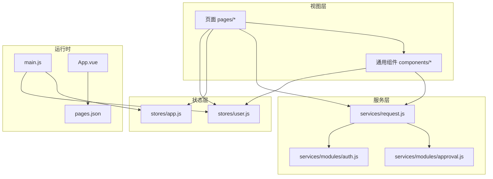
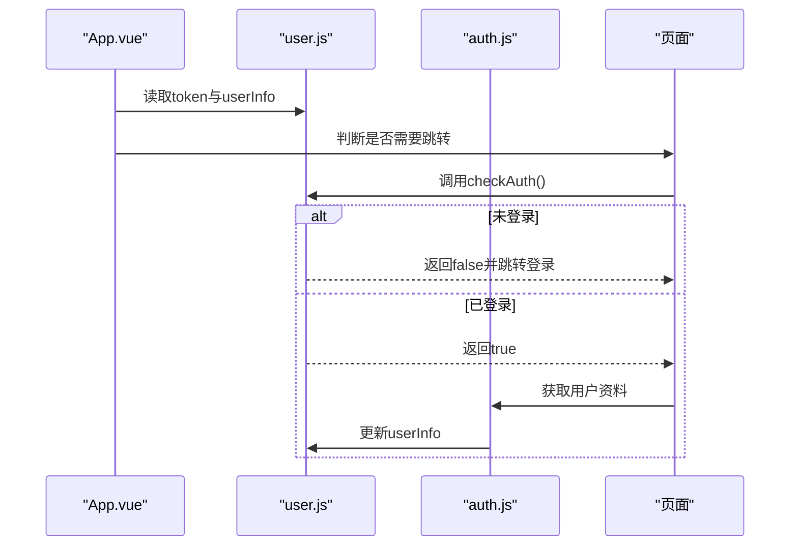
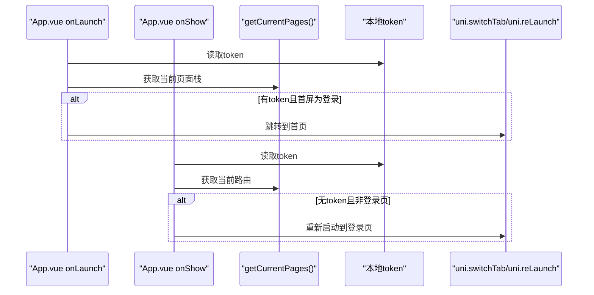
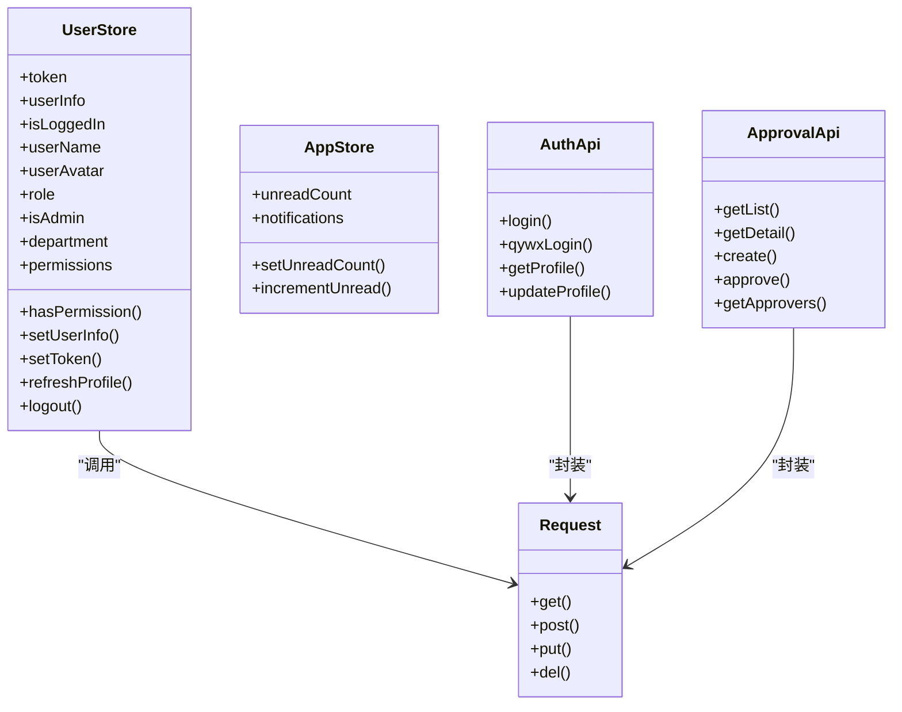
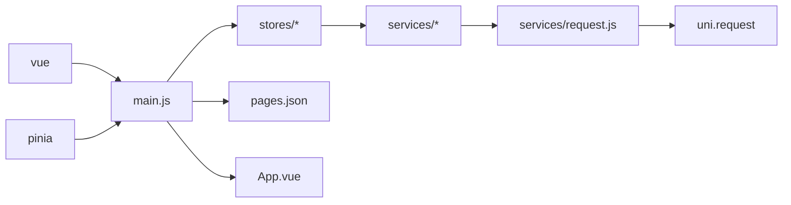

# 小程序前端

<cite>
**本文引用的文件**
- [main.js](file://miniapp/src/main.js)
- [App.vue](file://miniapp/src/App.vue)
- [pages.json](file://miniapp/src/pages.json)
- [package.json](file://miniapp/package.json)
- [vite.config.js](file://miniapp/vite.config.js)
- [user.js](file://miniapp/src/stores/user.js)
- [app.js](file://miniapp/src/stores/app.js)
- [request.js](file://miniapp/src/services/request.js)
- [useAuth.js](file://miniapp/src/composables/useAuth.js)
- [usePagination.js](file://miniapp/src/composables/usePagination.js)
- [auth.js](file://miniapp/src/services/modules/auth.js)
- [approval.js](file://miniapp/src/services/modules/approval.js)
- [nav-bar.vue](file://miniapp/src/components/nav-bar/nav-bar.vue)
- [tab-bar.vue](file://miniapp/src/components/tab-bar/tab-bar.vue)
- [date.js](file://miniapp/src/utils/date.js)
</cite>

## 目录
1. [简介](#简介)
2. [项目结构](#项目结构)
3. [核心组件](#核心组件)
4. [架构总览](#架构总览)
5. [详细组件分析](#详细组件分析)
6. [依赖分析](#依赖分析)
7. [性能考虑](#性能考虑)
8. [故障排查指南](#故障排查指南)
9. [结论](#结论)
10. [附录](#附录)

## 简介
本文件面向“智慧办公助手 OA 系统”的小程序前端（Vue 3 + UniApp），系统性梳理项目结构、组件架构、状态管理、路由配置与多端编译策略；重点说明用户认证流程、页面导航体系、数据绑定与事件处理模式；深入解析服务层设计（API 调用封装、错误处理、缓存策略）；并提供组件开发规范、样式管理方案与性能优化建议。文档中的所有实现细节均以仓库源码为依据，并通过“章节来源”与“图示来源”进行溯源。

## 项目结构
小程序前端采用 UniApp 3 的 Vite 插件生态，使用 Vue 3 Composition API 与 Pinia 进行状态管理。项目目录按功能域划分：页面 pages、通用组件 components、服务层 services、状态 stores、工具 utils、全局样式 uni.scss 与入口文件 main.js、App.vue、pages.json、manifest.json 等。

- 入口与运行时
  - 应用入口：在入口文件中创建应用实例并挂载 Pinia。
  - 应用根组件：负责启动与显示阶段的全局逻辑（如登录态校验与跳转）。
  - 构建脚本：通过 npm scripts 驱动 uni 命令，支持小程序与 H5 双端开发与构建。
  - Vite 别名：@ 指向 src，便于统一路径引用。

- 页面与导航
  - 页面注册集中于 pages.json，包含各页面标题、导航样式、下拉刷新、自定义占位组件等。
  - tabBar 自定义配置，结合页面占位组件实现统一导航与底部标签栏。

- 组件化
  - 通用组件：导航栏、底部标签栏、日期选择器、图片上传、空状态、加载遮罩、确认对话框、意见输入、人员选择器等。
  - 组件内通过条件编译（如 #ifdef MP-WEIXIN）适配不同平台差异。

- 服务层与状态
  - 服务层：统一请求封装，内置鉴权头、状态码处理、开发模式 Mock。
  - 状态层：Pinia Store 管理用户信息、权限、未读数等；提供组合式工具函数用于鉴权与分页。

**图示来源**
- [main.js:1-11](file://miniapp/src/main.js#L1-L11)
- [App.vue:11-42](file://miniapp/src/App.vue#L11-L42)
- [pages.json:1-220](file://miniapp/src/pages.json#L1-L220)
- [request.js:1-127](file://miniapp/src/services/request.js#L1-L127)
- [auth.js:1-20](file://miniapp/src/services/modules/auth.js#L1-L20)
- [approval.js:1-24](file://miniapp/src/services/modules/approval.js#L1-L24)
- [user.js:1-78](file://miniapp/src/stores/user.js#L1-L78)
- [app.js:1-23](file://miniapp/src/stores/app.js#L1-L23)
- [nav-bar.vue:1-171](file://miniapp/src/components/nav-bar/nav-bar.vue#L1-L171)
- [tab-bar.vue:1-67](file://miniapp/src/components/tab-bar/tab-bar.vue#L1-L67)
- [date.js:1-64](file://miniapp/src/utils/date.js#L1-L64)

**章节来源**
- [main.js:1-11](file://miniapp/src/main.js#L1-L11)
- [App.vue:11-42](file://miniapp/src/App.vue#L11-L42)
- [pages.json:1-220](file://miniapp/src/pages.json#L1-L220)
- [package.json:1-29](file://miniapp/package.json#L1-L29)
- [vite.config.js:1-13](file://miniapp/vite.config.js#L1-L13)

## 核心组件
- 用户状态与权限
  - 用户 Store：维护 token、用户信息、角色、部门、权限集合；提供登录态判断、权限校验、资料刷新与登出。
  - 组合式鉴权：useAuth 提供登录态检查与响应式数据访问。
- 应用状态
  - 应用 Store：维护未读数、通知列表等全局状态。
- 请求与服务
  - request：统一请求封装，自动注入 Authorization 头，处理 401、业务 code、HTTP 错误与网络异常；开发模式支持 dev-mode-token 的 Mock 数据。
  - 模块 API：auth.js、approval.js 等按领域拆分，调用 request 并返回标准化结果。
- 导航与标签
  - 导航栏 nav-bar：支持返回、右侧图标、未读角标、品牌样式、胶囊按钮避让等。
  - 底部标签栏 tab-bar：根据当前激活项切换图标，触发 uni.switchTab 跳转。
- 分页与工具
  - usePagination：统一分页加载逻辑，支持防抖、刷新、重置、上拉加载更多。
  - date 工具：日期格式化、时间格式化、今日判定、周/月范围计算。

**章节来源**
- [user.js:1-78](file://miniapp/src/stores/user.js#L1-L78)
- [useAuth.js:1-26](file://miniapp/src/composables/useAuth.js#L1-L26)
- [app.js:1-23](file://miniapp/src/stores/app.js#L1-L23)
- [request.js:1-127](file://miniapp/src/services/request.js#L1-L127)
- [auth.js:1-20](file://miniapp/src/services/modules/auth.js#L1-L20)
- [approval.js:1-24](file://miniapp/src/services/modules/approval.js#L1-L24)
- [nav-bar.vue:1-171](file://miniapp/src/components/nav-bar/nav-bar.vue#L1-L171)
- [tab-bar.vue:1-67](file://miniapp/src/components/tab-bar/tab-bar.vue#L1-L67)
- [usePagination.js:1-63](file://miniapp/src/composables/usePagination.js#L1-L63)
- [date.js:1-64](file://miniapp/src/utils/date.js#L1-L64)

## 架构总览
整体采用“页面/组件 + 服务层 + 状态层”的分层架构。页面通过组合式 API 使用状态与服务；服务层统一处理网络请求与错误；状态层集中管理用户与应用级数据；导航与标签组件提供一致的交互体验。

**图示来源**
- [main.js:1-11](file://miniapp/src/main.js#L1-L11)
- [App.vue:11-42](file://miniapp/src/App.vue#L11-L42)
- [pages.json:1-220](file://miniapp/src/pages.json#L1-L220)
- [user.js:1-78](file://miniapp/src/stores/user.js#L1-L78)
- [app.js:1-23](file://miniapp/src/stores/app.js#L1-L23)
- [request.js:1-127](file://miniapp/src/services/request.js#L1-L127)
- [auth.js:1-20](file://miniapp/src/services/modules/auth.js#L1-L20)
- [approval.js:1-24](file://miniapp/src/services/modules/approval.js#L1-L24)

## 详细组件分析

### 认证与会话管理
- 登录态校验
  - App.vue 在 onLaunch/onShow 中读取本地 token，决定是否跳转至首页或登录页。
  - useAuth 提供 checkAuth，未登录则强制跳转登录。
- 用户信息与权限
  - user.js 维护 token 与 userInfo，计算角色、部门、权限集合；提供刷新资料与登出。
  - 权限映射：管理员与超级管理员拥有不同权限集合，员工权限最小。
- 登出流程
  - 清除本地存储并 reLaunch 到登录页，确保后续页面无法访问受保护资源。

**图示来源**
- [App.vue:14-29](file://miniapp/src/App.vue#L14-L29)
- [useAuth.js:11-17](file://miniapp/src/composables/useAuth.js#L11-L17)
- [user.js:37-51](file://miniapp/src/stores/user.js#L37-L51)
- [auth.js:12-18](file://miniapp/src/services/modules/auth.js#L12-L18)

**章节来源**
- [App.vue:14-29](file://miniapp/src/App.vue#L14-L29)
- [useAuth.js:1-26](file://miniapp/src/composables/useAuth.js#L1-L26)
- [user.js:1-78](file://miniapp/src/stores/user.js#L1-L78)
- [auth.js:1-20](file://miniapp/src/services/modules/auth.js#L1-L20)

### 服务层设计与错误处理
- 统一请求封装
  - 自动拼接 BASE_URL 与注入 Authorization 头；对 401 统一提示并跳转登录；对业务 code=0 成功，否则提示错误信息；对网络异常与 HTTP 异常分别处理。
  - 开发模式支持 dev-mode-token 的 Mock 数据，覆盖常用接口。
- 接口模块化
  - auth.js、approval.js 等按领域拆分，职责清晰，便于扩展与测试。
- 缓存策略
  - 用户资料与 token 存储于本地缓存；刷新资料在弱网环境下保留缓存，避免阻塞。

```mermaid
flowchart TD
Start(["发起请求"]) --> CheckToken["读取token"]
CheckToken --> DevMode{"开发模式且token=dev-mode-token?"}
DevMode --> |是| Mock["返回Mock数据"]
DevMode --> |否| Net["调用uni.request"]
Net --> Status{"HTTP状态码"}
Status --> |401| Unauthorized["提示并跳转登录"]
Status --> |2xx| Code{"业务code"}
Code --> |0| Resolve["返回成功数据"]
Code --> |其他| FailCode["提示错误信息"]
Status --> |其他| HttpErr["提示HTTP错误"]
Net --> NetErr["网络异常"]
Mock --> End(["结束"])
Unauthorized --> End
Resolve --> End
FailCode --> End
HttpErr --> End
NetErr --> End
```

**图示来源**
- [request.js:17-65](file://miniapp/src/services/request.js#L17-L65)
- [request.js:67-106](file://miniapp/src/services/request.js#L67-L106)

**章节来源**
- [request.js:1-127](file://miniapp/src/services/request.js#L1-L127)
- [auth.js:1-20](file://miniapp/src/services/modules/auth.js#L1-L20)
- [approval.js:1-24](file://miniapp/src/services/modules/approval.js#L1-L24)

### 导航体系与页面生命周期
- 页面注册与样式
  - pages.json 统一声明页面路径、标题、导航样式、下拉刷新、组件占位等；tabBar 自定义样式与列表。
- 生命周期与登录态联动
  - App.vue 在 onLaunch/onShow 中根据 token 与当前页面决定跳转，保证进入应用即处于正确路由。
- 导航组件
  - nav-bar 支持返回、右侧图标点击、未读角标、品牌样式与胶囊按钮避让；tab-bar 根据激活项切换图标并跳转。

**图示来源**
- [App.vue:14-29](file://miniapp/src/App.vue#L14-L29)
- [pages.json:202-213](file://miniapp/src/pages.json#L202-L213)

**章节来源**
- [pages.json:1-220](file://miniapp/src/pages.json#L1-L220)
- [App.vue:11-42](file://miniapp/src/App.vue#L11-L42)
- [nav-bar.vue:1-171](file://miniapp/src/components/nav-bar/nav-bar.vue#L1-L171)
- [tab-bar.vue:1-67](file://miniapp/src/components/tab-bar/tab-bar.vue#L1-L67)

### 数据绑定与事件处理
- 响应式数据
  - user.js 使用 ref/computed 管理 token、userInfo、角色、权限等；app.js 管理未读数与通知列表。
- 事件处理
  - nav-bar 通过 emits 触发 back/rightClick；tab-bar 通过 emits 触发 change 并执行 uni.switchTab。
- 组合式工具
  - usePagination 封装分页加载、刷新、重置与防抖；useAuth 提供登录态检查。

**图示来源**
- [user.js:11-76](file://miniapp/src/stores/user.js#L11-L76)
- [app.js:4-21](file://miniapp/src/stores/app.js#L4-L21)
- [request.js:108-127](file://miniapp/src/services/request.js#L108-L127)
- [auth.js:3-18](file://miniapp/src/services/modules/auth.js#L3-L18)
- [approval.js:3-22](file://miniapp/src/services/modules/approval.js#L3-L22)

**章节来源**
- [user.js:1-78](file://miniapp/src/stores/user.js#L1-L78)
- [app.js:1-23](file://miniapp/src/stores/app.js#L1-L23)
- [request.js:1-127](file://miniapp/src/services/request.js#L1-L127)
- [auth.js:1-20](file://miniapp/src/services/modules/auth.js#L1-L20)
- [approval.js:1-24](file://miniapp/src/services/modules/approval.js#L1-L24)

### 多端编译与代码复用
- 多端入口
  - package.json 中提供 dev:mp-weixin/build:mp-weixin 与 dev:h5/build:h5 脚本，通过 uni 命令驱动不同目标平台。
- 路径别名
  - vite.config.js 中 @ 指向 src，减少相对路径复杂度，提升跨端一致性。
- 条件编译
  - nav-bar.vue 中使用 #ifdef MP-WEIXIN 对胶囊按钮尺寸与间距进行平台差异化处理，保证视觉一致性。
- 页面与组件占位
  - pages.json 的 componentPlaceholder 使页面可按需插入自定义组件（如 nav-bar、tab-bar、特定业务组件），实现页面级复用与解耦。

**章节来源**
- [package.json:5-10](file://miniapp/package.json#L5-L10)
- [vite.config.js:7-11](file://miniapp/vite.config.js#L7-L11)
- [nav-bar.vue:56-64](file://miniapp/src/components/nav-bar/nav-bar.vue#L56-L64)
- [pages.json:17-213](file://miniapp/src/pages.json#L17-L213)

## 依赖分析
- 运行时依赖
  - vue、pinia：框架与状态管理。
- 开发依赖
  - @dcloudio/uni-app、@dcloudio/uni-mp-weixin、@dcloudio/vite-plugin-uni：UniApp 与微信小程序平台支持、Vite 插件。
  - sass/sass-loader、vite：样式与构建工具链。
- 关键耦合点
  - 页面与组件依赖 stores 与 services；services 依赖 request；request 依赖本地存储与 uni.request；App.vue 与 pages.json 影响全局导航与登录态。

**图示来源**
- [package.json:11-26](file://miniapp/package.json#L11-L26)
- [main.js:1-11](file://miniapp/src/main.js#L1-L11)
- [request.js:1-127](file://miniapp/src/services/request.js#L1-L127)
- [pages.json:1-220](file://miniapp/src/pages.json#L1-L220)

**章节来源**
- [package.json:1-29](file://miniapp/package.json#L1-L29)
- [main.js:1-11](file://miniapp/src/main.js#L1-L11)
- [request.js:1-127](file://miniapp/src/services/request.js#L1-L127)

## 性能考虑
- 网络层
  - 使用统一拦截器与状态码处理，避免重复请求与错误风暴；开发模式 Mock 降低联调成本。
- 状态层
  - Pinia 响应式数据按需更新，避免不必要的渲染；store 内聚合用户与应用状态，减少跨组件通信。
- 组件层
  - 导航与标签组件复用性强，减少重复实现；使用条件编译适配平台差异，避免冗余逻辑。
- 分页与滚动
  - usePagination 提供防抖与上拉加载更多，结合 computed hasMore 控制加载节奏，降低内存压力。
- 样式与资源
  - 使用 uni.scss 统一样式变量与基础排版；静态资源集中管理，减少打包体积。

[本节为通用性能建议，无需具体文件分析]

## 故障排查指南
- 登录态异常
  - 现象：进入应用被强制跳转登录。
  - 排查：检查本地 token 是否存在；确认 App.vue 生命周期逻辑；核对后端返回的 401 处理。
- 请求失败
  - 现象：接口报错或网络异常。
  - 排查：查看 request 统一封装中的状态码与业务 code；确认 BASE_URL 与 Authorization 头；开发模式下检查 Mock 映射。
- 页面跳转异常
  - 现象：tab 切换无效或导航不生效。
  - 排查：确认 pages.json 中 tabBar 配置与页面路径；检查 nav-bar/tab-bar 的事件发射与 uni.switchTab 调用。
- 权限不足
  - 现象：某些操作不可见或不可用。
  - 排查：核对 user.js 中权限映射与角色；确认 hasPermission 的使用位置。

**章节来源**
- [App.vue:14-29](file://miniapp/src/App.vue#L14-L29)
- [request.js:33-65](file://miniapp/src/services/request.js#L33-L65)
- [pages.json:202-213](file://miniapp/src/pages.json#L202-L213)
- [nav-bar.vue:76-79](file://miniapp/src/components/nav-bar/nav-bar.vue#L76-L79)
- [tab-bar.vue:37-42](file://miniapp/src/components/tab-bar/tab-bar.vue#L37-L42)
- [user.js:23-25](file://miniapp/src/stores/user.js#L23-L25)

## 结论
该小程序前端以 Vue 3 + UniApp 为基础，采用 Pinia 管理状态、以模块化服务层封装 API、以通用组件统一导航与交互体验。通过 pages.json 与 App.vue 的生命周期配合，实现稳定的登录态与导航体系；借助条件编译与路径别名，兼顾多端一致性与开发效率。整体架构清晰、职责明确，具备良好的扩展性与可维护性。

[本节为总结性内容，无需具体文件分析]

## 附录
- 组件开发规范
  - 属性校验：使用 validator 约束属性值（如 nav-bar 的 rightIcon）。
  - 事件命名：统一使用小驼峰，如 back、rightClick；在模板中通过 @tap 绑定。
  - 条件编译：针对平台差异使用 #ifdef/#endif 包裹。
- 样式管理
  - 使用 uni.scss 统一变量与基础样式；组件样式 scoped，避免全局污染。
- 最佳实践
  - 页面尽量复用 nav-bar、tab-bar 等通用组件；将业务逻辑下沉至 services 与 stores。
  - 使用 usePagination 统一分页行为；在组件中通过 emits 与父组件解耦。
  - 开发阶段利用 dev-mode-token 快速联调，上线前清理相关逻辑。

[本节为通用指导，无需具体文件分析]