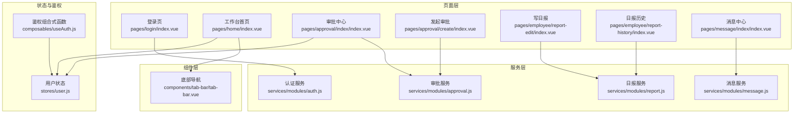
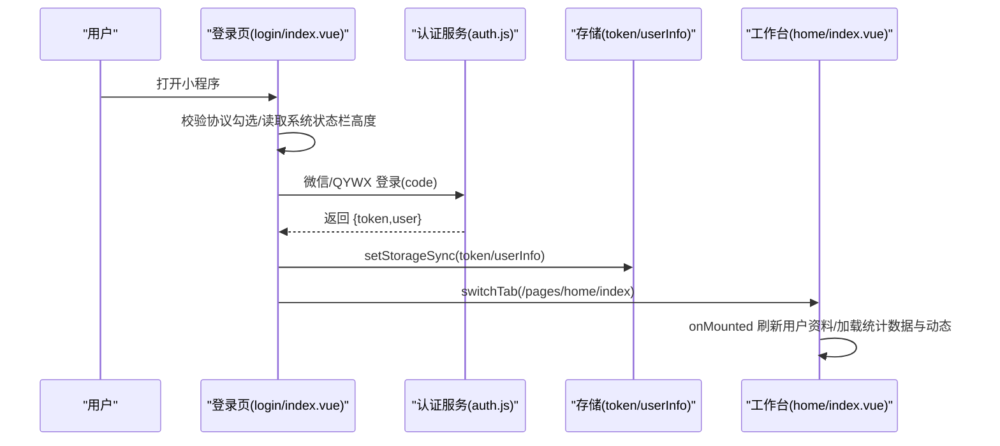
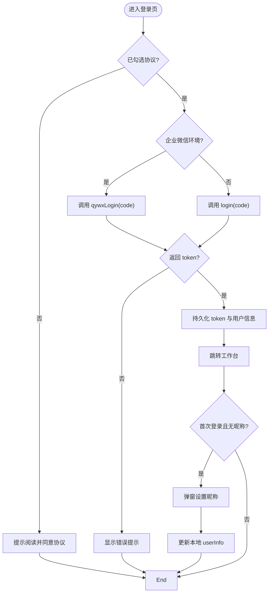
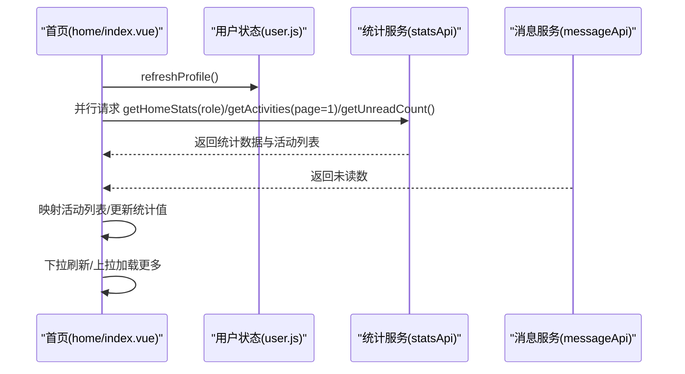
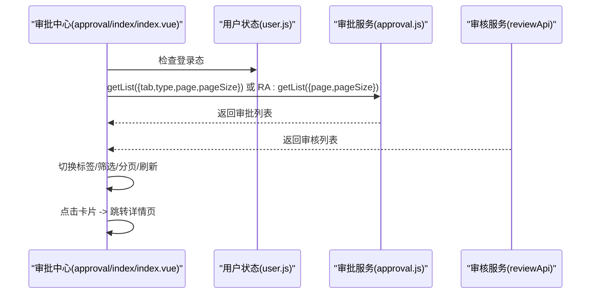
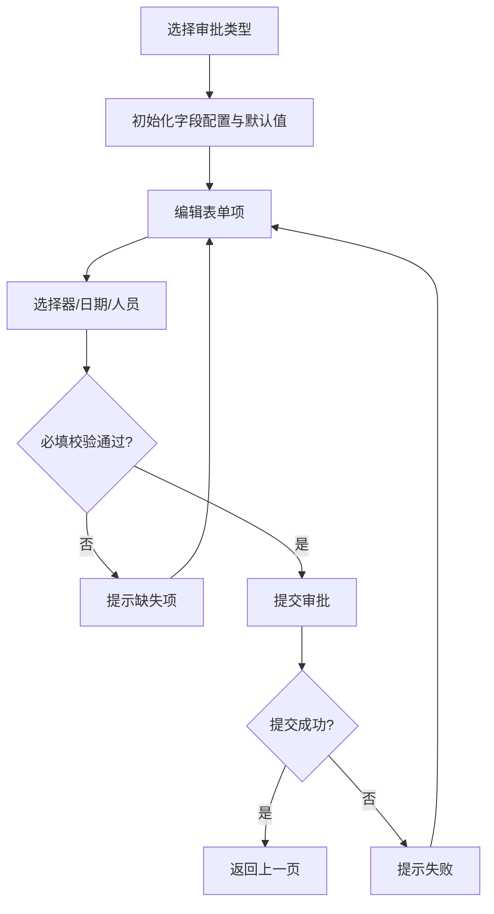
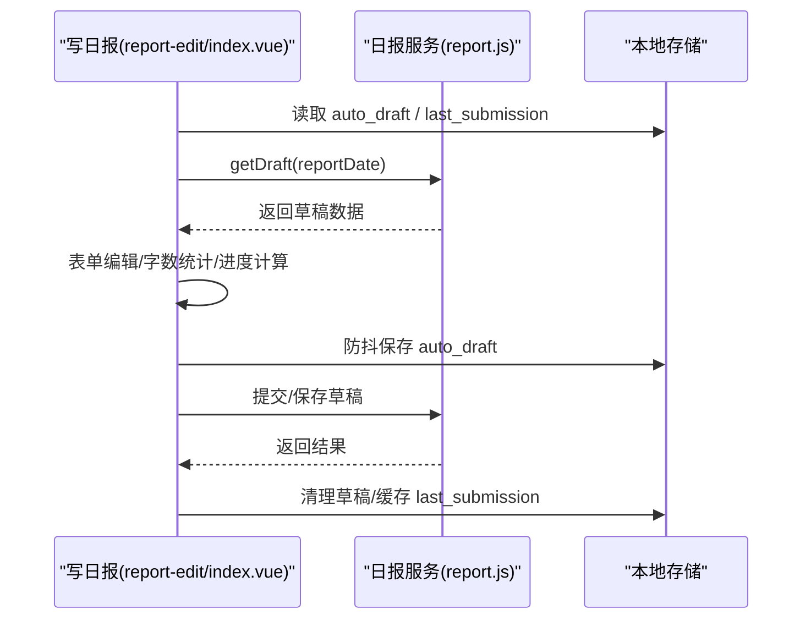
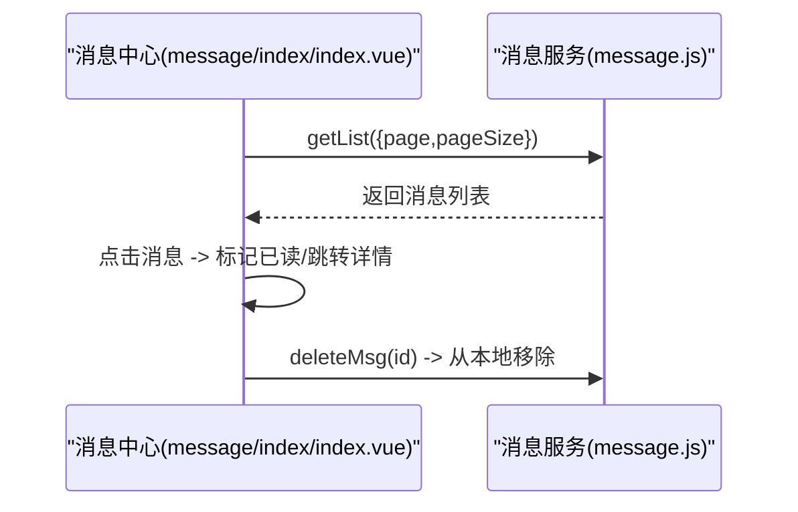
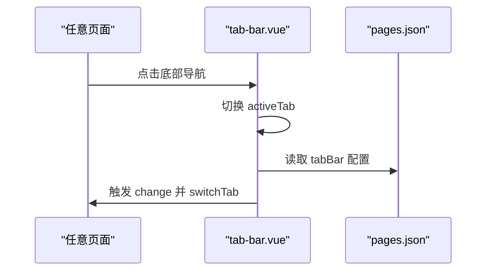
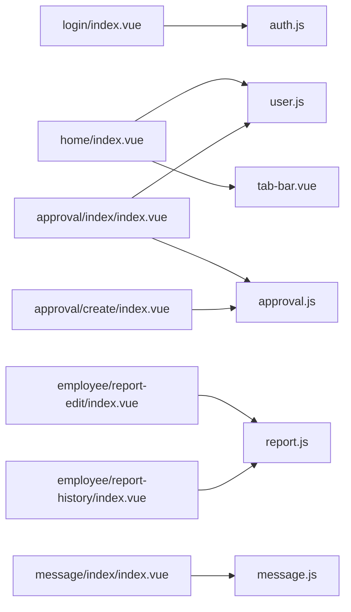

# 核心页面

<cite>
**本文引用的文件**
- [login/index.vue](file://miniapp/src/pages/login/index.vue)
- [home/index.vue](file://miniapp/src/pages/home/index.vue)
- [approval/index/index.vue](file://miniapp/src/pages/approval/index/index.vue)
- [approval/create/index.vue](file://miniapp/src/pages/approval/create/index.vue)
- [employee/report-history/index.vue](file://miniapp/src/pages/employee/report-history/index.vue)
- [employee/report-edit/index.vue](file://miniapp/src/pages/employee/report-edit/index.vue)
- [message/index/index.vue](file://miniapp/src/pages/message/index/index.vue)
- [tab-bar.vue](file://miniapp/src/components/tab-bar/tab-bar.vue)
- [user.js](file://miniapp/src/stores/user.js)
- [auth.js](file://miniapp/src/services/modules/auth.js)
- [approval.js](file://miniapp/src/services/modules/approval.js)
- [report.js](file://miniapp/src/services/modules/report.js)
- [message.js](file://miniapp/src/services/modules/message.js)
- [useAuth.js](file://miniapp/src/composables/useAuth.js)
- [pages.json](file://miniapp/src/pages.json)
</cite>

## 目录
1. [简介](#简介)
2. [项目结构](#项目结构)
3. [核心组件](#核心组件)
4. [架构总览](#架构总览)
5. [详细组件分析](#详细组件分析)
6. [依赖分析](#依赖分析)
7. [性能考虑](#性能考虑)
8. [故障排查指南](#故障排查指南)
9. [结论](#结论)
10. [附录](#附录)

## 简介
本文件面向智慧办公助手 OA 小程序的核心页面，围绕用户登录、工作台首页、审批中心、日报管理、消息中心等关键页面进行系统化文档化说明。内容覆盖页面设计思路、交互流程、数据绑定机制、事件处理模式、生命周期管理、页面间导航逻辑、参数传递方式、状态管理策略，并提供可操作的开发指导与排障建议。

## 项目结构
- 页面采用按功能域分层组织：pages 下按模块划分（如 home、approval、employee、message 等），每个页面以 index.vue 作为入口。
- 组件层：通用组件（如 nav-bar、tab-bar、空状态、日期选择器等）位于 components 目录，便于复用。
- 服务层：通过 services/modules 下的模块封装 API 调用，统一请求方法与接口路径。
- 状态层：使用 Pinia 的 user store 管理用户态（token、角色、权限等），并在页面中通过组合式函数 useAuth 进行鉴权校验。
- 全局配置：pages.json 定义页面路由、tabBar、导航样式等全局行为。

图表来源
- [login/index.vue:1-196](file://miniapp/src/pages/login/index.vue#L1-L196)
- [home/index.vue:1-227](file://miniapp/src/pages/home/index.vue#L1-L227)
- [approval/index/index.vue:1-478](file://miniapp/src/pages/approval/index/index.vue#L1-L478)
- [approval/create/index.vue:1-517](file://miniapp/src/pages/approval/create/index.vue#L1-L517)
- [employee/report-edit/index.vue:1-961](file://miniapp/src/pages/employee/report-edit/index.vue#L1-L961)
- [employee/report-history/index.vue:1-310](file://miniapp/src/pages/employee/report-history/index.vue#L1-L310)
- [message/index/index.vue:1-187](file://miniapp/src/pages/message/index/index.vue#L1-L187)
- [tab-bar.vue:1-67](file://miniapp/src/components/tab-bar/tab-bar.vue#L1-L67)
- [user.js:1-78](file://miniapp/src/stores/user.js#L1-L78)
- [useAuth.js:1-26](file://miniapp/src/composables/useAuth.js#L1-L26)
- [auth.js:1-20](file://miniapp/src/services/modules/auth.js#L1-L20)
- [approval.js:1-24](file://miniapp/src/services/modules/approval.js#L1-L24)
- [report.js:1-32](file://miniapp/src/services/modules/report.js#L1-L32)
- [message.js:1-24](file://miniapp/src/services/modules/message.js#L1-L24)

章节来源
- [pages.json:1-220](file://miniapp/src/pages.json#L1-L220)

## 核心组件
- 用户状态与鉴权
  - user store 提供 token、用户信息、角色、权限计算与刷新、登出等能力。
  - useAuth 组合式函数封装登录态检查与跳转。
- 通用组件
  - tab-bar 底部导航，支持切换到 home/features/profile 三类页面。
- 服务模块
  - 认证、审批、日报、消息等 API 封装，统一请求方法与接口路径。

章节来源
- [user.js:1-78](file://miniapp/src/stores/user.js#L1-L78)
- [useAuth.js:1-26](file://miniapp/src/composables/useAuth.js#L1-L26)
- [tab-bar.vue:1-67](file://miniapp/src/components/tab-bar/tab-bar.vue#L1-L67)
- [auth.js:1-20](file://miniapp/src/services/modules/auth.js#L1-L20)
- [approval.js:1-24](file://miniapp/src/services/modules/approval.js#L1-L24)
- [report.js:1-32](file://miniapp/src/services/modules/report.js#L1-L32)
- [message.js:1-24](file://miniapp/src/services/modules/message.js#L1-L24)

## 架构总览
- 数据流
  - 页面通过 services/modules 发起网络请求，返回数据后更新本地响应式状态（ref/computed），驱动模板渲染。
  - 用户态通过 Pinia store 管理，跨页面共享，避免重复登录与权限判断。
- 导航与路由
  - pages.json 定义页面与 tabBar 列表，支持 switchTab 与 navigateTo 等跳转方式。
- 生命周期与事件
  - onMounted 初始化数据；下拉刷新、上拉加载触发对应异步加载函数；点击卡片跳转详情页。

图表来源
- [login/index.vue:91-119](file://miniapp/src/pages/login/index.vue#L91-L119)
- [auth.js:1-20](file://miniapp/src/services/modules/auth.js#L1-L20)
- [home/index.vue:110-145](file://miniapp/src/pages/home/index.vue#L110-L145)

## 详细组件分析

### 登录页面（登录与协议、开发调试）
- 设计要点
  - 顶部留白适配状态栏；Logo 区域支持开发模式快速切换。
  - 底部固定区域包含登录按钮与协议勾选。
- 交互流程
  - 勾选协议后点击登录，根据是否企业微信环境调用不同登录接口。
  - 成功后持久化 token 与用户信息，跳转工作台。
  - 首次登录且昵称为空时弹窗引导设置昵称。
- 关键实现
  - 条件编译区分企业微信环境；开发模式下连击 Logo 弹出角色选择。
  - 使用 authApi.login 或 authApi.qywxLogin 获取 token；持久化后跳转 home。
  - 首次登录弹窗设置昵称并更新本地缓存。

图表来源
- [login/index.vue:91-139](file://miniapp/src/pages/login/index.vue#L91-L139)
- [auth.js:1-20](file://miniapp/src/services/modules/auth.js#L1-L20)

章节来源
- [login/index.vue:1-196](file://miniapp/src/pages/login/index.vue#L1-L196)
- [auth.js:1-20](file://miniapp/src/services/modules/auth.js#L1-L20)

### 工作台首页（统计、快捷入口、动态与下拉刷新/上拉加载）
- 设计要点
  - 蓝色渐变头部展示“待审批/待提交/待阅读”等统计项，管理员视图会调整为“待审核”等。
  - 快捷功能网格（审批、公出日志、消息、日报历史）。
  - 最近动态卡片列表，带彩色圆点与时间轴。
- 交互与数据流
  - 首次进入时刷新用户资料并并行加载统计数据、活动列表与未读数。
  - 支持下拉刷新与上拉加载更多，分页加载活动列表。
  - 底部 tab-bar 切换至 home/features/profile。
- 关键实现
  - 统计项根据角色动态调整；活动列表映射标题/描述/时间与颜色。
  - 上拉加载通过 activityPage 控制页码，noMoreData 控制“没有更多”。

图表来源
- [home/index.vue:112-164](file://miniapp/src/pages/home/index.vue#L112-L164)
- [user.js:37-51](file://miniapp/src/stores/user.js#L37-L51)

章节来源
- [home/index.vue:1-227](file://miniapp/src/pages/home/index.vue#L1-L227)
- [user.js:1-78](file://miniapp/src/stores/user.js#L1-L78)

### 审批中心（待审批/我发起的/已处理/审核，筛选与分页）
- 设计要点
  - 顶部标签页：待审批、我发起的、已处理；管理员可见“审核”标签。
  - 审批列表卡片：类型图标、申请人、时间、状态徽标。
  - 筛选区（仅审批标签可用）：按类型筛选（请假/报销/售后等）。
- 交互与数据流
  - 切换标签重置筛选并加载对应列表；切换“审核”标签加载管理员审核列表。
  - 支持下拉刷新与上拉加载更多；根据 pageSize 控制分页。
  - 点击卡片跳转详情页（审批详情或审核详情）。
- 关键实现
  - tabs 动态计算（管理员追加 review 标签）；filters 为静态枚举。
  - 状态徽标与文本通过状态映射函数生成；类型图标与背景色映射。

图表来源
- [approval/index/index.vue:159-254](file://miniapp/src/pages/approval/index/index.vue#L159-L254)
- [user.js:11-25](file://miniapp/src/stores/user.js#L11-L25)
- [approval.js:1-24](file://miniapp/src/services/modules/approval.js#L1-L24)

章节来源
- [approval/index/index.vue:1-478](file://miniapp/src/pages/approval/index/index.vue#L1-L478)
- [approval/create/index.vue:1-517](file://miniapp/src/pages/approval/create/index.vue#L1-L517)
- [user.js:1-78](file://miniapp/src/stores/user.js#L1-L78)
- [approval.js:1-24](file://miniapp/src/services/modules/approval.js#L1-L24)

### 发起审批（动态表单、字段联动、提交）
- 设计要点
  - 类型选择器（请假/报销/物料），动态渲染对应表单项。
  - 表单类型：picker、date、input、textarea、daterow、persons（审批人/抄送人）。
  - 底部固定提交按钮，提交前进行必填校验。
- 交互与数据流
  - 选择类型初始化表单字段；日期联动计算请假天数。
  - 审批人/抄送人通过弹窗选择，支持从后端获取可选人员列表。
  - 提交成功后返回上一页。
- 关键实现
  - 字段配置按类型定义；watch 监听日期变化计算天数。
  - 提交时构造 payload（含类型、标题、表单数据）并调用创建接口。

图表来源
- [approval/create/index.vue:137-339](file://miniapp/src/pages/approval/create/index.vue#L137-L339)

章节来源
- [approval/create/index.vue:1-517](file://miniapp/src/pages/approval/create/index.vue#L1-L517)
- [approval.js:1-24](file://miniapp/src/services/modules/approval.js#L1-L24)

### 日报管理（写日报、草稿与上次内容回填、历史与详情）
- 写日报（report-edit）
  - 分节表单：基本信息、作业信息、当日工作、工作量统计、明日工作、其他、附件。
  - 草稿与上次内容回填：本地 auto draft 与 last submission；支持“加载上次内容”。
  - 作业人员多选：弹窗搜索/自定义添加，支持标签展示与移除。
  - 进度条与字数统计：根据需求数量与完成数量计算百分比，限制字数。
  - 附件上传：最多 9 张，支持预览与移除。
  - 提交：必填校验后调用提交接口，成功后清理草稿并缓存本次提交。
- 日报历史（report-history）
  - 标签页筛选：全部/草稿/已提交/已通过/已驳回。
  - 列表卡片：项目名、状态徽标、日期/提交人、进度条。
  - 支持下拉刷新与上拉加载更多。
- 关键实现
  - 草稿持久化：watch 深度监听 + 2 秒防抖自动保存；页面卸载/隐藏时保存。
  - 作业人员列表：从后端加载；支持搜索与自定义新增。
  - 历史筛选：根据 activeTab 映射 status 参数。

图表来源
- [employee/report-edit/index.vue:316-451](file://miniapp/src/pages/employee/report-edit/index.vue#L316-L451)
- [report.js:1-32](file://miniapp/src/services/modules/report.js#L1-L32)

章节来源
- [employee/report-edit/index.vue:1-961](file://miniapp/src/pages/employee/report-edit/index.vue#L1-L961)
- [employee/report-history/index.vue:1-310](file://miniapp/src/pages/employee/report-history/index.vue#L1-L310)
- [report.js:1-32](file://miniapp/src/services/modules/report.js#L1-L32)

### 消息中心（分类、未读标记、删除与详情）
- 设计要点
  - 顶部标签：消息通知/系统公告/待办提醒；根据类型过滤列表。
  - 列表项：图标背景、标题/描述、时间、未读红点；支持滑动删除。
- 交互与数据流
  - 首次进入加载消息列表；点击未读消息自动标记已读并跳转详情。
  - 删除消息：二次确认后调用删除接口并从本地列表移除。
- 关键实现
  - 图标与背景色按类型映射；未读态高亮标题。
  - 列表过滤通过 computed 基于 activeTab 与消息类型进行筛选。

图表来源
- [message/index/index.vue:73-134](file://miniapp/src/pages/message/index/index.vue#L73-L134)
- [message.js:1-24](file://miniapp/src/services/modules/message.js#L1-L24)

章节来源
- [message/index/index.vue:1-187](file://miniapp/src/pages/message/index/index.vue#L1-L187)
- [message.js:1-24](file://miniapp/src/services/modules/message.js#L1-L24)

### 底部导航（tab-bar）
- 设计要点
  - 固定三格图标：工作台、功能、我的；当前页图标高亮。
- 交互与数据流
  - 点击非当前页触发 change 事件，内部执行 switchTab 跳转对应页面。

图表来源
- [tab-bar.vue:37-42](file://miniapp/src/components/tab-bar/tab-bar.vue#L37-L42)
- [pages.json:202-213](file://miniapp/src/pages.json#L202-L213)

章节来源
- [tab-bar.vue:1-67](file://miniapp/src/components/tab-bar/tab-bar.vue#L1-L67)
- [pages.json:1-220](file://miniapp/src/pages.json#L1-L220)

## 依赖分析
- 页面与服务层
  - 登录页依赖认证服务；首页依赖用户状态与消息服务；审批页依赖审批/审核服务；日报页依赖日报服务；消息页依赖消息服务。
- 页面与组件层
  - 首页、审批、消息等页面均复用 tab-bar 组件。
- 页面与全局配置
  - pages.json 统一声明页面、tabBar、导航样式，影响所有页面的导航行为。

图表来源
- [login/index.vue:33-35](file://miniapp/src/pages/login/index.vue#L33-L35)
- [home/index.vue:82-86](file://miniapp/src/pages/home/index.vue#L82-L86)
- [approval/index/index.vue:114-120](file://miniapp/src/pages/approval/index/index.vue#L114-L120)
- [approval/create/index.vue:134-135](file://miniapp/src/pages/approval/create/index.vue#L134-L135)
- [employee/report-edit/index.vue:261-262](file://miniapp/src/pages/employee/report-edit/index.vue#L261-L262)
- [employee/report-history/index.vue:63-64](file://miniapp/src/pages/employee/report-history/index.vue#L63-L64)
- [message/index/index.vue:47-49](file://miniapp/src/pages/message/index/index.vue#L47-L49)

章节来源
- [pages.json:1-220](file://miniapp/src/pages.json#L1-L220)

## 性能考虑
- 列表分页与懒加载
  - 审批/消息/日报历史均采用分页加载，控制单次请求数据量，避免一次性渲染过多节点。
- 防抖与节流
  - 日报编辑中的草稿保存采用 2 秒防抖，减少频繁写入本地存储。
- 下拉刷新与上拉加载
  - 首页与消息页开启下拉刷新，审批/日报历史页开启上拉加载，提升滚动体验。
- 图标与资源
  - 使用静态图标与 SVG，减少体积；图片上传采用压缩与预览，避免大图占用内存。

## 故障排查指南
- 登录失败
  - 检查是否勾选协议；确认微信/QYWX 登录接口返回 token；查看网络错误与提示。
  - 参考路径：[login/index.vue:91-119](file://miniapp/src/pages/login/index.vue#L91-L119)，[auth.js:1-20](file://miniapp/src/services/modules/auth.js#L1-L20)
- 首页数据不显示
  - 确认用户已登录；检查 statsApi 与 messageApi 请求是否成功；关注 noMoreData 与 loading 状态。
  - 参考路径：[home/index.vue:112-145](file://miniapp/src/pages/home/index.vue#L112-L145)
- 审批列表空白
  - 检查 activeTab 与 activeFilter 是否导致无数据；确认后端分页参数与返回 list。
  - 参考路径：[approval/index/index.vue:200-235](file://miniapp/src/pages/approval/index/index.vue#L200-L235)
- 日报提交失败
  - 校验必填项；查看提交接口返回；确认本地草稿清理与上次提交缓存更新。
  - 参考路径：[employee/report-edit/index.vue:514-574](file://miniapp/src/pages/employee/report-edit/index.vue#L514-L574)
- 消息删除异常
  - 确认二次确认与接口调用；检查本地列表移除逻辑。
  - 参考路径：[message/index/index.vue:92-103](file://miniapp/src/pages/message/index/index.vue#L92-L103)

章节来源
- [login/index.vue:91-119](file://miniapp/src/pages/login/index.vue#L91-L119)
- [home/index.vue:112-145](file://miniapp/src/pages/home/index.vue#L112-L145)
- [approval/index/index.vue:200-235](file://miniapp/src/pages/approval/index/index.vue#L200-L235)
- [employee/report-edit/index.vue:514-574](file://miniapp/src/pages/employee/report-edit/index.vue#L514-L574)
- [message/index/index.vue:92-103](file://miniapp/src/pages/message/index/index.vue#L92-L103)

## 结论
本文档对智慧办公助手 OA 小程序的核心页面进行了系统化梳理，覆盖登录、工作台、审批、日报、消息等关键场景。通过明确的数据绑定、事件处理与生命周期管理，结合服务层与状态层的解耦设计，实现了清晰的页面职责与良好的扩展性。建议在后续迭代中持续完善权限控制、错误上报与性能监控，以进一步提升用户体验与稳定性。

## 附录
- 页面与导航
  - pages.json 中定义了页面路径、导航样式与 tabBar 列表，确保页面跳转与底部导航一致。
- 鉴权与权限
  - useUserStore 提供角色与权限计算，useAuth 提供统一登录态检查；页面可通过 useAuth.checkAuth 在进入前校验登录。
- 开发建议
  - 对高频接口增加缓存与兜底；对长列表使用虚拟滚动；对图片上传增加进度与失败重试；对必填校验统一抽离为通用校验器。

章节来源
- [pages.json:1-220](file://miniapp/src/pages.json#L1-L220)
- [useAuth.js:1-26](file://miniapp/src/composables/useAuth.js#L1-L26)
- [user.js:1-78](file://miniapp/src/stores/user.js#L1-L78)