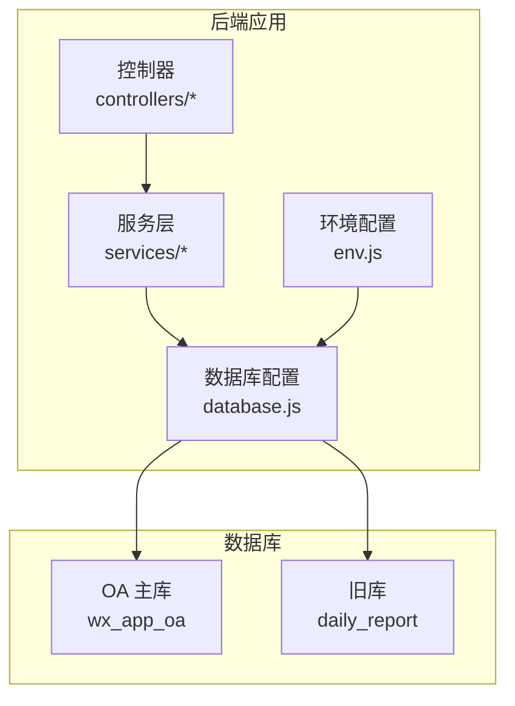
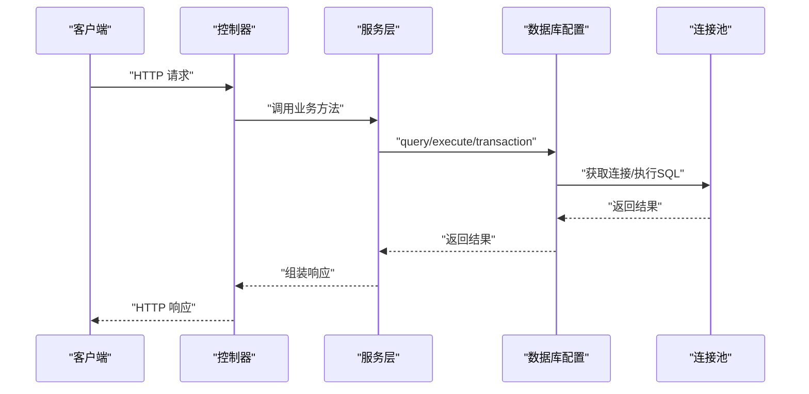
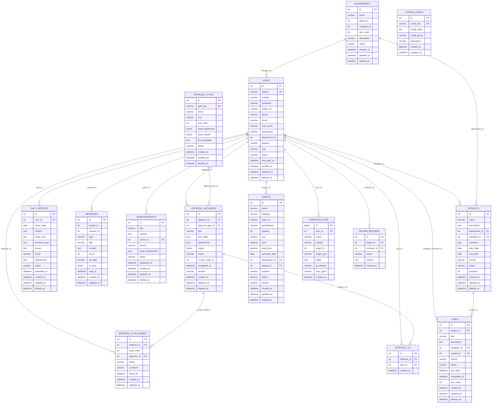

# 数据库设计

<cite>
**本文引用的文件**   
- [database.js](file://backend/src/common/config/database.js)
- [env.js](file://backend/src/common/config/env.js)
- [init-db.js](file://backend/scripts/init-db.js)
- [review_records.sql](file://backend/scripts/review_records.sql)
- [approval_cc.sql](file://backend/scripts/approval_cc.sql)
- [alter_daily_reports.sql](file://backend/scripts/alter_daily_reports.sql)
- [alter_daily_reports_safe.sql](file://backend/scripts/alter_daily_reports_safe.sql)
- [report.service.js](file://backend/src/core/services/report.service.js)
- [approval.service.js](file://backend/src/core/services/approval.service.js)
- [review.service.js](file://backend/src/features/services/review.service.js)
- [report.controller.js](file://backend/src/core/controllers/report.controller.js)
- [approval.controller.js](file://backend/src/core/controllers/approval.controller.js)
- [message.controller.js](file://backend/src/core/controllers/message.controller.js)
- [package.json](file://backend/package.json)
</cite>

## 目录
1. [简介](#简介)
2. [项目结构](#项目结构)
3. [核心组件](#核心组件)
4. [架构总览](#架构总览)
5. [详细组件分析](#详细组件分析)
6. [依赖分析](#依赖分析)
7. [性能考虑](#性能考虑)
8. [故障排查指南](#故障排查指南)
9. [结论](#结论)
10. [附录](#附录)

## 简介
本文件为“智慧办公助手 OA 系统”的数据库设计文档，面向后端工程师与运维人员，系统性阐述基于 MySQL 的数据库架构设计、核心数据表设计、表关系模型与约束、索引策略、迁移脚本执行顺序、数据同步与版本管理策略，并给出 ER 图与表关系图，覆盖数据访问模式、缓存策略与数据生命周期管理的最佳实践。

## 项目结构
数据库相关代码主要分布在以下位置：
- 数据库连接与事务封装：backend/src/common/config/database.js
- 环境变量与数据库配置：backend/src/common/config/env.js
- 初始化建表脚本：backend/scripts/init-db.js
- 扩展与迁移脚本：backend/scripts/*.sql
- 业务服务层（读写数据库）：backend/src/core/services/*.js、backend/src/features/services/*.js
- 控制器层（对外接口）：backend/src/core/controllers/*.js
- 项目脚本命令：backend/package.json

图表来源
- [database.js:11-222](file://backend/src/common/config/database.js#L11-L222)
- [env.js:58-78](file://backend/src/common/config/env.js#L58-L78)

章节来源
- [database.js:11-222](file://backend/src/common/config/database.js#L11-L222)
- [env.js:58-78](file://backend/src/common/config/env.js#L58-L78)
- [package.json:13-14](file://backend/package.json#L13-L14)

## 核心组件
- 数据库连接池与事务封装：提供 OA 主库与旧库双连接池、参数化查询、事务执行、连通性检测等能力。
- 初始化建表脚本：一次性创建 M2 阶段所需的基础表集合。
- 扩展与迁移脚本：针对旧库 daily_report 的字段补齐与索引增强，以及新增 review_records、approval_cc 等表。
- 业务服务层：围绕用户、日报、审批、消息等模块封装数据库访问逻辑。
- 控制器层：对外暴露 REST 接口，调用服务层完成业务处理。

章节来源
- [database.js:48-181](file://backend/src/common/config/database.js#L48-L181)
- [init-db.js:18-322](file://backend/scripts/init-db.js#L18-L322)
- [review_records.sql:8-19](file://backend/scripts/review_records.sql#L8-L19)
- [approval_cc.sql:7-15](file://backend/scripts/approval_cc.sql#L7-L15)
- [report.service.js:105-153](file://backend/src/core/services/report.service.js#L105-L153)
- [approval.service.js:84-132](file://backend/src/core/services/approval.service.js#L84-L132)
- [review.service.js:33-106](file://backend/src/features/services/review.service.js#L33-L106)

## 架构总览
系统采用“控制器 -> 服务层 -> 数据库配置”的分层架构。数据库配置模块负责：
- OA 主库连接池（wx_app_oa）：承载当前业务主数据
- 旧库连接池（daily_report）：兼容旧系统数据与迁移场景
- 统一的查询/执行/事务 API，确保参数化与日志可观测性

图表来源
- [report.controller.js:14-34](file://backend/src/core/controllers/report.controller.js#L14-L34)
- [approval.controller.js:15-36](file://backend/src/core/controllers/approval.controller.js#L15-L36)
- [database.js:65-109](file://backend/src/common/config/database.js#L65-L109)

## 详细组件分析

### 数据库连接与事务（database.js）
- 双连接池设计：OA 主库与旧库分离，分别配置连接上限、字符集与时区。
- 参数化查询与执行：query/oldQuery、execute/oldExecute，避免 SQL 注入。
- 事务封装：transaction 回调自动开启/提交/回滚，异常自动回滚并释放连接。
- 连通性检测：ping/oldPing 用于健康检查。

章节来源
- [database.js:11-43](file://backend/src/common/config/database.js#L11-L43)
- [database.js:65-109](file://backend/src/common/config/database.js#L65-L109)
- [database.js:168-181](file://backend/src/common/config/database.js#L168-L181)
- [database.js:187-207](file://backend/src/common/config/database.js#L187-L207)

### 环境变量与数据库配置（env.js）
- OA_DB_* 与 OLD_DB_* 环境变量用于配置双数据库连接参数。
- 连接池大小可配置（poolMin/poolMax），默认值在配置对象中定义。
- 验证必需环境变量，启动前强制校验。

章节来源
- [env.js:13-41](file://backend/src/common/config/env.js#L13-L41)
- [env.js:58-78](file://backend/src/common/config/env.js#L58-L78)

### 初始化建表脚本（init-db.js）
- 创建 M2 阶段基础表集合，覆盖用户、部门、审批类型、审批实例、审批节点、日报、消息、公告、项目、任务、资产、操作日志、系统配置等。
- 字段设计遵循业务需求，统一使用 utf8mb4 字符集与合适的数据类型（JSON、DATETIME、DECIMAL 等）。
- 大量索引覆盖常见查询维度（用户、状态、日期、部门、角色等）。

章节来源
- [init-db.js:18-322](file://backend/scripts/init-db.js#L18-L322)

### 扩展与迁移脚本（alter_daily_reports*.sql）
- alter_daily_reports.sql：为旧库 daily_report 的 daily_reports 表补充完整字段与索引，满足 Report 模块表单数据存储。
- alter_daily_reports_safe.sql：带存在性检查的安全版 ALTER，逐列/索引判断后添加，避免重复执行失败。

章节来源
- [alter_daily_reports.sql:7-28](file://backend/scripts/alter_daily_reports.sql#L7-L28)
- [alter_daily_reports_safe.sql:6-87](file://backend/scripts/alter_daily_reports_safe.sql#L6-L87)

### 新增表：审核记录表 review_records（review_records.sql）
- 关联 daily_reports(id) 与 users(id)，记录管理员对日报的审核动作、意见与时间。
- 索引覆盖 report_id、reviewer_id、created_at，支撑审核列表与统计查询。

章节来源
- [review_records.sql:8-19](file://backend/scripts/review_records.sql#L8-L19)

### 新增表：审批抄送表 approval_cc（approval_cc.sql）
- 记录审批实例与抄送人的关系，支持创建审批时指定抄送人。
- 索引覆盖 instance_id、user_id，便于查询与清理。

章节来源
- [approval_cc.sql:7-15](file://backend/scripts/approval_cc.sql#L7-L15)

### 业务服务层与数据库交互

#### 日报模块（report.service.js）
- 列表/详情/提交/草稿/删除/导出 CSV 等核心能力均通过数据库封装执行。
- 对 daily_reports 表进行多条件筛选、分页与字段映射；对 users 表进行 LEFT JOIN 获取用户信息。
- 提交逻辑根据是否存在当天记录决定 INSERT/UPDATE，并严格控制状态转换。

章节来源
- [report.service.js:105-153](file://backend/src/core/services/report.service.js#L105-L153)
- [report.service.js:161-174](file://backend/src/core/services/report.service.js#L161-L174)
- [report.service.js:189-280](file://backend/src/core/services/report.service.js#L189-L280)
- [report.service.js:288-297](file://backend/src/core/services/report.service.js#L288-L297)
- [report.service.js:377-409](file://backend/src/core/services/report.service.js#L377-L409)

#### 审批模块（approval.service.js）
- 列表/详情/创建/审批（通过/驳回）等核心能力。
- 审批流程节点表 approval_flow_nodes 与实例表 approval_instances 双表协作，支持多节点流转。
- 创建审批时可写入抄送关系 approval_cc；审批通过/驳回时更新实例状态与当前节点。

章节来源
- [approval.service.js:84-132](file://backend/src/core/services/approval.service.js#L84-L132)
- [approval.service.js:140-180](file://backend/src/core/services/approval.service.js#L140-L180)
- [approval.service.js:195-256](file://backend/src/core/services/approval.service.js#L195-L256)
- [approval.service.js:267-356](file://backend/src/core/services/approval.service.js#L267-L356)

#### 审核模块（review.service.js）
- 审核列表/详情/操作（通过/驳回）与统计分析。
- 审核操作写入 review_records 表，并向消息表 messages 发送通知。
- 统计包含待审核数、今日审核数、平均审核耗时与通过率。

章节来源
- [review.service.js:33-106](file://backend/src/features/services/review.service.js#L33-L106)
- [review.service.js:148-230](file://backend/src/features/services/review.service.js#L148-L230)
- [review.service.js:244-314](file://backend/src/features/services/review.service.js#L244-L314)
- [review.service.js:322-368](file://backend/src/features/services/review.service.js#L322-L368)

### 控制器层与数据访问模式
- 控制器负责参数解析、鉴权与调用服务层。
- 服务层统一通过 database.js 的 query/execute/transaction 访问数据库，保证一致性与安全性。
- 消息模块（message.controller.js）同样遵循相同的数据访问模式。

章节来源
- [report.controller.js:14-34](file://backend/src/core/controllers/report.controller.js#L14-L34)
- [approval.controller.js:15-36](file://backend/src/core/controllers/approval.controller.js#L15-L36)
- [message.controller.js:10-19](file://backend/src/core/controllers/message.controller.js#L10-L19)

## 依赖分析

### 表关系与约束（ER 图）

图表来源
- [init-db.js:23-322](file://backend/scripts/init-db.js#L23-L322)
- [review_records.sql:8-19](file://backend/scripts/review_records.sql#L8-L19)
- [approval_cc.sql:7-15](file://backend/scripts/approval_cc.sql#L7-L15)

### 关键索引与约束
- 用户表 users：唯一索引 openid，常用查询索引 idx_department、idx_role、idx_status、idx_created_at。
- 部门表 departments：常用查询索引 idx_parent_id、idx_status、idx_created_at。
- 审批类型 approval_types：唯一索引 type_key，常用查询索引 idx_status。
- 审批实例 approval_instances：常用查询索引 idx_applicant_id、idx_approval_type、idx_status、idx_created_at。
- 审批节点 approval_flow_nodes：常用查询索引 idx_instance_id、idx_approver_id、idx_action。
- 日报表 daily_reports：唯一索引 uk_user_date，常用查询索引 idx_report_date、idx_status、idx_created_at。
- 消息表 messages：常用查询索引 idx_receiver_id、idx_type、idx_is_read、idx_created_at。
- 公告表 announcements：常用查询索引 idx_priority、idx_status、idx_published_at、idx_created_at。
- 项目表 projects：常用查询索引 idx_department、idx_manager、idx_status、idx_created_at。
- 任务表 tasks：常用查询索引 idx_project_id、idx_assignee、idx_status、idx_due_date、idx_created_at。
- 资产表 assets：常用查询索引 idx_category、idx_department、idx_keeper、idx_status、idx_created_at。
- 操作日志 operation_logs：常用查询索引 idx_user_id、idx_action、idx_module、idx_created_at。
- 系统配置 system_config：唯一索引 config_key，常用查询索引 idx_config_group。
- 审批抄送 approval_cc：索引 idx_instance_id、idx_user_id。
- 审核记录 review_records：索引 idx_report_id、idx_reviewer_id、idx_created_at。

章节来源
- [init-db.js:42-47](file://backend/scripts/init-db.js#L42-L47)
- [init-db.js:64-67](file://backend/scripts/init-db.js#L64-L67)
- [init-db.js:86-87](file://backend/scripts/init-db.js#L86-L87)
- [init-db.js:109-113](file://backend/scripts/init-db.js#L109-L113)
- [init-db.js:129-132](file://backend/scripts/init-db.js#L129-L132)
- [init-db.js:153-157](file://backend/scripts/init-db.js#L153-L157)
- [init-db.js:176-180](file://backend/scripts/init-db.js#L176-L180)
- [init-db.js:198-202](file://backend/scripts/init-db.js#L198-L202)
- [init-db.js:223-227](file://backend/scripts/init-db.js#L223-L227)
- [init-db.js:248-253](file://backend/scripts/init-db.js#L248-L253)
- [init-db.js:278-283](file://backend/scripts/init-db.js#L278-L283)
- [init-db.js:300-304](file://backend/scripts/init-db.js#L300-L304)
- [init-db.js:318-320](file://backend/scripts/init-db.js#L318-L320)
- [review_records.sql:15-18](file://backend/scripts/review_records.sql#L15-L18)
- [approval_cc.sql:12-14](file://backend/scripts/approval_cc.sql#L12-L14)

## 性能考虑
- 连接池参数：根据并发与资源情况调整 poolMin/poolMax，默认值见环境配置。
- 索引策略：围绕高频查询维度建立索引，避免全表扫描；注意写多读少场景的写入成本。
- JSON 字段：form_data、attachments、members、target_departments 等字段使用 JSON 存储，查询时建议尽量避免对 JSON 进行复杂函数计算。
- 事务边界：将相关写操作放入事务，减少中间态；长事务会增加锁竞争，应尽量缩短。
- 分页与排序：列表接口统一按 created_at DESC 排序并分页，避免大偏移量导致的慢查询。
- 旧库迁移：使用安全 ALTER 脚本，避免重复执行失败；迁移期间建议只读或限流。

## 故障排查指南
- 连接失败：检查环境变量 OA_DB_* 与 OLD_DB_* 是否齐全；使用 ping/oldPing 进行连通性测试。
- SQL 注入风险：确认所有外部输入均通过参数化查询执行。
- 事务异常：关注 transaction 回滚日志，定位具体失败点。
- 索引失效：使用 EXPLAIN 分析慢查询，确认是否命中预期索引。
- 旧库字段缺失：执行 alter_daily_reports_safe.sql 确保字段与索引补齐。

章节来源
- [env.js:34-41](file://backend/src/common/config/env.js#L34-L41)
- [database.js:187-207](file://backend/src/common/config/database.js#L187-L207)
- [alter_daily_reports_safe.sql:6-87](file://backend/scripts/alter_daily_reports_safe.sql#L6-L87)

## 结论
本设计以清晰的分层架构与完善的索引策略为基础，结合事务与参数化查询保障数据一致性与安全性；通过初始化脚本与安全迁移脚本实现平滑演进；配合业务服务层的规范化封装，形成可维护、可扩展的数据库方案。建议在生产环境中持续监控慢查询与连接池使用情况，定期评估索引有效性与数据增长趋势。

## 附录

### 数据库迁移与版本管理策略
- 初始化：首次部署执行 init-db.js，创建 M2 阶段基础表。
- 扩展：针对旧库执行 alter_daily_reports*.sql，补齐字段与索引。
- 新功能：新增 review_records、approval_cc 等表，按需执行对应 SQL。
- 版本化：建议将每次 SQL 变更纳入版本控制，配合迁移脚本统一执行。

章节来源
- [package.json:13-14](file://backend/package.json#L13-L14)
- [init-db.js:327-370](file://backend/scripts/init-db.js#L327-L370)
- [alter_daily_reports.sql:7-28](file://backend/scripts/alter_daily_reports.sql#L7-L28)
- [alter_daily_reports_safe.sql:6-87](file://backend/scripts/alter_daily_reports_safe.sql#L6-L87)
- [review_records.sql:8-19](file://backend/scripts/review_records.sql#L8-L19)
- [approval_cc.sql:7-15](file://backend/scripts/approval_cc.sql#L7-L15)

### 数据访问模式与缓存策略
- 数据访问模式：控制器 -> 服务层 -> database.js（参数化查询/事务），保持统一入口。
- 缓存策略：结合 Redis 配置（见 env.js 中 redis.*），对热点查询结果与会话数据进行缓存；注意缓存与数据库的一致性更新策略。
- 数据生命周期：软删除字段 deleted_at 支持逻辑删除；操作日志表记录关键变更细节，便于审计与回溯。

章节来源
- [env.js:80-87](file://backend/src/common/config/env.js#L80-L87)
- [database.js:65-109](file://backend/src/common/config/database.js#L65-L109)
- [init-db.js:39, 61, 83, 106, 150, 174, 195, 220, 244, 275, 298, 316:39-39](file://backend/scripts/init-db.js#L39-L39)