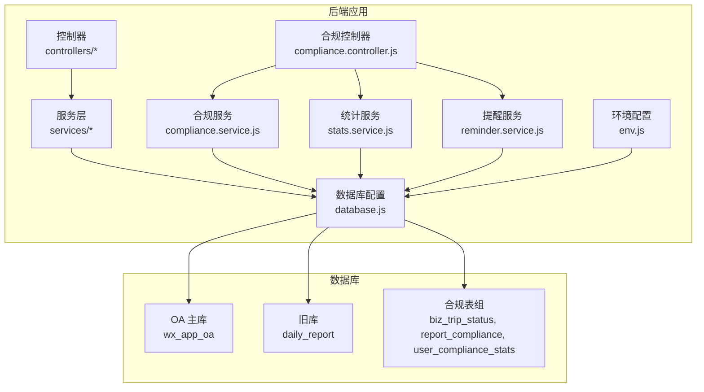
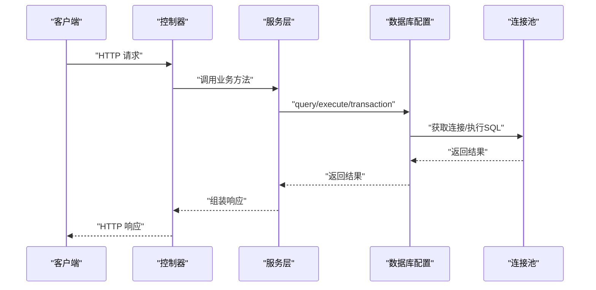
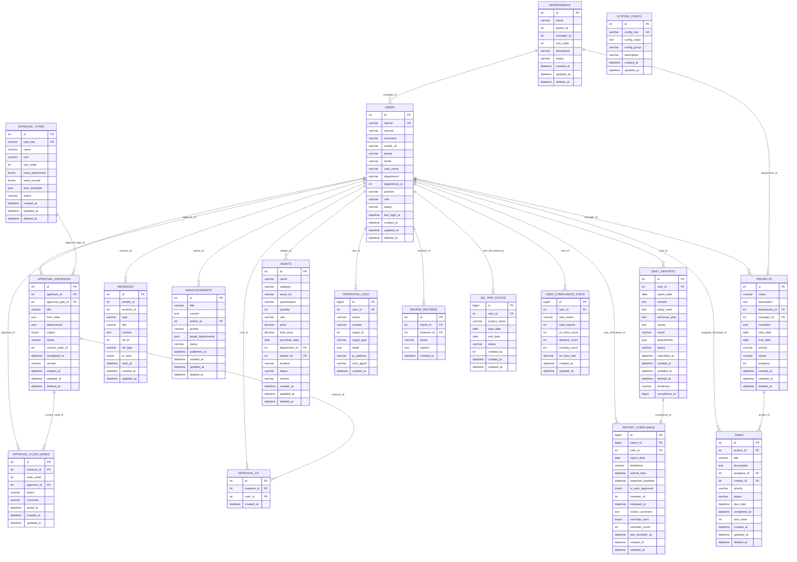

# 数据库设计

<cite>
**本文引用的文件**   
- [database.js](file://backend/src/config/database.js)
- [env.js](file://backend/src/config/env.js)
- [init-db.js](file://backend/scripts/init-db.js)
- [review_records.sql](file://backend/scripts/review_records.sql)
- [approval_cc.sql](file://backend/scripts/approval_cc.sql)
- [alter_daily_reports.sql](file://backend/scripts/alter_daily_reports.sql)
- [alter_daily_reports_safe.sql](file://backend/scripts/alter_daily_reports_safe.sql)
- [migration_create_compliance_tables.sql](file://backend/scripts/migration_create_compliance_tables.sql)
- [migration_alter_daily_reports_compliance.sql](file://backend/scripts/migration_alter_daily_reports_compliance.sql)
- [run-compliance-migration.js](file://backend/scripts/run-compliance-migration.js)
- [compliance.controller.js](file://backend/src/features/compliance/controllers/compliance.controller.js)
- [compliance.service.js](file://backend/src/features/compliance/services/compliance.service.js)
- [stats.service.js](file://backend/src/features/compliance/services/stats.service.js)
- [reminder.service.js](file://backend/src/features/compliance/services/reminder.service.js)
- [compliance.routes.js](file://backend/src/features/compliance/routes/compliance.routes.js)
- [compliance.task.js](file://backend/src/common/tasks/compliance.task.js)
- [compliance.ts](file://webapp/src/api/compliance.ts)
- [compliance.test.js](file://backend/tests/integration/compliance.test.js)
- [report.service.js](file://backend/src/core/services/report.service.js)
- [approval.service.js](file://backend/src/core/services/approval.service.js)
- [review.service.js](file://backend/src/features/services/review.service.js)
- [report.controller.js](file://backend/src/core/controllers/report.controller.js)
- [approval.controller.js](file://backend/src/core/controllers/approval.controller.js)
- [message.controller.js](file://backend/src/core/controllers/message.controller.js)
- [package.json](file://backend/package.json)
</cite>

## 目录
1. [简介](#简介)
2. [项目结构](#项目结构)
3. [核心组件](#核心组件)
4. [架构总览](#架构总览)
5. [详细组件分析](#详细组件分析)
6. [依赖分析](#依赖分析)
7. [性能考虑](#性能考虑)
8. [故障排查指南](#故障排查指南)
9. [结论](#结论)
10. [附录](#附录)

## 简介
本文件为"智慧办公助手 OA 系统"的数据库设计文档，面向后端工程师与运维人员，系统性阐述基于 MySQL 的数据库架构设计、核心数据表设计、表关系模型与约束、索引策略、迁移脚本执行顺序、数据同步与版本管理策略，并给出 ER 图与表关系图，覆盖数据访问模式、缓存策略与数据生命周期管理的最佳实践。

**更新** 新增合规管理相关的数据表设计，包括出差状态表、日志合规记录表和用户合规统计表，以及相关的迁移脚本和业务逻辑。

## 项目结构
数据库相关代码主要分布在以下位置：
- 数据库连接与事务封装：backend/src/config/database.js
- 环境变量与数据库配置：backend/src/config/env.js
- 初始化建表脚本：backend/scripts/init-db.js
- 扩展与迁移脚本：backend/scripts/*.sql
- 合规管理迁移脚本：backend/scripts/migration_create_compliance_tables.sql、backend/scripts/migration_alter_daily_reports_compliance.sql
- 合规管理业务逻辑：backend/src/features/compliance/controllers/*.js、backend/src/features/compliance/services/*.js
- 合规管理定时任务：backend/src/common/tasks/compliance.task.js
- 控制器层（对外接口）：backend/src/core/controllers/*.js
- 项目脚本命令：backend/package.json

**图表来源**
- [database.js:11-222](file://backend/src/config/database.js#L11-L222)
- [env.js:58-78](file://backend/src/config/env.js#L58-L78)
- [compliance.controller.js:1-268](file://backend/src/features/compliance/controllers/compliance.controller.js#L1-L268)
- [compliance.service.js:1-287](file://backend/src/features/compliance/services/compliance.service.js#L1-L287)
- [stats.service.js:1-214](file://backend/src/features/compliance/services/stats.service.js#L1-L214)
- [reminder.service.js:1-85](file://backend/src/features/compliance/services/reminder.service.js#L1-L85)

**章节来源**
- [database.js:11-222](file://backend/src/config/database.js#L11-L222)
- [env.js:58-78](file://backend/src/config/env.js#L58-L78)
- [package.json:13-14](file://backend/package.json#L13-L14)

## 核心组件
- 数据库连接池与事务封装：提供 OA 主库与旧库双连接池、参数化查询、事务执行、连通性检测等能力。
- 初始化建表脚本：一次性创建 M2 阶段所需的基础表集合。
- 扩展与迁移脚本：针对旧库 daily_report 的字段补齐与索引增强，以及新增 review_records、approval_cc 等表。
- **合规管理迁移脚本**：创建出差状态表、日志合规记录表、用户合规统计表，并修改 daily_reports 表结构。
- 合规管理业务服务层：围绕出差状态管理、日志合规检查、统计分析等功能封装数据库访问逻辑。
- 控制器层：对外暴露 REST 接口，调用服务层完成业务处理。

**章节来源**
- [database.js:48-181](file://backend/src/config/database.js#L48-L181)
- [init-db.js:18-322](file://backend/scripts/init-db.js#L18-L322)
- [review_records.sql:8-19](file://backend/scripts/review_records.sql#L8-L19)
- [approval_cc.sql:7-15](file://backend/scripts/approval_cc.sql#L7-L15)
- [migration_create_compliance_tables.sql:1-93](file://backend/scripts/migration_create_compliance_tables.sql#L1-L93)
- [migration_alter_daily_reports_compliance.sql:1-84](file://backend/scripts/migration_alter_daily_reports_compliance.sql#L1-L84)
- [compliance.controller.js:1-268](file://backend/src/features/compliance/controllers/compliance.controller.js#L1-L268)
- [compliance.service.js:1-287](file://backend/src/features/compliance/services/compliance.service.js#L1-L287)
- [stats.service.js:1-214](file://backend/src/features/compliance/services/stats.service.js#L1-L214)
- [reminder.service.js:1-85](file://backend/src/features/compliance/services/reminder.service.js#L1-L85)

## 架构总览
系统采用"控制器 -> 服务层 -> 数据库配置"的分层架构。数据库配置模块负责：
- OA 主库连接池（wx_app_oa）：承载当前业务主数据
- 旧库连接池（daily_report）：兼容旧系统数据与迁移场景
- 统一的查询/执行/事务 API，确保参数化与日志可观测性

**图表来源**
- [report.controller.js:14-34](file://backend/src/core/controllers/report.controller.js#L14-L34)
- [approval.controller.js:15-36](file://backend/src/core/controllers/approval.controller.js#L15-L36)
- [database.js:65-109](file://backend/src/config/database.js#L65-L109)

## 详细组件分析

### 数据库连接与事务（database.js）
- 双连接池设计：OA 主库与旧库分离，分别配置连接上限、字符集与时区。
- 参数化查询与执行：query/oldQuery、execute/oldExecute，避免 SQL 注入。
- 事务封装：transaction 回调自动开启/提交/回滚，异常自动回滚并释放连接。
- 连通性检测：ping/oldPing 用于健康检查。

**章节来源**
- [database.js:11-43](file://backend/src/config/database.js#L11-L43)
- [database.js:65-109](file://backend/src/config/database.js#L65-L109)
- [database.js:168-181](file://backend/src/config/database.js#L168-L181)
- [database.js:187-207](file://backend/src/config/database.js#L187-L207)

### 环境变量与数据库配置（env.js）
- OA_DB_* 与 OLD_DB_* 环境变量用于配置双数据库连接参数。
- 连接池大小可配置（poolMin/poolMax），默认值在配置对象中定义。
- 验证必需环境变量，启动前强制校验。

**章节来源**
- [env.js:13-41](file://backend/src/config/env.js#L13-L41)
- [env.js:58-78](file://backend/src/config/env.js#L58-L78)

### 初始化建表脚本（init-db.js）
- 创建 M2 阶段基础表集合，覆盖用户、部门、审批类型、审批实例、审批节点、日报、消息、公告、项目、任务、资产、操作日志、系统配置等。
- 字段设计遵循业务需求，统一使用 utf8mb4 字符集与合适的数据类型（JSON、DATETIME、DECIMAL 等）。
- 大量索引覆盖常见查询维度（用户、状态、日期、部门、角色等）。

**章节来源**
- [init-db.js:18-322](file://backend/scripts/init-db.js#L18-L322)

### 扩展与迁移脚本（alter_daily_reports*.sql）
- alter_daily_reports.sql：为旧库 daily_report 的 daily_reports 表补充完整字段与索引，满足 Report 模块表单数据存储。
- alter_daily_reports_safe.sql：带存在性检查的安全版 ALTER，逐列/索引判断后添加，避免重复执行失败。

**章节来源**
- [alter_daily_reports.sql:7-28](file://backend/scripts/alter_daily_reports.sql#L7-L28)
- [alter_daily_reports_safe.sql:6-87](file://backend/scripts/alter_daily_reports_safe.sql#L6-L87)

### 合规管理迁移脚本

#### 新增表：出差状态表 biz_trip_status（migration_create_compliance_tables.sql）
- 记录员工出差状态，用于自动判断是否需要提交日报。
- 字段包含用户ID、项目名称、出差开始/结束日期、状态枚举等。
- 索引覆盖 user_id、status、start_date，支撑状态查询与统计。

**章节来源**
- [migration_create_compliance_tables.sql:14-30](file://backend/scripts/migration_create_compliance_tables.sql#L14-L30)

#### 新增表：日志合规记录表 report_compliance（migration_create_compliance_tables.sql）
- 记录每条日报的合规性信息（及时性、审核状态等）。
- 包含及时性枚举、实际提交时间、期望截止时间、自动审核标识等字段。
- 索引覆盖 report_id（唯一）、user_id+report_date、timeliness、report_date。

**章节来源**
- [migration_create_compliance_tables.sql:36-60](file://backend/scripts/migration_create_compliance_tables.sql#L36-L60)

#### 新增表：用户合规统计表 user_compliance_stats（migration_create_compliance_tables.sql）
- 按月聚合统计每个用户的合规情况。
- 字段包含用户ID、统计月份、各类报告数量及及时率。
- 索引覆盖 user_id+stat_month（唯一）、stat_month。

**章节来源**
- [migration_create_compliance_tables.sql:66-82](file://backend/scripts/migration_create_compliance_tables.sql#L66-L82)

#### 修改表：daily_reports 表结构（migration_alter_daily_reports_compliance.sql）
- 新增 timeliness 字段（及时性标记）。
- 新增 compliance_id 字段（关联合规记录ID）。
- 新增 idx_timeliness 索引。
- 使用存在性检查避免重复添加。

**章节来源**
- [migration_alter_daily_reports_compliance.sql:17-63](file://backend/scripts/migration_alter_daily_reports_compliance.sql#L17-L63)

### 合规管理业务服务层

#### 合规控制器（compliance.controller.js）
- 出差状态管理：设置出差状态、结束出差、获取出差列表。
- 缺失报告管理：获取缺失报告列表、审核缺失报告、手动修正及时性。
- 统计看板：获取合规统计看板数据。
- 个人合规：获取我的合规记录、检查我的出差状态。
- 权限控制：管理员接口需要 admin/superadmin 角色。

**章节来源**
- [compliance.controller.js:11-30](file://backend/src/features/compliance/controllers/compliance.controller.js#L11-L30)
- [compliance.controller.js:35-53](file://backend/src/features/compliance/controllers/compliance.controller.js#L35-L53)
- [compliance.controller.js:58-91](file://backend/src/features/compliance/controllers/compliance.controller.js#L58-L91)
- [compliance.controller.js:96-137](file://backend/src/features/compliance/controllers/compliance.controller.js#L96-L137)
- [compliance.controller.js:142-162](file://backend/src/features/compliance/controllers/compliance.controller.js#L142-L162)
- [compliance.controller.js:167-180](file://backend/src/features/compliance/controllers/compliance.controller.js#L167-L180)
- [compliance.controller.js:185-211](file://backend/src/features/compliance/controllers/compliance.controller.js#L185-L211)
- [compliance.controller.js:216-236](file://backend/src/features/compliance/controllers/compliance.controller.js#L216-L236)
- [compliance.controller.js:241-254](file://backend/src/features/compliance/controllers/compliance.controller.js#L241-L254)

#### 合规服务（compliance.service.js）
- 及时性检查：根据报告日期和提交时间计算及时性状态。
- 合规记录创建：事务性创建 report_compliance 记录并更新 daily_reports。
- 缺失报告审核：管理员审核缺失报告，更新状态和统计。
- 及时性修正：手动修正及时性标记，维护统计准确性。

**章节来源**
- [compliance.service.js:11-21](file://backend/src/features/compliance/services/compliance.service.js#L11-L21)
- [compliance.service.js:33-92](file://backend/src/features/compliance/services/compliance.service.js#L33-L92)
- [compliance.service.js:103-157](file://backend/src/features/compliance/services/compliance.service.js#L103-L157)
- [compliance.service.js:168-210](file://backend/src/features/compliance/services/compliance.service.js#L168-L210)
- [compliance.service.js:220-278](file://backend/src/features/compliance/services/compliance.service.js#L220-L278)

#### 统计服务（stats.service.js）
- 月度统计更新：聚合计算用户月度合规统计并插入/更新 user_compliance_stats。
- 统计看板：提供整体及时率、部门排名、缺失报告TOP10、趋势数据。
- 个人统计：获取用户当月合规统计。

**章节来源**
- [stats.service.js:11-53](file://backend/src/features/compliance/services/stats.service.js#L11-L53)
- [stats.service.js:62-134](file://backend/src/features/compliance/services/stats.service.js#L62-L134)
- [stats.service.js:141-174](file://backend/src/features/compliance/services/stats.service.js#L141-L174)
- [stats.service.js:179-206](file://backend/src/features/compliance/services/stats.service.js#L179-L206)

#### 提醒服务（reminder.service.js）
- 出差提醒：向出差员工发送日志提醒，支持不同时间段提醒。
- 微信模板消息：集成企业微信模板消息发送。
- 提醒统计：记录提醒发送次数和时间。

**章节来源**
- [reminder.service.js:11-82](file://backend/src/features/compliance/services/reminder.service.js#L11-L82)

#### 合规定时任务（compliance.task.js）
- 昨日报告检查：每天执行检查出差员工昨日日报提交情况。
- 及时性标记：根据提交时间标记及时性状态。
- 事务处理：确保检查过程的数据一致性。

**章节来源**
- [compliance.task.js:11-97](file://backend/src/common/tasks/compliance.task.js#L11-L97)

### 控制器层与数据访问模式
- 控制器负责参数解析、鉴权与调用服务层。
- 服务层统一通过 database.js 的 query/execute/transaction 访问数据库，保证一致性与安全性。
- 消息模块（message.controller.js）同样遵循相同的数据访问模式。

**章节来源**
- [report.controller.js:14-34](file://backend/src/core/controllers/report.controller.js#L14-L34)
- [approval.controller.js:15-36](file://backend/src/core/controllers/approval.controller.js#L15-L36)
- [message.controller.js:10-19](file://backend/src/core/controllers/message.controller.js#L10-L19)

## 依赖分析

### 表关系与约束（ER 图）

**图表来源**
- [init-db.js:23-322](file://backend/scripts/init-db.js#L23-L322)
- [review_records.sql:8-19](file://backend/scripts/review_records.sql#L8-L19)
- [approval_cc.sql:7-15](file://backend/scripts/approval_cc.sql#L7-L15)
- [migration_create_compliance_tables.sql:16-82](file://backend/scripts/migration_create_compliance_tables.sql#L16-L82)
- [migration_alter_daily_reports_compliance.sql:17-63](file://backend/scripts/migration_alter_daily_reports_compliance.sql#L17-L63)

### 关键索引与约束
- 用户表 users：唯一索引 openid，常用查询索引 idx_department、idx_role、idx_status、idx_created_at。
- 部门表 departments：常用查询索引 idx_parent_id、idx_status、idx_created_at。
- 审批类型 approval_types：唯一索引 type_key，常用查询索引 idx_status。
- 审批实例 approval_instances：常用查询索引 idx_applicant_id、idx_approval_type、idx_status、idx_created_at。
- 审批节点 approval_flow_nodes：常用查询索引 idx_instance_id、idx_approver_id、idx_action。
- 日报表 daily_reports：唯一索引 uk_user_date，常用查询索引 idx_report_date、idx_status、idx_created_at、**新增 idx_timeliness**。
- 消息表 messages：常用查询索引 idx_receiver_id、idx_type、idx_is_read、idx_created_at。
- 公告表 announcements：常用查询索引 idx_priority、idx_status、idx_published_at、idx_created_at。
- 项目表 projects：常用查询索引 idx_department、idx_manager、idx_status、idx_created_at。
- 任务表 tasks：常用查询索引 idx_project_id、idx_assignee、idx_status、idx_due_date、idx_created_at。
- 资产表 assets：常用查询索引 idx_category、idx_department、idx_keeper、idx_status、idx_created_at。
- 操作日志 operation_logs：常用查询索引 idx_user_id、idx_action、idx_module、idx_created_at。
- 系统配置 system_config：唯一索引 config_key，常用查询索引 idx_config_group。
- 审批抄送 approval_cc：索引 idx_instance_id、idx_user_id。
- 审核记录 review_records：索引 idx_report_id、idx_reviewer_id、idx_created_at。
- **出差状态 biz_trip_status：索引 idx_user_id、idx_status、idx_start_date**。
- **日志合规 report_compliance：唯一索引 uk_report_id，索引 idx_user_date、idx_timeliness、idx_report_date**。
- **用户统计 user_compliance_stats：唯一索引 uk_user_month，索引 idx_stat_month**。

**章节来源**
- [init-db.js:42-47](file://backend/scripts/init-db.js#L42-L47)
- [init-db.js:64-67](file://backend/scripts/init-db.js#L64-L67)
- [init-db.js:86-87](file://backend/scripts/init-db.js#L86-L87)
- [init-db.js:109-113](file://backend/scripts/init-db.js#L109-L113)
- [init-db.js:129-132](file://backend/scripts/init-db.js#L129-L132)
- [init-db.js:153-157](file://backend/scripts/init-db.js#L153-L157)
- [init-db.js:176-180](file://backend/scripts/init-db.js#L176-L180)
- [init-db.js:198-202](file://backend/scripts/init-db.js#L198-L202)
- [init-db.js:223-227](file://backend/scripts/init-db.js#L223-L227)
- [init-db.js:248-253](file://backend/scripts/init-db.js#L248-L253)
- [init-db.js:278-283](file://backend/scripts/init-db.js#L278-L283)
- [init-db.js:300-304](file://backend/scripts/init-db.js#L300-L304)
- [init-db.js:318-320](file://backend/scripts/init-db.js#L318-L320)
- [review_records.sql:15-18](file://backend/scripts/review_records.sql#L15-L18)
- [approval_cc.sql:12-14](file://backend/scripts/approval_cc.sql#L12-L14)
- [migration_create_compliance_tables.sql:27-29](file://backend/scripts/migration_create_compliance_tables.sql#L27-L29)
- [migration_create_compliance_tables.sql:57-59](file://backend/scripts/migration_create_compliance_tables.sql#L57-L59)
- [migration_create_compliance_tables.sql:80-81](file://backend/scripts/migration_create_compliance_tables.sql#L80-L81)
- [migration_alter_daily_reports_compliance.sql:49-63](file://backend/scripts/migration_alter_daily_reports_compliance.sql#L49-L63)

## 性能考虑
- 连接池参数：根据并发与资源情况调整 poolMin/poolMax，默认值见环境配置。
- 索引策略：围绕高频查询维度建立索引，避免全表扫描；注意写多读少场景的写入成本。
- JSON 字段：form_data、attachments、members、target_departments 等字段使用 JSON 存储，查询时建议尽量避免对 JSON 进行复杂函数计算。
- 事务边界：将相关写操作放入事务，减少中间态；长事务会增加锁竞争，应尽量缩短。
- 分页与排序：列表接口统一按 created_at DESC 排序并分页，避免大偏移量导致的慢查询。
- 旧库迁移：使用安全 ALTER 脚本，避免重复执行失败；迁移期间建议只读或限流。
- **合规统计优化**：user_compliance_stats 表按月聚合统计，减少实时计算开销；report_compliance 表建立复合索引支撑高频查询。

## 故障排查指南
- 连接失败：检查环境变量 OA_DB_* 与 OLD_DB_* 是否齐全；使用 ping/oldPing 进行连通性测试。
- SQL 注入风险：确认所有外部输入均通过参数化查询执行。
- 事务异常：关注 transaction 回滚日志，定位具体失败点。
- 索引失效：使用 EXPLAIN 分析慢查询，确认是否命中预期索引。
- 旧库字段缺失：执行 alter_daily_reports_safe.sql 确保字段与索引补齐。
- **合规表创建失败**：检查 migration_create_compliance_tables.sql 执行结果，确认表名和字段定义正确。
- **daily_reports 修改失败**：检查 migration_alter_daily_reports_compliance.sql 的存在性检查逻辑。

**章节来源**
- [env.js:34-41](file://backend/src/config/env.js#L34-L41)
- [database.js:187-207](file://backend/src/config/database.js#L187-L207)
- [alter_daily_reports_safe.sql:6-87](file://backend/scripts/alter_daily_reports_safe.sql#L6-L87)
- [run-compliance-migration.js:15-60](file://backend/scripts/run-compliance-migration.js#L15-L60)

## 结论
本设计以清晰的分层架构与完善的索引策略为基础，结合事务与参数化查询保障数据一致性与安全性；通过初始化脚本与安全迁移脚本实现平滑演进；配合业务服务层的规范化封装，形成可维护、可扩展的数据库方案。**新增的合规管理模块通过三个核心表实现了完整的日志合规管理体系，包括出差状态跟踪、日志及时性检查和统计分析功能，为系统的合规管理提供了强有力的数据支撑。**

## 附录

### 数据库迁移与版本管理策略
- 初始化：首次部署执行 init-db.js，创建 M2 阶段基础表。
- 扩展：针对旧库执行 alter_daily_reports*.sql，补齐字段与索引。
- 新功能：新增 review_records、approval_cc 等表，按需执行对应 SQL。
- **合规管理**：执行 migration_create_compliance_tables.sql 创建合规相关表，执行 migration_alter_daily_reports_compliance.sql 修改 daily_reports 表结构。
- 版本化：建议将每次 SQL 变更纳入版本控制，配合迁移脚本统一执行。

**章节来源**
- [package.json:13-14](file://backend/package.json#L13-L14)
- [init-db.js:327-370](file://backend/scripts/init-db.js#L327-L370)
- [alter_daily_reports.sql:7-28](file://backend/scripts/alter_daily_reports.sql#L7-L28)
- [alter_daily_reports_safe.sql:6-87](file://backend/scripts/alter_daily_reports_safe.sql#L6-L87)
- [review_records.sql:8-19](file://backend/scripts/review_records.sql#L8-L19)
- [approval_cc.sql:7-15](file://backend/scripts/approval_cc.sql#L7-L15)
- [migration_create_compliance_tables.sql:1-93](file://backend/scripts/migration_create_compliance_tables.sql#L1-L93)
- [migration_alter_daily_reports_compliance.sql:1-84](file://backend/scripts/migration_alter_daily_reports_compliance.sql#L1-L84)

### 数据访问模式与缓存策略
- 数据访问模式：控制器 -> 服务层 -> database.js（参数化查询/事务），保持统一入口。
- 缓存策略：结合 Redis 配置（见 env.js 中 redis.*），对热点查询结果与会话数据进行缓存；注意缓存与数据库的一致性更新策略。
- 数据生命周期：软删除字段 deleted_at 支持逻辑删除；操作日志表记录关键变更细节，便于审计与回溯。

**章节来源**
- [env.js:80-87](file://backend/src/config/env.js#L80-L87)
- [database.js:65-109](file://backend/src/config/database.js#L65-L109)
- [init-db.js:39, 61, 83, 106, 150, 174, 195, 220, 244, 275, 298, 316:39-39](file://backend/scripts/init-db.js#L39-L39)

### 合规管理 API 接口规范
- 出差状态管理：POST /api/compliance/biz-trip、PUT /api/compliance/biz-trip/:id/end、GET /api/compliance/biz-trip/list
- 缺失报告管理：GET /api/compliance/missing-reports、POST /api/compliance/missing-reports/:id/review、PUT /api/compliance/timeliness/:id
- 统计看板：GET /api/compliance/stats/dashboard
- 个人合规：GET /api/compliance/my-compliance、GET /api/compliance/biz-trip/check-status

**章节来源**
- [compliance.routes.js:8-27](file://backend/src/features/compliance/routes/compliance.routes.js#L8-L27)
- [compliance.ts:6-69](file://webapp/src/api/compliance.ts#L6-L69)
- [compliance.test.js:47-242](file://backend/tests/integration/compliance.test.js#L47-L242)