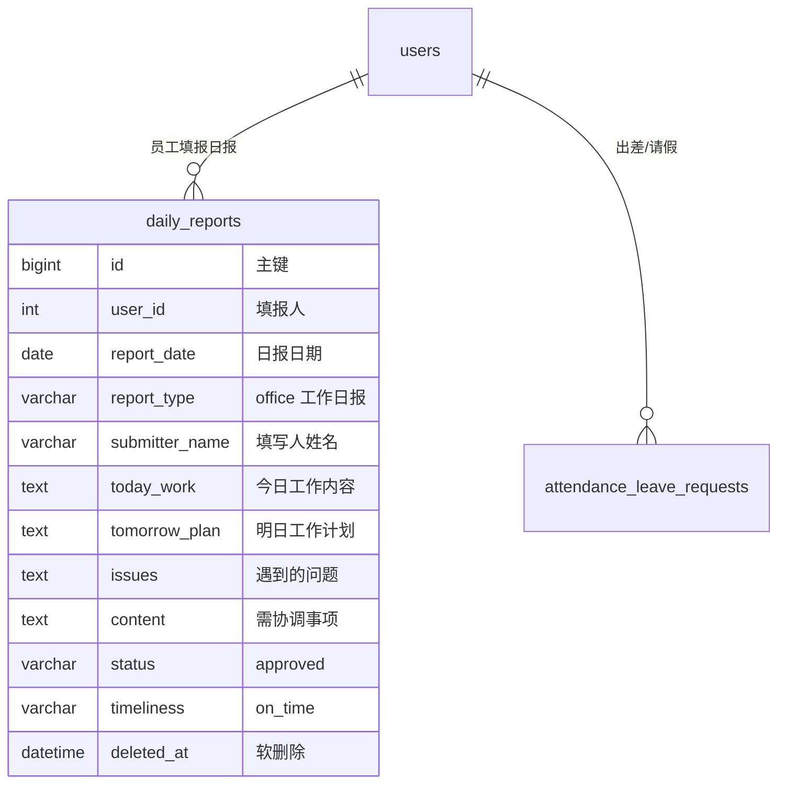

# 02-data-design — 数据设计

> 维度：数据模型（ER 图、DDL、索引、迁移）
> 读者：后端开发、DBA
> 上游依赖：`01-requirements.md`
> 下游影响：`03-api-design.md`、`06-tech-architecture.md`

## 文档目标

定义本功能块的全部数据结构。**本期无 DDL**：复用现有 `daily_reports` 表，仅新增 `report_type='office'` 类型值（varchar 已支持）。

## 1. ER 图



> 工作日报不写 `daily_report_workers`（无代填关系）。

## 2. 完整建表 DDL

### 新建表清单

无（本期不新建表）。

### 扩展表（已有表加字段）

无 DDL。`daily_reports.report_type` 为 varchar，已可存储 'office'，无需 ALTER。

```sql
-- 无需执行任何 DDL。已存在列：report_type varchar
```

## 3. 索引设计

工作日报复用 `daily_reports` 现有索引，无需新增：

| 索引名 | 表名 | 字段 | 类型 | 说明 |
|--------|------|------|------|------|
| uk_user_date | daily_reports | user_id, report_date | 唯一 | 一人一天一条日报（含工作日报） |
| idx_report_date | daily_reports | report_date | 普通 | 按日期统计/查询 |
| idx_status_date | daily_reports | status, report_date | 联合 | 统计非草稿记录 |

## 4. 迁移脚本

### 正向迁移（up）

```sql
-- 迁移：工作日报（复用 daily_reports，无结构变更）
-- 日期：2026-08-05
-- 说明：report_type='office' 由 varchar 列天然支持，无需 DDL。
-- 验收：SHOW COLUMNS FROM daily_reports LIKE 'report_type'; -- 确认存在
```

### 回滚脚本（down）

```sql
-- 回滚：工作日报（无结构变更，回滚 = 停用 office 类型）
-- 1. 后端 submit 白名单移除 'office'
-- 2. 小程序 typeTabs 移除 office Tab
-- 3. 存量 report_type='office' 记录由管理员按需删除
```

## 5. 数据初始化（可选）

无。工作日报数据由员工提交产生，无需预置。

## 变更记录

| 日期 | 变更内容 | 变更人 |
|------|---------|--------|
| 2026-08-05 | 初始创建（无 DDL，复用 daily_reports） | 殇血轮回 |
