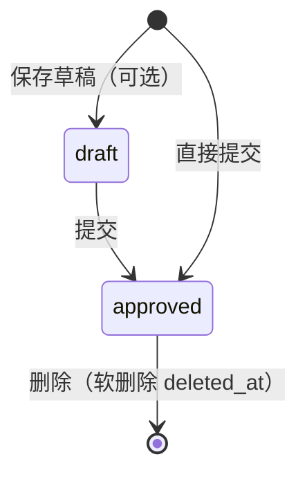

# 04-business-logic — 业务逻辑

> 维度：业务规则（核心规则、状态机、伪代码、映射表）
> 读者：后端开发、测试、产品
> 上游依赖：`01-requirements.md`、`02-data-design.md`、`03-api-design.md`
> 下游影响：`06-tech-architecture.md`、`08-acceptance.md`

## 文档目标

用自然语言 + 状态机 + 伪代码定义工作日报的全部业务规则。

## 1. 核心业务规则

### 规则 1：工作日报类型与提交状态

工作日报 = `report_type='office'`，提交即 `status='approved'`、`timeliness='on_time'`，无审核流程。

- **触发条件**：`POST /api/report/submit` 携带 `reportType='office'`
- **执行逻辑**：controller 白名单校验放行；跳过 todayWorkType 必填/枚举校验（office 可不选工作类型）；跳过 project/area/workerIds 等公出必填校验；service 写入 `status='approved'`
- **异常处理**：`reportType` 不在 `['biz_trip','biz_trip_supplement','office']` 抛「无效的日志类型」

### 规则 2：一人一天一条

同一用户同一天只能有一条日报（公出 / 补公出 / 工作日报三选一）。

- **触发条件**：提交时按 `user_id + report_date` 查重
- **执行逻辑**：已有 draft/请假记录则 UPDATE 覆盖；已有已提交记录抛 `REPORT_ALREADY_SUBMITTED`
- **异常处理**：前端收到冲突错误提示重复提交

### 规则 3：工作日报字段与代填

工作日报只填四字段：今日工作内容必填，明日计划/问题/协调选填；不选作业人员。

- **触发条件**：office 提交
- **执行逻辑**：`workers` 为空时自动填提交人自己；不写 `daily_report_workers` 代填表；`coordination` 落库 `content` 列
- **异常处理**：今日工作内容为空时前端校验拦截

### 规则 4：统计纳入范围

工作日报纳入 全员当日 / 明日状态 / 日历 三个视图；项目进展、人员分布、区域分布、个人统计、全量 getStats 保持排除。

- **触发条件**：调用 `getDailyStatus` / `getTomorrowStatus` / `getDailyCounts`
- **执行逻辑**：
  - `getDailyStatus`：放开人员清单的 `report_type != 'office'` 排除，office 提交者进入当日，状态=office，`summary.office` 计数
  - `getTomorrowStatus`：放开明日计划查询的 office 排除
  - `getDailyCounts`：office 提交者直接计入当日 submitted 与 total（不走 isOnTrip 路径），不再按请假处理
- **异常处理**：无

### 规则 5：填报口径

只纳入实际填写者——填了工作日报的人以「工作日报」状态计入；没填且没出差的办公人员不显示、不算缺失。

- **触发条件**：getDailyStatus 构建人员集合
- **执行逻辑**：人员集合 = 当日有日报者（含 office）∪ 出差在职者 ∪ 请假者；其余在职外场人员标「未提交」，非外场且无报告者跳过
- **异常处理**：无

### 规则 6：日期限制

工作日报只可填昨天/今天（与公出日志一致）；请假类型放开限制。

- **触发条件**：前端日期 picker start=yesterday end=today
- **执行逻辑**：前端约束，后端不强制
- **异常处理**：无

## 2. 状态机

工作日报无流转状态（提交即终态 approved）：



### 状态定义

| 状态 | 名称 | 说明 | 允许的操作 |
|------|------|------|-----------|
| draft | 草稿 | 未提交 | 提交/编辑 |
| approved | 已通过 | 提交即终态 | 编辑(admin)/删除 |

### 状态转换条件

| 起始状态 | 目标状态 | 触发条件 | 操作角色 | 副作用 |
|---------|---------|---------|---------|--------|
| draft | approved | 提交工作日报 | employee | 写 submitter_name、workers=提交人自己 |
| approved | 软删除 | 删除 | admin/自己 | deleted_at=NOW()，可恢复 |

## 3. 伪代码

### 3.1 `report.controller.submit`（office 分支）

**函数签名：**

```
async function submit(req, res, next): Promise<void>
```

**逻辑步骤：**

1. 解析 `reportType`，白名单校验（含 'office'）
2. 校验 `reportDate` 非空
3. 若 `reportType !== 'office'`：校验 todayWorkType 枚举；否则跳过
4. 若 `reportType ∈ {biz_trip, biz_trip_supplement}`：校验项目/区域/数量/作业人员等
5. 自动补充 entryDate / initialBizTripDate
6. 调 `reportService.submit(data, userId)`

**伪代码：**

```
function submit(req, res):
    reportType = req.body.reportType || 'biz_trip'
    if reportType not in ['biz_trip', 'biz_trip_supplement', 'office']:
        throw ValidationError("无效的日志类型")
    if req.body.reportDate 为空:
        throw ValidationError("日报日期不能为空")
    if reportType != 'office':
        校验 todayWorkType 枚举（默认 工作（陆））
    if reportType in ['biz_trip', 'biz_trip_supplement']:
        校验 项目/区域/初始出差/工作内容/数量/作业人员
    result = reportService.submit(req.body, req.user.userId)
    return success(result)
```

### 3.2 `statsService.getDailyCounts`（office 计数）

**函数签名：**

```
async function getDailyCounts(month): Promise<{ month, data: [{ date, submitted, total }] }>
```

**逻辑步骤：**

1. 查当月 active 用户、出差记录、非草稿日报（含 report_type）
2. 遍历日报：office → 提交者计入 `submittedSet[d]` 与 `officeDateSet[d]`；请假 → `leaveDateSet[d]`；其余走 `addSubmitted`（isOnTrip 过滤）+ workers 文本兜底
3. 逐日计算：`total = 出差在职(且已入场, 非请假) ∪ officeDateSet[d]`；`submitted = submittedSet[d].size`

**伪代码：**

```
function getDailyCounts(month):
    reportRows = query(非草稿日报, month)
    for r in reportRows:
        d = formatDate(r.report_date)
        if r.report_type == 'office':
            submittedSet[d].add(r.user_id)
            officeDateSet[d].add(r.user_id)
        elif r.today_work_type == '请假':
            leaveDateSet[d].add(r.user_id)
        else:
            if isOnTrip(r.user_id, d): submittedSet[d].add(r.user_id)
            处理 workers 文本兜底
    for each day:
        totalSet = { 出差在职且已入场且非请假 } ∪ officeDateSet[day]
        data.push({ date, submitted: submittedSet[day].size, total: totalSet.size })
```

## 4. 映射表

### 4.1 枚举值映射

| 字段 | 值 | 名称 | 说明 |
|------|-----|------|------|
| report_type | biz_trip | 公出日志 | 出差日志 |
| report_type | biz_trip_supplement | 补公出日志 | 补录出差 |
| report_type | office | 工作日报 | 本功能块 |
| status | office | 工作日报状态 | 全员当日中的状态值 |

### 4.2 转换规则

| 输入 | 条件 | 输出 |
|------|------|------|
| coordination | submit 写入 | content 列（需协调事项落库 content） |
| workerIds 空 | reportType=office | workers=提交人自己 |
| todayWorkType 空 | reportType=office | today_work_type=null |

### 4.3 计算规则

| 场景 | 计算公式 | 示例 |
|------|---------|------|
| 日历 total | 出差在职(已入场,非请假) ∪ 当日工作日报提交者 | 出差 12 + 办公 3 = 15 |
| 日历 submitted | 出差提交者 + 工作日报提交者（去重） | 10 + 3 = 13 |
| 全员当日 summary.office | 当日 report_type='office' 的非草稿记录去重人数 | 3 |

## 5. 权限规则

### RBAC 权限矩阵

| 操作 | employee | admin | superadmin |
|------|----------|-------|------------|
| 提交/查看自己的工作日报 | ✅ 自己 | ✅ | ✅ |
| 查看公出统计（含工作日报） | ❌（仅个人统计） | ✅ 全员 | ✅ 全员 |
| Web 工作日报管理页 | ❌ | ✅ | ✅ |
| 编辑/删除工作日报 | ❌ | ✅ | ✅ |

### 数据权限

| 角色 | 可见数据范围 |
|------|------------|
| employee | 仅自己的日报数据（公出统计仅个人统计 Tab） |
| admin | 全员日报 + 公出统计 + Web 管理页 |
| superadmin | 全部数据 |

## 变更记录

| 日期 | 变更内容 | 变更人 |
|------|---------|--------|
| 2026-08-05 | 初始创建 | 殇血轮回 |
