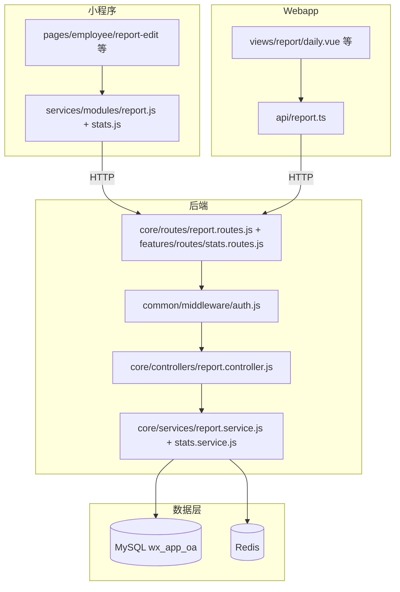

# 06-tech-architecture — 技术架构

> 维度：技术架构（系统架构图、模块划分、服务层、前端封装、中间件）
> 读者：后端开发、前端开发
> 上游依赖：`02-data-design.md`、`03-api-design.md`、`04-business-logic.md`
> 下游影响：`07-agent-matrix.md`、`architecture-blueprint.md`

## 文档目标

定义工作日报的技术实现架构。**工作日报是日报模块内的类型扩展，不新建后端模块目录**，在现有 report/stats 上做增量改动。

## 1. 系统架构图



## 2. 模块划分

### 后端模块（在现有 report/stats 内增量）

| 模块 | 路径 | 职责 | 改动 |
|------|------|------|------|
| 控制器 | `backend/src/core/controllers/report.controller.js` | submit 放行 office、list 透传 reportType | 增量 |
| 服务层 | `backend/src/core/services/report.service.js` | list 增加 reportType 过滤 | 增量 |
| 服务层 | `backend/src/core/services/stats.service.js` | 当日/明日/日历放开 office | 增量 |
| 路由 | `backend/src/core/routes/report.routes.js` + `features/routes/stats.routes.js` | 无新增端点 | 无 |

### 小程序模块

| 模块 | 路径 | 职责 | 改动 |
|------|------|------|------|
| 页面 | `miniapp/src/pages/employee/report-edit/index.vue` | 新增工作日报 Tab | 增量 |
| 页面 | `miniapp/src/pages/profile/stats.vue` | 状态标签 office | 增量 |
| 页面 | `miniapp/src/pages/employee/report-history/` `report-detail/` | 类型标签 | 增量 |
| 页面 | `miniapp/src/pages/admin/daily-overview/` | 状态标签 | 增量 |
| API 封装 | `miniapp/src/services/modules/report.js` | 复用，无新增 | 无 |

### Webapp 模块

| 模块 | 路径 | 职责 | 改动 |
|------|------|------|------|
| 视图 | `webapp/src/views/report/daily.vue` | 工作日报管理页 | 新建 |
| 视图 | `webapp/src/views/report/index.vue` `daily-status.vue` | office 标签/筛选 | 增量 |
| API 封装 | `webapp/src/api/report.ts` | getReportList 加 reportType 类型 | 增量 |
| 组件 | `webapp/src/components/ReportDetailDialog.vue` | office 标签 | 增量 |
| 路由/菜单 | `webapp/src/router/index.ts` `config/modules.ts` | 新增工作日报菜单 | 增量 |

## 3. 服务层设计

### 3.1 `reportService`（增量）

**文件**：`backend/src/core/services/report.service.js`

**函数签名：**

```javascript
// 列表（新增 reportType 筛选）
async function list(userId, { page, pageSize, status, reportType, startDate, endDate, keyword }): Promise<{ list, total }>

// 提交（office 已天然支持：普通→approved、workers 空→提交人自己）
async function submit(data, userId): Promise<{ reportId }>
```

**逻辑步骤（list）：**

1. 组装 conditions：deleted_at IS NULL（必选）+ user_id（非管理员）+ status + reportType + 日期范围 + keyword
2. `SELECT COUNT(*)` 取 total
3. `SELECT dr.*, u.nickname AS userName` 分页取 list
4. `formatReportRow` 映射 camelCase 输出

### 3.2 `statsService`（增量）

**文件**：`backend/src/core/services/stats.service.js`

**函数签名：**

```javascript
// 全员当日（放开 office 排除，office 提交者状态=office）
async function getDailyStatus(date): Promise<{ date, summary, workers }>

// 明日状态（放开 office 排除）
async function getTomorrowStatus(date): Promise<{ date, prevDate, summary, workers }>

// 日历（office 计入 submitted + total）
async function getDailyCounts(month): Promise<{ month, data: [{ date, submitted, total }] }>
```

**依赖关系：**

- 依赖 `daily_reports`、`users`、`attendance_leave_requests`（只读）
- `getTomorrowStatus` 内部调用 `getDailyStatus(prevDate)` 取人员集合

## 4. 前端 API 封装

### 4.1 小程序端

**文件**：`miniapp/src/services/modules/report.js`（复用，无新增）

```javascript
// 复用现有接口：submit / getList / getDailyStatus / getTomorrowStatus / getDailyCounts
export const reportApi = {
  submit: (data) => post('/api/report/submit', data),            // reportType='office'
  getDailyStatus: (params) => post('/api/report/daily-status', params),
  getTomorrowStatus: (params) => post('/api/report/tomorrow-status', params),
  getDailyCounts: (month) => post('/api/stats/daily-counts', { month }),
}
```

### 4.2 Webapp 端

**文件**：`webapp/src/api/report.ts`

```typescript
// getReportList 参数补 reportType（工作日报管理页固定传 'office'）
export function getReportList(params: {
  page?: number; pageSize?: number; status?: string; reportType?: string;
  startDate?: string; endDate?: string; keyword?: string
}): Promise<ReportListResult> {
  return request.post('/report/list', params)
}
```

## 5. 中间件设计

工作日报复用现有认证/权限中间件，无新增：

- `authenticate`：`common/middleware/auth.js`（JWT Bearer 校验）
- `requireRole('admin', 'superadmin')`：用于 `/report/update`、`/report/daily-status`、`/report/tomorrow-status`、Web 管理页路由

## 6. 路由定义

工作日报不新增路由端点，复用：

```javascript
// core/routes/report.routes.js（已有）
router.post('/submit', authenticate, controller.submit)
router.post('/list', authenticate, controller.list)
router.post('/update', authenticate, requireRole('admin', 'superadmin'), controller.update)
router.post('/daily-status', authenticate, requireRole('admin', 'superadmin'), controller.dailyStatus)
router.post('/tomorrow-status', authenticate, requireRole('admin', 'superadmin'), controller.tomorrowStatus)

// features/routes/stats.routes.js（已有）
router.post('/daily-counts', controller.dailyCounts)
```

## 变更记录

| 日期 | 变更内容 | 变更人 |
|------|---------|--------|
| 2026-08-05 | 初始创建（在现有 report/stats 内增量扩展） | 殇血轮回 |
