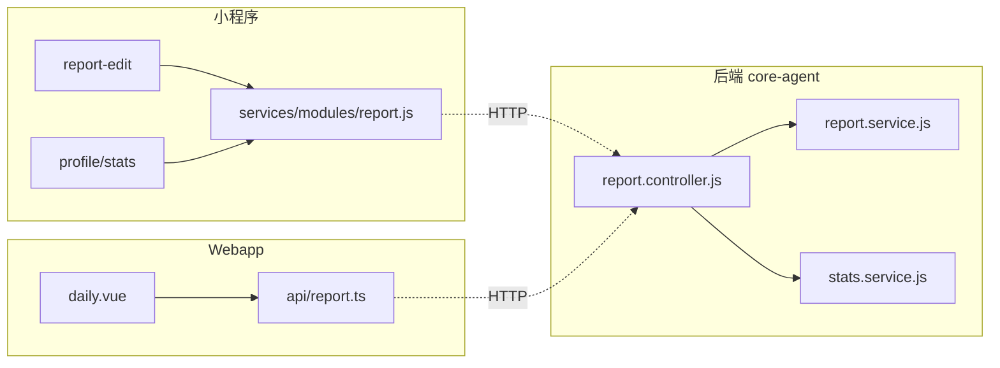

# 07-agent-matrix — Agent 归属

> 维度：代码归属（Agent 归属表、目录结构、文件清单、依赖关系）
> 读者：所有开发 Agent
> 上游依赖：`06-tech-architecture.md`
> 下游影响：`architecture-blueprint.md`、阶段 4 implement

## 文档目标

定义工作日报每个文件的归属 Agent，避免多 Agent 协作冲突。本功能块改动集中在现有模块，无新增目录。

## 1. Agent 归属表

| 文件路径 | 归属 Agent | 类型 | 上游依赖 |
|---------|-----------|------|---------|
| `backend/src/core/controllers/report.controller.js` | core-agent | 控制器 | 03-api-design.md |
| `backend/src/core/services/report.service.js` | core-agent | 服务层 | 04-business-logic.md |
| `backend/src/core/services/stats.service.js` | core-agent（跨 data-agent 域，需 orchestrator 协调） | 服务层 | 04-business-logic.md |
| `miniapp/src/pages/employee/report-edit/index.vue` | miniapp-core-agent | 页面 | 05-ui-ux.md |
| `miniapp/src/pages/profile/stats.vue` | miniapp-core-agent | 页面 | 05-ui-ux.md |
| `miniapp/src/pages/employee/report-history/index.vue` | miniapp-core-agent | 页面 | 05-ui-ux.md |
| `miniapp/src/pages/employee/report-detail/index.vue` | miniapp-core-agent | 页面 | 05-ui-ux.md |
| `miniapp/src/pages/admin/daily-overview/index.vue` | miniapp-admin-agent | 页面 | 05-ui-ux.md |
| `webapp/src/views/report/daily.vue` | webapp-core-agent | 视图（新建） | 05-ui-ux.md |
| `webapp/src/views/report/index.vue` | webapp-core-agent | 视图 | 05-ui-ux.md |
| `webapp/src/views/report/daily-status.vue` | webapp-core-agent | 视图 | 05-ui-ux.md |
| `webapp/src/api/report.ts` | webapp-common-agent | API 封装 | 03-api-design.md |
| `webapp/src/router/index.ts` | webapp-common-agent | 路由 | 05-ui-ux.md |
| `webapp/src/config/modules.ts` | webapp-common-agent | 菜单 | 05-ui-ux.md |
| `webapp/src/components/ReportDetailDialog.vue` | webapp-common-agent | 组件 | 05-ui-ux.md |

## 2. 目录结构树

```
backend/src/core/
├── controllers/report.controller.js   # submit 放行 office + list reportType
├── services/
│   ├── report.service.js              # list reportType 过滤
│   └── stats.service.js               # 当日/明日/日历放开 office

miniapp/src/pages/
├── employee/
│   ├── report-edit/index.vue          # 工作日报 Tab
│   ├── report-history/index.vue       # office 标签
│   └── report-detail/index.vue        # office 标签
├── profile/stats.vue                  # 状态标签 office
└── admin/daily-overview/index.vue     # 状态标签 office

webapp/src/
├── views/report/
│   ├── daily.vue                      # 工作日报管理页（新建）
│   ├── index.vue                      # office 标签/筛选
│   └── daily-status.vue               # office 标签
├── api/report.ts                      # getReportList 加 reportType
├── router/index.ts                    # /report/daily 路由
├── config/modules.ts                  # 工作日报菜单项
└── components/ReportDetailDialog.vue  # office 标签
```

## 3. 文件清单

### 3.1 后端文件

| # | 路径 | 用途 | 行数 |
|---|------|------|------|
| 1 | `core/controllers/report.controller.js` | submit 白名单放行 office、list 透传 reportType、office 跳过工作类型校验 | +20 |
| 2 | `core/services/report.service.js` | list 增加 reportType 过滤 | +6 |
| 3 | `core/services/stats.service.js` | getDailyStatus/getTomorrowStatus 放开、getDailyCounts office 计入 | +60 |

### 3.2 小程序文件

| # | 路径 | 用途 | 行数 |
|---|------|------|------|
| 1 | `pages/employee/report-edit/index.vue` | typeTabs 加 office Tab、隐藏工作类型选择器、submitLabel | +9 |
| 2 | `pages/profile/stats.vue` | statusLabel office→工作日报 | +1 |
| 3 | `pages/employee/report-history/index.vue` | getTypeLabel/Bg/Color 加 office | +6 |
| 4 | `pages/employee/report-detail/index.vue` | getTypeLabel 加 office | +1 |
| 5 | `pages/admin/daily-overview/index.vue` | statusLabelMap office→工作日报 | +1 |

### 3.3 Webapp 文件

| # | 路径 | 用途 | 行数 |
|---|------|------|------|
| 1 | `views/report/daily.vue` | 工作日报管理页（新建） | ~300 |
| 2 | `views/report/index.vue` | reportTypeOptions/getReportTypeTag 加 office | +6 |
| 3 | `views/report/daily-status.vue` | office 标签→工作日报 | +1 |
| 4 | `api/report.ts` | getReportList 加 reportType | +1 |
| 5 | `router/index.ts` | /report/daily 路由 | +6 |
| 6 | `config/modules.ts` | 工作日报菜单项 | +1 |
| 7 | `components/ReportDetailDialog.vue` | getReportTypeTag 加 office | +3 |

## 4. 依赖关系图



### 生成/修改顺序

1. 后端 controller/service（core-agent，先行，接口稳定）
2. 小程序页面标签与 Tab（miniapp-core-agent / miniapp-admin-agent）
3. Web 管理页 + 标签 + 路由菜单（webapp-core-agent / webapp-common-agent）
4. 三端可并行（后端完成后）

## 5. Agent 协作规则

- **core-agent 先行**：后端放行 office 后，前端才能联调提交
- **共享契约**：`03-api-design.md` 是前后端共享契约（submit 的 office 请求体、daily-status 的 office 状态）
- **禁止跨端修改**：core-agent 不得改前端文件，反之亦然
- **跨 Agent 协调**：`core/services/stats.service.js` 归属 core-agent，但 stats 域通常归 data-agent，需 orchestrator（project-orchestrator）按 R40 协调

## 变更记录

| 日期 | 变更内容 | 变更人 |
|------|---------|--------|
| 2026-08-05 | 初始创建（6 个 Agent 涉及，orchestrator 协调） | 殇血轮回 |
