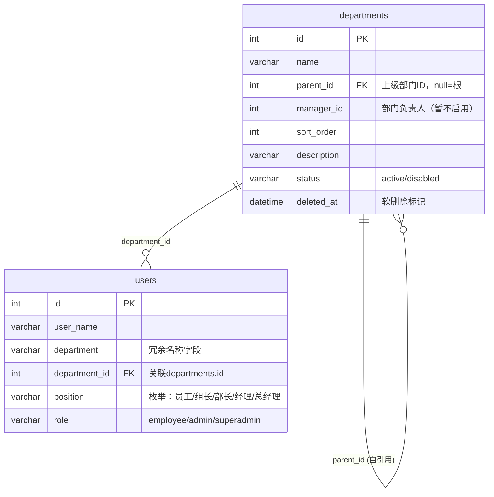

# 组织架构管理 — 数据设计文档

> 维度：数据模型
> 读者：开发者
> 上游依赖：01-requirements
> 下游影响：02-business-logic

## 文档目标

记录 departments 表的现有结构及本次迭代的变更点（修改删除逻辑，不改变表结构）。

## 1. ER 图



## 2. departments 表 DDL（现存，仅作记录）

```sql
CREATE TABLE IF NOT EXISTS departments (
  id          INT UNSIGNED NOT NULL AUTO_INCREMENT,
  name        VARCHAR(100) NOT NULL,
  parent_id   INT UNSIGNED DEFAULT NULL,
  manager_id  INT UNSIGNED DEFAULT NULL,
  sort_order  INT NOT NULL DEFAULT 0,
  description VARCHAR(500) DEFAULT NULL,
  status      VARCHAR(20) NOT NULL DEFAULT 'active',
  created_at  DATETIME NOT NULL DEFAULT CURRENT_TIMESTAMP,
  updated_at  DATETIME NOT NULL DEFAULT CURRENT_TIMESTAMP ON UPDATE CURRENT_TIMESTAMP,
  deleted_at  DATETIME DEFAULT NULL,
  PRIMARY KEY (id),
  KEY idx_parent_id (parent_id),
  KEY idx_sort (sort_order),
  KEY idx_status (status)
) ENGINE=InnoDB DEFAULT CHARSET=utf8mb4 COMMENT='部门表';
```

## 3. users 表相关字段（现存，仅作记录）

| 字段 | 类型 | 说明 |
|------|------|------|
| department_id | INT UNSIGNED | 外键关联 departments.id，NULL=未分配 |
| department | VARCHAR(100) | 冗余字段，updateUser 时自动同步 |
| position | VARCHAR(50) | 枚举：员工/组长/部长/经理/总经理 |

索引：`idx_department_id` (已建)

## 4. 本次迭代变更

| 变更项 | 说明 |
|--------|------|
| 表结构 | **不变** |
| deleteDepartment 逻辑 | `阻止删除` → `级联清空`：递归软删子部门 + 清空员工 department_id |
| position 字段 | 使用枚举值：员工/组长/部长/经理/总经理 |

## 变更记录

| 日期 | 变更内容 |
|------|---------|
| 2026-07-10 | 初始创建 — 基于现网 departments 表记录 |
